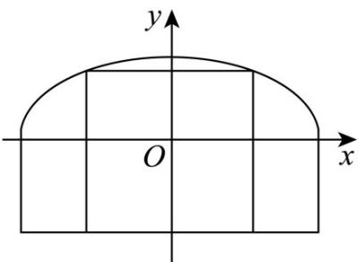

> [!faq]- 《专题01 椭圆的四大常考题型（高效培优专项训练）》官方解析
>
> > [!success]- **【答案】** (1)26.8 (2)拱高 $l \approx 28.3(\mathrm{~m})$ 、拱宽 $h \approx 5.8(\mathrm{~m})$
>
> > [!note]- **【解析】**
> > （1）如图建立平面直角坐标系，
> >
> > 依题意可得点 $(10,2)$ 在椭圆 $\frac{x^{2}}{a^{2}}+\frac{y^{2}}{b^{2}}=1(a>b>0)$ 上，
> >
> > 又 $b = 6 - 3 = 3$ ，将点 $(10,2)$ 代入椭圆方程得 $\frac{100}{a^2} +\frac{4}{9} = 1$ ，解得 $a = 6\sqrt{5}$
> >
> > 此时 $l = 2a = 12\sqrt{5}\approx 26.8$
> >
> > 因此隧道设计的拱宽 l 约为 26.8 米；
> >
> > 
> >
> > (2) 设隧道上方半椭圆部分的面积为 S，
> >
> > 由椭圆方程 $\frac{x^2}{a^2} +\frac{y^2}{b^2} = 1(a > b > 0)$ 且点 $(10,2)$ 在椭圆上或椭圆内部，得 $\frac{100}{a^2} +\frac{4}{b^2}\leq 1$
> >
> > 因为 $1 \frac{100}{a^2} + \frac{4}{b^2} \frac{2 \times 10 \times 2}{ab}$ ，即 $ab = 40$ ，当且仅当 $\frac{10}{a} = \frac{2}{b}$ 时取等号，
> >
> > 所以 $S = \frac{\pi ab}{2}$ $20\pi$
> >
> > 由于隧道长度为 2500 米，故隧道上方半椭圆部分的土方工程量 V = 2500S ，
> >
> > 当 $V$ 取得最小值时，有 $\frac{10}{a} = \frac{2}{b}$ 且 $ab = 40$ ，得 $a = 10\sqrt{2}$ ， $b = 2\sqrt{2}$
> >
> > 此时 $l = 2a = 20\sqrt{2} \approx 28.3$ ， $h = b + 3 = 3 + 2\sqrt{2} \approx 5.8$
> >
> > 即拱高 $l \approx 28.3(\mathrm{~m})$ 和拱宽 $h \approx 5.8(\mathrm{~m})$ ，隧道上方半椭圆部分的土方工程量最小。
