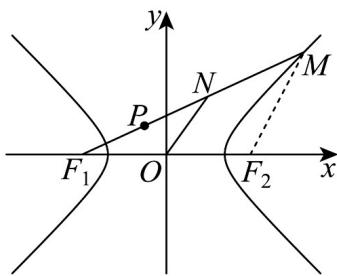

> [!faq]- 《专题02 双曲线的四大常考题型（高效培优专项训练）》官方解析
>
> > [!success]- **【答案】** C
>
> > [!note]- **【解析】**
> > 如图，连接 $MF_{2}$
> >
> > 
> >
> > 由题意可知 $|MF_1| - |MF_2| = 2$
> >
> > 因为 O 为坐标原点，N 为 $MF_{1}$ 的中点，
> >
> > 所以 $|ON| = \frac{1}{2} |MF_2|$ ， $|F_1N| = \frac{1}{2} |MF_1|$ ，
> >
> > 则 $\left|PF_1\right| = \left|F_1N\right| - \left|PN\right| = \left|F_1N\right| - \left|ON\right| = \frac{1}{2}\left(\left|MF_1\right| - \left|MF_2\right|\right) = 1.$
> >
> > 故选 **C**
