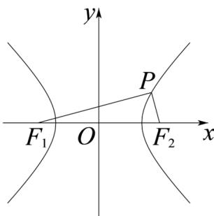

> [!faq]- 《专题02 双曲线的四大常考题型（高效培优专项训练）》官方解析
>
> > [!success]- **【答案】** $^{2}$
>
> > [!note]- **【解析】**
> > 由 $x^{2} - y^{2} = 2$ 得 $\frac{x^2}{2} -\frac{y^2}{2} = 1$ ，所以 $a = \sqrt{2},b = \sqrt{2},c = \sqrt{2 + 2} = 2,\left|F_1F_2\right| = 4\cdot$
> >
> > 
> >
> > 不妨设点 P 在第一象限，则 $\left|PF_{1}\right| - \left|PF_{2}\right| = 2a = 2\sqrt{2}$ ，故 $\left|PF_{1}\right|^{2} + \left|PF_{2}\right|^{2} - 2\left|PF_{1}\right| \cdot \left|PF_{2}\right| = 8$ $\because PF_{1} \cdot PF_{2} = 0, \therefore PF_{1} \perp PF_{2}$
> >
> > $\therefore \left|PF_{1}\right|^{2} + \left|PF_{2}\right|^{2} = \left|F_{1}F_{2}\right|^{2}$ 即 $\left|PF_1\right|^2 +\left|PF_2\right|^2 = 16$
> >
> > $\therefore \left|PF_{1}\right|\cdot \left|PF_{2}\right| = 4$
> >
> > $$
> > \therefore S _ {\triangle F _ {1} P F _ {2}} = \frac {1}{2} \left| P F _ {1} \right| \cdot \left| P F _ {2} \right| = 2
> > $$
> >
> > 故答案为：2.
