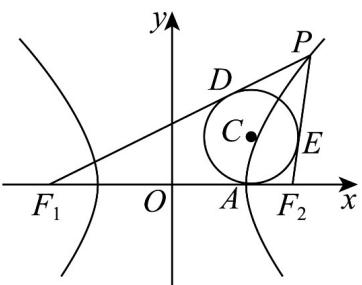

> [!faq]- 《专题02 双曲线的四大常考题型（高效培优专项训练）》官方解析
>
> > [!success]- **【答案】**  A. $\frac{5\sqrt{3}}{11}$ B. $\frac{\sqrt{3}}{2}$ C. $\frac{2\sqrt{3}}{3}$ D. $\sqrt{3}$
>
> > [!note]- **【解析】**
> > 由题意可知 $|PD|=|PE|$ ， $|F_{1}D|=|F_{1}A|$ ， $|F_{2}A|=|F_{2}E|$ ，
> >
> > 所以 $\left|PF_1\right| - \left|PF_2\right| = \left(\left|PD\right| + \left|DF_1\right|\right) - \left(\left|PE\right| + \left|EF_2\right|\right) = \left|DF_1\right| - \left|EF_2\right| = \left|AF_1\right| - \left|AF_2\right| = 2a$
> >
> > 设 $A(x_0, 0)$
> >
> > 则 $\left(x_0 + c\right) - \left(c - x_0\right) = 2a\Rightarrow x_0 = a$
> >
> > 即 $A(2,0)$
> >
> > 设圆 $C$ 的半径为 $r(r > 0)$ ，因为圆 $C$ 的面积为 $3\pi$ ，则 $\pi r^2 = 3\pi \Rightarrow r = \sqrt{3}$
> >
> > 因为 $CA \perp F_{1}F_{2}$ ，所以 $C(2, \sqrt{3})$
> >
> > 于是 $\tan \angle CF_2A = \frac{|CA|}{|AF_2|} = \frac{\sqrt{3}}{3 - 2} = \sqrt{3}$
> >
> > 因为 $CF_{2}$ 是 $\angle PF_{2}F_{1}$ 的角平分线，
> >
> > 所以 $\tan \angle PF_2F_1 = \tan (2\angle CF_2A) = \frac{2\tan\angle CF_2A}{1 - \tan^2\angle CF_2A} = \frac{2\sqrt{3}}{-2} = -\sqrt{3}$
> >
> > 所以 $\tan \angle PF_2x = \tan (\pi -\angle PF_2F_1) = -\tan \angle PF_2F = \sqrt{3}$ ，即直线 $PF_{2}$ 的斜率为 $\sqrt{3}$
> >
> > 故选 **D**.
