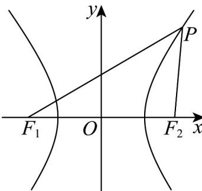

> [!faq]- 《专题02 双曲线的四大常考题型（高效培优专项训练）》官方解析
>
> > [!success]- **【答案】** A
>
> > [!note]- **【解析】**
> > 由余弦定理得 $\left|F_{1}F_{2}\right|^{2}=\left|PF_{1}\right|^{2}+\left|PF_{2}\right|^{2}-2\left|PF_{1}\right|\cdot\left|PF_{2}\right|\cdot\cos\frac{\pi}{3}$
> >
> > $$
> > = \left| P F _ {1} \right| ^ {2} + \left| P F _ {2} \right| ^ {2} - \left| P F _ {1} \right| \cdot \left| P F _ {2} \right|
> > $$
> >
> > $$
> > = \left(\left| P F _ {1} \right| - \left| P F _ {2} \right|\right) ^ {2} + \left| P F _ {1} \right| \cdot \left| P F _ {2} \right| = 4 a ^ {2} + \left| P F _ {1} \right| \cdot \left| P F _ {2} \right|,
> > $$
> >
> > $$
> > \therefore \left| P F _ {1} \right| \cdot \left| P F _ {2} \right| = \left| F _ {1} F _ {2} \right| ^ {2} - 4 a ^ {2} = 4 c ^ {2} - 4 a ^ {2} = 4 b ^ {2}
> > $$
> >
> > $\therefore S_{\triangle PF_{1}F_{2}}=\frac{1}{2}\left|PF_{1}\right|\cdot\left|PF_{2}\right|\sin\frac{\pi}{3}=\frac{1}{2}\times4b^{2}\times\frac{\sqrt{3}}{2}=\sqrt{3}b^{2}=6\sqrt{3}$ ， $\therefore b=\sqrt{6}$ （负值已舍去）.
> >
> > 
> >
> > 故选 **A**.
