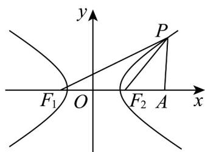
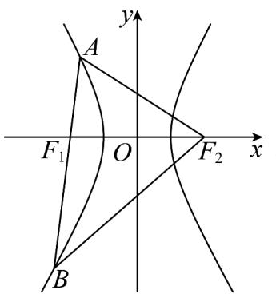

> [!faq]- 《专题02 双曲线的四大常考题型（高效培优专项训练）》官方解析
>
> > [!success]- **【答案】** (1) $\frac{\sqrt{39}}{3}$ ; (2) $\sqrt{3}$ .
>
> > [!note]- **【解析】**
> > （1）
> >
> > 
> >
> > 设点 $P$ 的坐标为 $\left(x_0,y_0\right)$
> >
> > 则 $|PA|^{2} = (x_{0} - 4)^{2} + y_{0}^{2} = (x_{0} - 4)^{2} + \frac{x_{0}^{2}}{2} - 1 = \frac{3}{2} x_{0}^{2} - 8x_{0} + 15 = \frac{3}{2}\left(x_{0} - \frac{8}{3}\right)^{2} + \frac{13}{3}$ 因为 $\left|x_{0}\right|\quad\sqrt{2}$ ，所以当 $x_{0}=\frac{8}{3}$ 时， $\left|PA\right|$ 取得最小值 $\frac{\sqrt{39}}{3}$
> >
> > (2) 由双曲线的定义知 $\left\| PF_1\right| - \left|PF_2\right| = 2\sqrt{2}$ ①,
> >
> > 由余弦定理得 $\left(2\sqrt{3}\right)^{2}=\left|PF_{1}\right|^{2}+\left|PF_{2}\right|^{2}-2\left|PF_{1}\right|\left|PF_{2}\right|\cos60^{\circ}$ ②,
> >
> > 根据①②可得 $\left|PF_{1}\right|\left|PF_{2}\right|=4$ ，所以 $S_{\triangle PF_{1}F_{2}}=\frac{1}{2}\cdot\left|PF_{1}\right|\left|PF_{2}\right|\sin60^{\circ}=\frac{1}{2}\times4\times\frac{\sqrt{3}}{2}=\sqrt{3}$
> >
> > 10. 经过双曲线 $x^{2} - \frac{y^{2}}{3} = 1$ 的左焦点 $F_{1}$ 作斜率为 2 的弦 $AB$ ，求：
> >
> > (1)线段 $|AB|$ 的长；
> >
> > (2)设点 $F_{2}$ 为右焦点，求 $\triangle F_{2}AB$ 的周长·
> >
> > 【答案】(1)30
> >
> > (2)64
> >
> > 【详解】（1）由题意得直线 AB 的方程为 $y = 2(x + 2)$ ,
> >
> > 代入双曲线方程 $x^{2} - \frac{y^{2}}{3} = 1$ 可得 $x^{2} + 16x + 19 = 0, \Delta = 16^{2} - 4 \times 19 > 0$
> >
> > 设 $A(x_{1},y_{1}),B(x_{2},y_{2})$ ，则 $x_{1} + x_{2} = -16,x_{1}x_{2} = 19,$
> >
> > 即 $\left|AB\right|$ 的长为 $\sqrt{5}\cdot\sqrt{\left(x_{1}+x_{2}\right)^{2}-4x_{1}x_{2}}=30$
> >
> > (2) 由双曲线的定义得 $\left|AF_{2}\right| - \left|AF_{1}\right| = \left|BF_{2}\right| - \left|BF_{1}\right| = 2a = 2$
> >
> > 则 $\triangle F_{2}AB$ 的周长为 $\left|AF_2\right| + \left|BF_2\right| + \left|AF_1\right| + \left|BF_1\right| = 4a + 2(\left|AF_1\right| + \left|BF_1\right|) = 4a + 2\left|AB\right|$ $= 4 + 2\times 30 = 64$
> >
> > 
