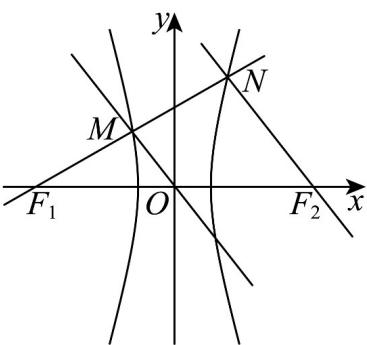

> [!faq]- 《专题02 双曲线的四大常考题型（高效培优专项训练）》官方解析
>
> > [!success]- **【答案】** D
>
> > [!note]- **【解析】**
> > 
> >
> > 由题意得 $\left|MN\right|=\left|MF_{1}\right|=x$ ，而后根据题意可知 $\left|MF_{2}\right|=2a+x,\left|NF_{2}\right|=2x-2a$ ，
> > 在 $\triangle MNF_{2}$ 中， $x^{2}+\left(2x-2a\right)^{2}=\left(2a+x\right)^{2}$ 得x=3a，
> > 从而 $(4a)^{2}+(6a)^{2}=(2c)^{2}$ ，即 $e=\sqrt{13}$ 。
> > 故答案为： $\sqrt{13}$
