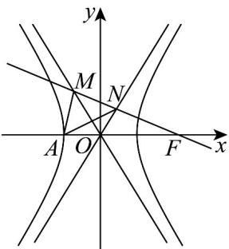
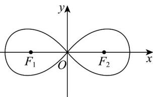

> [!faq]- 《专题02 双曲线的四大常考题型（高效培优专项训练）》官方解析
>
> > [!success]- **【答案】** A
>
> > [!note]- **【解析】**
> > 
> >
> > 设过点 $F$ 且倾斜角为 $150^{\circ}$ 的直线为 $y = -\frac{\sqrt{3}}{3} (x - c)$ ，与双曲线的渐近线 $y = \frac{b}{a} x$ 联立可得： $x = \frac{c}{1 + \sqrt{3}\frac{b}{a}} = \frac{ac}{a + \sqrt{3}b}, y = \frac{b}{a} \cdot \frac{c}{1 + \sqrt{3}\frac{b}{a}} = \frac{bc}{a + \sqrt{3}b}$ ，同理与双曲线的渐近线 $y = -\frac{b}{a} x$ 联立可得： $x = \frac{c}{1 - \sqrt{3}\frac{b}{a}} = \frac{ac}{a - \sqrt{3}b}, y = \frac{b}{a} \cdot \frac{c}{1 - \sqrt{3}\frac{b}{a}} = \frac{-bc}{a - \sqrt{3}b}$ ，由为等边三角形，则的中点坐标为 $\triangle AMN$ MN G 由题意可得： $k_{AG} = \tan 60^{\circ} = \sqrt{3}$ ，
> >
> > $$
> > \text {即} \frac {\frac {b c}{a + \sqrt {3} b} + \frac {- b c}{a - \sqrt {3} b}}{\frac {2}{\frac {a c}{a + \sqrt {3} b} + \frac {a c}{a - \sqrt {3} b}} + a} = \sqrt {3} \Rightarrow \frac {\frac {b c}{a + \sqrt {3} b} - \frac {b c}{a - \sqrt {3} b}}{\frac {a c}{a + \sqrt {3} b} + \frac {a c}{a - \sqrt {3} b} + 2 a} = \sqrt {3},
> > $$
> >
> > $$
> > \Rightarrow \frac {b c (a - \sqrt {3} b) - b c (a + \sqrt {3} b)}{a c (a - \sqrt {3} b) + a c (a + \sqrt {3} b) + 2 a (a + \sqrt {3} b) (a - \sqrt {3} b)} = \sqrt {3},
> > $$
> >
> > $$
> > \Rightarrow \frac {- 2 \sqrt {3} b ^ {2} c}{2 a ^ {2} c + 2 a (a ^ {2} - 3 b ^ {2})} = \sqrt {3} \Rightarrow \frac {- (c ^ {2} - a ^ {2}) c}{a ^ {2} c + a (4 a ^ {2} - 3 c ^ {2})} = 1 \Rightarrow \frac {- (e ^ {2} - 1) e}{e + 4 - 3 e ^ {2}} = 1,
> > $$
> >
> > $$
> > \Rightarrow \frac {- (e ^ {2} - 1) e}{(e + 1) (- 3 e + 4)} = 1 \Rightarrow \frac {- (e - 1) e}{4 - 3 e} = 1 \Rightarrow - e ^ {2} + e = 4 - 3 e
> > $$
> >
> > $$
> > \Rightarrow e ^ {2} - 4 e + 4 = 0 \Rightarrow (e - 2) ^ {2} = 0,
> > $$
> >
> > 所以解得 e = 2，
> >
> > 故选：A.
> >
> > 24．2025春节档国产影片《哪吒之魔童闹海》接连破全球票房记录，影片中哪吒与敖丙是不可分割的二人组，其中敖丙的武器“盘龙冰锤”相撞后形成了如图所示的曲线，可以用来表示数学上特殊的曲线．如图所示的曲线 C 过坐标原点 O，C 上的点到两定点 $F_{1}(-a,0)$ ， $F_{2}(a,0)$ （a>0）的距离之积为定值．当 a=3 时，C 上第一象限内的点 P 满足 $\triangle PF_{1}F_{2}$ 的面积为 $\frac{9}{2}$ ，则 $\left|PF_{1}\right|^{2}-\left|PF_{2}\right|^{2}=(\quad)$
> >
> > 
> >
> > 
> >
> > A.6 B. $18\sqrt{3}$ C. $2\sqrt{13}$ D. $6\sqrt{5}$
> >
> > 【答案】B
> >
> > 【详解】由原点在曲线上，则 $\left|OF_1\right|\left|OF_2\right| = a^2 = 9$
> >
> > 设 $P(x,y)$ ，则 $\sqrt{(x + 3)^2 + y^2}\cdot \sqrt{(x - 3)^2 + y^2} = 9$
> >
> > 所以 $(x^{2} + y^{2} + 9 + 6x)\cdot (x^{2} + y^{2} + 9 - 6x) = 81$ ，则 $(x^{2} + y^{2} + 9)^{2} - 36x^{2} = 81$
> >
> > 所以 $(x^{2}+y^{2})^{2}=18(x^{2}-y^{2})$ ，
> >
> > 由 $S_{\triangle PF_1F_2} = \frac{1}{2}\left|PF_1\right|\left|PF_2\right|\sin \angle F_1PF_2 = \frac{9}{2}$ ，且 $\left|PF_1\right|\left|PF_2\right| = 9$ ，可得 $\sin \angle F_1PF_2 = 1$
> >
> > 所以 $\angle F_{1}PF_{2} = 90^{\circ}$ ，易知 $P$ 是曲线 $(x^{2} + y^{2})^{2} = 18(x^{2} - y^{2})$ 与以 $F_{1}F_{2}$ 直径的圆的交点，
> >
> > 联立 $\left\{ \begin{array}{l}(x^2 +y^2)^2 = 18(x^2 -y^2)\\ x^2 +y^2 = 9 \end{array} \right.$ ，且 $P$ 在第一象限，可得 $x_{P} = \frac{3\sqrt{3}}{2}$
> >
> > 所以 $\left|PF_1\right|^2 -\left|PF_2\right|^2 = (x_P + 3)^2 +y_P^2 -(x_P - 3)^2 -y_P^2 = 12x_P = 18\sqrt{3}.$
> >
> > 故选 **B**
