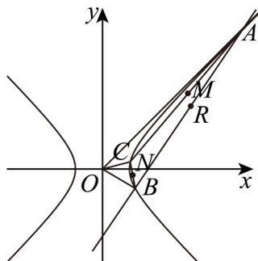

## 题型三：双曲线的简单几何性质

21. 斜率为 1 的直线与双曲线 $E: \frac{x^2}{a^2} - \frac{y^2}{b^2} = 1 (a > 0, b > 0)$ 交于两点 $A, B$ ，点 $C$ 是 $E$ 上的一点，满足 $AC \perp BC$ ， $\triangle OAC$ ， $\triangle OBC$ 的重心分别为 $P, Q$ ，VABC 的外心为 $R$ 。记直线 $OP, OQ, OR$ 的斜率为 $k_1, k_2, k_3$ 。若 $k_1 k_2 k_3 = -27$ ，则双曲线 $E$ 的离心率为（） A. 2 B. $2\sqrt{2}$ C. 3 D. $3\sqrt{3}$

【答案】A

【详解】取 AC, BC 的中点为 M, N，因为 $\triangle OAC$ 的重心为 P，且 P 在中线 OM 上，
所以 $k_{1}=k_{OP}=k_{OM}, k_{2}=k_{OQ}=k_{ON}$ ，由中点弦有 $k_{OM}\cdot k_{AC}=k_{ON}\cdot k_{BC}=\frac{b^{2}}{a^{2}}$

所以 $k_{1}k_{AC}=k_{2}k_{BC}=\frac{b^{2}}{a^{2}}$ ，所以 $k_{1}k_{AC}k_{2}k_{BC}=\left(\frac{b^{2}}{a^{2}}\right)^{2}$ ，又因为 $AC\perp BC$ ，

所以 $k_{AC}k_{BC} = -1$ ，所以 $k_{1}k_{2} = -\left(\frac{b^{2}}{a^{2}}\right)^{2}$

又由 $AC \perp BC$ ，得 VABC 的外心为 R 为 AB 的中点，

所以由中点弦有 $k_{OR} \cdot k_{AB} = \frac{b^2}{a^2}, k_{AB} = 1$ ，所以 $k_{OR} = \frac{b^2}{a^2}$ ，即 $k_3 = \frac{b^2}{a^2}$

由 $k_{1}k_{2}k_{3} = -27$ 有 $\left(\frac{b^2}{a^2}\right)^3 = 27$ ，所以 $\frac{b^2}{a^2} = 3$

所以 $e=\frac{c}{a}=\sqrt{1+\frac{b^{2}}{a^{2}}}=2$

故选：A.

![[高中/课堂同步/题库/人教A版高中数学同步讲义(2026)/03_选择性必修第一册/第三章 圆锥曲线的方程/专题02 双曲线的四大常考题型（高效培优专项训练）/题型三_双曲线的简单几何性质/questions/Q00080064.md]]
![[高中/课堂同步/题库/人教A版高中数学同步讲义(2026)/03_选择性必修第一册/第三章 圆锥曲线的方程/专题02 双曲线的四大常考题型（高效培优专项训练）/题型三_双曲线的简单几何性质/questions/Q00080065.md]]
![[高中/课堂同步/题库/人教A版高中数学同步讲义(2026)/03_选择性必修第一册/第三章 圆锥曲线的方程/专题02 双曲线的四大常考题型（高效培优专项训练）/题型三_双曲线的简单几何性质/questions/Q00080066.md]]
![[高中/课堂同步/题库/人教A版高中数学同步讲义(2026)/03_选择性必修第一册/第三章 圆锥曲线的方程/专题02 双曲线的四大常考题型（高效培优专项训练）/题型三_双曲线的简单几何性质/questions/Q00080067.md]]
![[高中/课堂同步/题库/人教A版高中数学同步讲义(2026)/03_选择性必修第一册/第三章 圆锥曲线的方程/专题02 双曲线的四大常考题型（高效培优专项训练）/题型三_双曲线的简单几何性质/questions/Q00080068.md]]
![[高中/课堂同步/题库/人教A版高中数学同步讲义(2026)/03_选择性必修第一册/第三章 圆锥曲线的方程/专题02 双曲线的四大常考题型（高效培优专项训练）/题型三_双曲线的简单几何性质/questions/Q00080069.md]]
![[高中/课堂同步/题库/人教A版高中数学同步讲义(2026)/03_选择性必修第一册/第三章 圆锥曲线的方程/专题02 双曲线的四大常考题型（高效培优专项训练）/题型三_双曲线的简单几何性质/questions/Q00080070.md]]
![[高中/课堂同步/题库/人教A版高中数学同步讲义(2026)/03_选择性必修第一册/第三章 圆锥曲线的方程/专题02 双曲线的四大常考题型（高效培优专项训练）/题型三_双曲线的简单几何性质/questions/Q00080071.md]]
