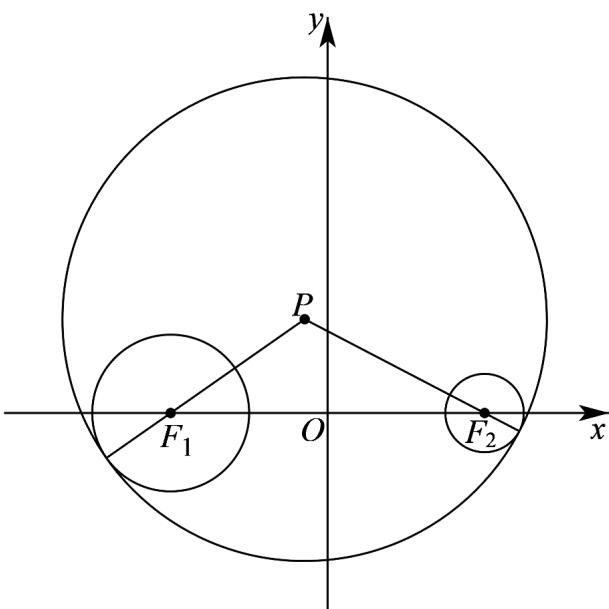

> [!faq]- 《专题02 双曲线的四大常考题型（高效培优专项训练）》官方解析
>
> > [!success]- **【答案】** A
>
> > [!note]- **【解析】**
> > 设 $P(x,y)$ ，由 $\left|PF_1\right| - \left|PF_2\right| = 2 <   2\sqrt{2} = \left|F_1F_2\right|$ ，得点 $P$ 的轨迹是以 $F_{1},F_{2}$ 为焦点，实轴长为 $^2$ 的双曲线右支，方程为 $x^{2} - y^{2} = 1(x > 0)$ ，当 $y = \frac{1}{2}$ 时， $x^{2} = \frac{5}{4}$
> >
> > 所以点 $P$ 到坐标原点的距离是 $\sqrt{\frac{5}{4} + (\frac{1}{2})^2} = \frac{\sqrt{6}}{2}$ .
> >
> > 故选：A
> >
> > 13. 与圆 $(x + 4)^2 + y^2 = 4$ 及圆 $x^2 + y^2 - 8x + 15 = 0$ 都内切的圆的圆心在（）A. 椭圆上 B. 双曲线的左支上C. 双曲线的右支上 D. 抛物线上
> >
> > 【答案】B
> >
> > 【详解】圆 $(x+4)^{2}+y^{2}=4$ 的圆心为 $F_{1}(-4,0)$ ，半径为 $r_{1}=2$ ，
> >
> > 圆 $x^{2} + y^{2} - 8x + 15 = 0$ 的标准方程为 $\left(x - 4\right)^{2} + y^{2} = 1$ ，圆心为 $F_{2}(4,0)$ ，半径为 $r_2 = 1$
> >
> > 如下图所示：
> >
> > 
> >
> > 设所求圆的圆心为 P，半径为 r，
> >
> > 由圆与圆的位置关系可得 $\left|PF_{1}\right|=r-2,\left|PF_{2}\right|=r-1$
> >
> > 所以， $\left|PF_{2}\right|-\left|PF_{1}\right|=1<\left|F_{1}F_{2}\right|=4$
> >
> > 所以，圆心 P 的轨迹是以 $F_{1}$ 、 $F_{2}$ 分别为左、右焦点的双曲线的左支，
> >
> > 故选 **B**.
