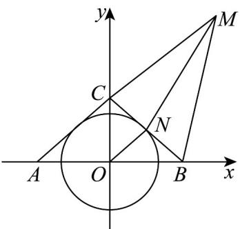

> [!faq]- 《专题02 双曲线的四大常考题型（高效培优专项训练）》官方解析
>
> > [!success]- **【答案】** B
>
> > [!note]- **【解析】**
> > 由题意知，圆 O 的半径 r = 2 ，延长 BN 交直线 AM 于点 C ，连接 ON ，因为 $\angle AMN = \angle BMN$ ，且 $MN \perp BN$ ，所以 $\left|MB\right| = \left|MC\right|$ ，且 N 为 BC 中点，所以 ON // AC ，且 $\left|ON\right| = \frac{1}{2}\left|AC\right|$
> >
> > 
> >
> > 因此， $\left|\left|MA\right| - \left|MB\right|\right| = \left|\left|MA\right| - \left|MC\right|\right| = \left|AC\right| = 2\left|ON\right| = 4 <   \left|AB\right|$
> >
> > 所以点 $M$ 在以A， $B$ 为焦点的双曲线 $\Omega$ 上，
> >
> > 设 $\Omega$ 的方程为 $\frac{x^2}{a^2} -\frac{y^2}{b^2} = 1(a > 0,b > 0)$ ，可知 $2a = 4$ ，所以 $a = 2$
> >
> > 又 $c = 3$ ，则 $b^{2} = c^{2} - a^{2} = 5$ ，所以 $\Omega$ 的方程为 $\frac{x^2}{4} -\frac{y^2}{5} = 1$ ，即 $|x|$ 2，
> >
> > 又点 M 是圆 O 外一点，
> >
> > 所以 $|x| > 2$ ，即 $|y| \neq 0$ ，故所求轨迹方程为 $\frac{x^2}{4} - \frac{y^2}{5} = 1(y \neq 0)$ .
> >
> > 故选 **B**
