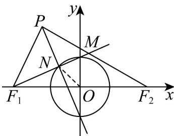

> [!faq]- 《专题02 双曲线的四大常考题型（高效培优专项训练）》官方解析
>
> > [!success]- **【答案】** B
>
> > [!note]- **【解析】**
> > 如图，当点 $P$ 在 $y$ 轴左侧时，连接 $ON, PF_1$ ，由点 $F_1$ 关于点 $N$ 的对称点为 $M$ ，得 $N$ 是线段 $MF_1$ 中点，
> >
> > 而点 O 是线段 $F_{1}F_{2}$ 的中点，则 $\left|F_{2}M\right|=2\left|ON\right|=2$
> >
> > 由 $PN$ 为线段 $MF_{1}$ 的垂直平分线，得 $\left|PF_1\right| = \left|PM\right| = \left|PF_2\right| - \left|F_2M\right| = \left|PF_2\right| - 2$ 于是 $\left|PF_{2}\right|-\left|PF_{1}\right|=2<\left|F_{1}F_{2}\right|=4$ ，当点P在y轴右侧时，同理 $\left|PF_{1}\right|-\left|PF_{2}\right|=2<\left|F_{1}F_{2}\right|=4$ ，
> > 则 $\left\|PF_{1}\right|-\left|PF_{2}\right\|=2<\left|F_{1}F_{2}\right|=4$
> >
> > 
> >
> > 所以点 $P$ 的轨迹是以 $F_{1}, F_{2}$ 为焦点，实轴长为 $^{2}$ 的双曲线，对应的方程为 $x^{2} - \frac{y^{2}}{3} = 1$ .
> >
> > 故选 **B**
