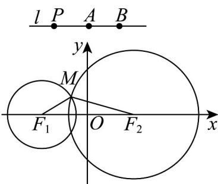
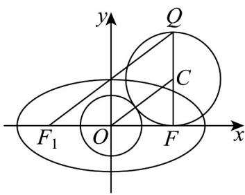

> [!faq]- 《专题02 双曲线的四大常考题型（高效培优专项训练）》官方解析
>
> > [!success]- **【答案】** A
>
> > [!note]- **【解析】**
> > 如下图所示：
> >
> > 
> >
> > 设圆 $F_{1}$ 、圆 $F_{2}$ 的半径分别为 $r$ 、 $R$ ，则 $r = |PA|$ ， $R = |PB|$
> >
> > 设两圆的一个公共点为 M ，由题意可知，点 P 不能与点 A 或点 B 重合，
> >
> > 若点 $P$ 在线段 $AB$ （不包括端点）上运动时，则 $\left|MF_1\right| + \left|MF_2\right| = r + R = \left|PA\right| + \left|PB\right| = \left|AB\right| = 2$
> >
> > 事实上， $\left|MF_{1}\right|+\left|MF_{2}\right|\quad\left|F_{1}F_{2}\right|=6$ ，此时点M不存在；
> >
> > 当点 P 在以点 A 为端点以 BA 的方向为方向的射线上时，
> >
> > 此时， $\left|MF_{2}\right|-\left|MF_{1}\right|=R-r=\left|PB\right|-\left|PA\right|=\left|AB\right|=2$
> >
> > 当点 P 在以点 B 为端点且以 $\overline{AB}$ 的方向为方向的射线上时，
> >
> > 此时， $\left|MF_{1}\right|-\left|MF_{2}\right|=r-R=\left|PA\right|-\left|PB\right|=\left|AB\right|=2$
> >
> > 综上， $\left\| MF_1\right| - \left|MF_2\right| = 2 <   \left|F_1F_2\right| = 6$
> >
> > 所以，动点 $M$ 的轨迹是以点 $F_{1}$ 、 $F_{2}$ 为焦点的双曲线，
> >
> > 设该双曲线的标准方程为 $\frac{x^2}{a^2} -\frac{y^2}{b^2} = 1(a > 0,b > 0)$ ，焦距为 $2c$
> >
> > 则 $\left\{ \begin{array}{l} 2a = 2 \\ 2c = 6 \\ c = \sqrt{a^2 + b^2} \end{array} \right.$ ，可得 $\left\{ \begin{array}{l} a = 1 \\ b = 2\sqrt{2} \end{array} \right.$
> >
> > 因此，两圆公共点的轨迹方程为 $x^{2} - \frac{y^{2}}{8} = 1$
> >
> > 故选：A.
> >
> > 19. 过椭圆 $\frac{x^2}{m} + \frac{y^2}{m - 9} = 1(m > 9)$ 右焦点 $F$ 的圆与圆 $O: x^2 + y^2 = 4$ 外切，则该圆直径 $FQ$ 的端点 $Q$ 的轨迹方程为（）A. $\frac{x^2}{4} - \frac{y^2}{5} = 1$ B. $\frac{x^2}{4} - \frac{y^2}{5} = 1(x \leq -2)$ C. $\frac{x^2}{4} - \frac{y^2}{5} = 1(x - 2)$ D. $\frac{y^2}{4} - \frac{x^2}{5} = 1$
> >
> > 【答案】C
> >
> > 【详解】由椭圆 $\frac{x^2}{m} +\frac{y^2}{m - 9} = 1(m > 9)$ ，得椭圆半焦距 $c = \sqrt{m - (m - 9)} = 3$ ，即有 $F(3,0)$ ，则椭圆的左焦点为 $F_{1}(-3,0)$ ，
> >
> > 设以 $FQ$ 为直径的圆的圆心为 $C$ ，如图，
> >
> > 
> >
> > 由圆 $O$ 与圆 $C$ 外切，得 $\left|OC\right| - \left|CF\right| = 2$ ，又 $\left|QF_1\right| = 2\left|OC\right|$ ， $\left|QF\right| = 2\left|CF\right|$
> >
> > 则 $\left|QF_{1}\right|-\left|QF\right|=2\left(\left|OC\right|-\left|CF\right|\right)=4<\left|F_{1}F\right|$
> >
> > 因此 $Q$ 的轨迹是以 $F_{1}$ 、 $F$ 为焦点，实轴长 $2a = 4$ 的双曲线的右支，即 $a = 2$ ， $b = \sqrt{9 - 4} = \sqrt{5}$
> >
> > 所以双曲线方程： $\frac{x^{2}}{4}-\frac{y^{2}}{5}=1(x-2)$
> >
> > 故选 **C**
