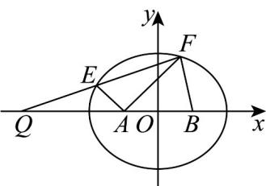
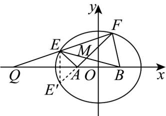

> [!faq]- 《专题02 双曲线的四大常考题型（高效培优专项训练）》官方解析
>
> > [!success]- **【答案】** (1) $\frac{x^{2}}{4}+\frac{y^{2}}{3}=1$ (2)① 证明见解析；②证明见解析
>
> > [!note]- **【解析】**
> > （1）由 $\left|AB\right|=2$ ， $\left|PA\right|+\left|PB\right|=4>\left|AB\right|$ ，
> >
> > 所以点 P 在以 A，B 为焦点，4 为长轴长的椭圆上，
> >
> > 设椭圆方程为 $\frac{x^{2}}{a^{2}}+\frac{y^{2}}{b^{2}}=1(a>b>0)$ ，焦距为 2c，
> >
> > 则 $c = 1$ ， $a = 2$ ，所以 $b^{2} = a^{2} - c^{2} = 3$
> >
> > 所以 C 的方程为 $\frac{x^{2}}{4} + \frac{y^{2}}{3} = 1$ .
> >
> > (2) ①由 $Q(-4,0)$ ，直线 $l$ 的斜率存在且不为 0。
> >
> > 设直线 $l$ 的方程为 $x = my - 4$ ， $E(x_{1},y_{1})$ ， $F(x_{2},y_{2})$ ， $x_{1} < 0$
> >
> > 联立 $\left\{ \begin{array}{l} \frac{x^2}{4} + \frac{y^2}{3} = 1 \\ x = my - 4 \end{array} \right.$ ，得 $\left(3m^2 + 4\right)y^2 - 24my + 36 = 0$
> >
> > 则 $\Delta = 144(m^2 - 4) > 0$ ， $y_1 + y_2 = \frac{24m}{3m^2 + 4}$ ， $y_1y_2 = \frac{36}{3m^2 + 4}$ ，
> >
> > 所以 $my_{1}y_{2} = \frac{3}{2}\left(y_{1} + y_{2}\right)$
> >
> > 又 $A(-1,0)$ ，所以 $k_{1} = \frac{y_{1}}{x_{1} + 1}$ ， $k_{2} = \frac{y_{2}}{x_{2} + 1}$
> >
> > 所以 $\frac{k_1}{k_2} = \frac{y_1(x_2 + 1)}{y_2(x_1 + 1)} = \frac{y_1(my_2 - 3)}{y_2(my_1 - 3)} = \frac{my_1y_2 - 3y_1}{my_1y_2 - 3y_2}$
> >
> > $$
> > = \frac {\frac {3}{2} \left(y _ {1} + y _ {2}\right) - 3 y _ {1}}{\frac {3}{2} \left(y _ {1} + y _ {2}\right) - 3 y _ {2}} = \frac {- \frac {3}{2} y _ {1} + \frac {3}{2} y _ {2}}{\frac {3}{2} y _ {1} - \frac {3}{2} y _ {2}} = - 1.
> > $$
> >
> > 
> > - **②**：由①知 $\frac{k_{1}}{k_{2}}=-1$ ，所以 $k_{1}+k_{2}=0$
> >
> > 作 $E$ 关于 $x$ 轴的对称点 $E^{\prime}(x_{1}, - y_{1})$ ，则 $F$ ，A， $E^{\prime}$ 三点共线．
> >
> > 又 $A(-1,0)$ ， $B(1,0)$ ，设 $M(x_{0},y_{0})$ .
> >
> > 则直线 $_{AF}$ 方程即为直线 $_{AE'}$ 方程 $x=\frac{-x_{1}-1}{y_{1}}y-1$ .
> >
> > 又直线 $_{BE}$ 方程为 $x=\frac{x_{1}-1}{y_{1}}y+1$ ，
> >
> > 作差，得 $y_{0} = -\frac{y_{1}}{x_{1}}$
> >
> > 所以 $x_{0}=\frac{-x_{1}-1}{y_{1}}\cdot\left(-\frac{y_{1}}{x_{1}}\right)-1=\frac{1}{x_{1}}$
> >
> > 所以 $x_{1}=\frac{1}{x_{0}}$ ， $y_{1}=-\frac{y_{0}}{x_{0}}$ ，
> >
> > 由 $x_{1} < 0$ ，得 $x_0 < 0$
> >
> > 又因为 $\frac{x_1^2}{4} +\frac{y_1^2}{3} = 1$ ，所以 $\frac{\left(\frac{1}{x_0}\right)^2}{4} +\frac{\left(-\frac{y_0}{x_0}\right)^2}{3} = 1$
> >
> > 即 $x_0^2 -\frac{y_0^2}{3} = \frac{1}{4}$ ，即 $\frac{x_0^2}{\frac{1}{4}} -\frac{y_0^2}{\frac{3}{4}} = 1(x_0 <   0)$
> >
> > 所以点 M 在以 A，B 为焦点，1 为实轴长的双曲线的左支（椭圆内部）上运动，所以 $\left|MA\right| - \left|MB\right| = -1$
> >
> > 
