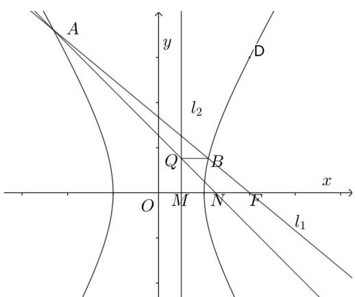

> [!faq]- 《专题02 双曲线的四大常考题型（高效培优专项训练）》官方解析
>
> > [!success]- **【答案】** (1) $x^{2}-\frac{y^{2}}{3}=1$ (2)证明见解析
>
> > [!note]- **【解析】**
> > （1）由题意可得 $\left\{ \begin{array}{l}a^2 +b^2 = 4,\\ \frac{4}{a^2} -\frac{9}{b^2} = 1, \end{array} \right.$ ，解得 $\left\{ \begin{array}{l}a^2 = 1,\\ b^2 = 3, \end{array} \right.$
> >
> > 所以 $C$ 的方程为 $x^{2} - \frac{y^{2}}{3} = 1$
> >
> > (2) 依题意， $F(2,0)$ ，直线 $l_{1}$ 的斜率必存在，可设 $l_{1}:y=k(x-2),A(x_{1},y_{1}),B(x_{2},y_{2})$
> >
> > $\left\{ \begin{array}{l} x^{2} - \frac{y^{2}}{3} = 1, \\ y = k(x - 2), \end{array} \right.$ 可得 $(3 - k^{2})x^{2} + 4k^{2}x - 4k^{2} - 3 = 0$
> >
> > $$
> > \Delta = 1 6 k ^ {4} + 4 (3 - k ^ {2}) (4 k ^ {2} + 3) = 3 6 (k ^ {2} + 1) > 0
> > $$
> >
> > 则 $x_{1} + x_{2} = -\frac{4k^{2}}{3 - k^{2}}, x_{1}x_{2} = -\frac{4k^{2} + 3}{3 - k^{2}}$
> >
> > $M\left(\frac{1}{2},0\right),N\left(\frac{5}{4},0\right)$ ，直线 $AN:y = \frac{y_1}{x_1 - \frac{5}{4}}\cdot \left(x - \frac{5}{4}\right)$
> >
> > 令 $x = \frac{1}{2}$ ，得 $y = -\frac{3y_1}{4x_1 - 5}$ ，则 $Q\left(\frac{1}{2}, - \frac{3y_1}{4x_1 - 5}\right)$
> >
> > $$
> > y _ {2} - \left(- \frac {3 y _ {1}}{4 x _ {1} - 5}\right) = \frac {y _ {2} (4 x _ {1} - 5) + 3 y _ {1}}{4 x _ {1} - 5} = \frac {k (x _ {2} - 2) (4 x _ {1} - 5) + 3 k (x _ {1} - 2)}{4 x _ {1} - 5}
> > $$
> >
> > $$
> > = \frac {k \left[ 4 x _ {1} x _ {2} + 4 - 5 \left(x _ {1} + x _ {2}\right) \right]}{4 x _ {1} - 5} = \frac {k}{4 x _ {1} - 5} \left[ 4 \left(- \frac {4 k ^ {2} + 3}{3 - k ^ {2}}\right) + 4 - 5 \left(- \frac {4 k ^ {2}}{3 - k ^ {2}}\right) \right]
> > $$
> >
> > $$
> > = \frac {4 k}{4 x _ {1} - 5} \cdot \frac {- 4 k ^ {2} - 3 + 3 - k ^ {2} + 5 k ^ {2}}{3 - k ^ {2}} = 0
> > $$
> >
> > 所以 $y_{2}=-\frac{3y_{1}}{4x_{1}-5}$ ，即 $BQ \parallel x$ 轴。
> >
> > 
