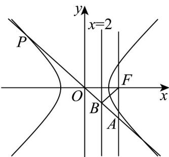

> [!faq]- 《专题02 双曲线的四大常考题型（高效培优专项训练）》官方解析
>
> > [!success]- **【答案】** (1) $\frac{x^{2}}{2}-\frac{y^{2}}{2}=1$ (2)① 证明见解析，定值为 $\sqrt{2}$ ；② 答案见解析
>
> > [!note]- **【解析】**
> > （1）设 $C$ 上任一点 $(x, y)$ ，而直线 $y = \frac{3}{2} x, y = \frac{2}{3} x$ 转化为 $3x - 2y = 0, 2x - 3y = 0$ .
> >
> > 根据点到直线的距离公式可得：
> >
> > $$
> > d _ {1} ^ {2} = \frac {(3 x - 2 y) ^ {2}}{9 + 4}, d _ {2} ^ {2} = \frac {(2 x - 3 y) ^ {2}}{4 + 9}.
> > $$
> >
> > 根据题意 $d_1^2 - d_2^2 = \frac{(3x - 2y)^2}{9 + 4} - \frac{(2x - 3y)^2}{4 + 9} = \frac{10}{13}$ ，化简得 $5x^2 - 5y^2 = 10$ ，
> >
> > 即 $\frac{x^2}{2} -\frac{y^2}{2} = 1.$
> >
> > (2) 由 (1) 可知 $a = b = \sqrt{2}$ ，所以 $c = \sqrt{2 + 2} = 2$ ，所以点 $F(2,0)$ .
> > - **①**：证明：依题意可知直线 m 的方程为 x = 2.
> >
> > 因为直线 $l: \frac{x_{0}x}{2}-\frac{y_{0}y}{2}=1$ 与直线 m 交于点 A，所以将 x=2 代入直线 l 方程可得到点 A 的坐标为 $A\left(2, \frac{2(x_{0}-1)}{y_{0}}\right)$ .
> >
> > 因为线 $l: \frac{x_0x}{2} - \frac{y_0y}{2} = 1$ 与直线 $x = 1$ 交于点 $B$ ，所以将 $x = 1$ 代入直线 $l$ 方程
> >
> > 可得到点 $_{B}$ 的坐标为 $B\left(1,\frac{x_{0}-2}{y_{0}}\right)$ .
> >
> > 所以 $\left|AF\right|=\left|\frac{2(x_{0}-1)}{y_{0}}\right|$ ， $\left|BF\right|=\sqrt{1+\left(\frac{x_{0}-2}{y_{0}}\right)^{2}}$ ，
> >
> > 所以 $\frac{|AF|}{|BF|} = \frac{\left|\frac{2(x_0 - 1)}{y_0}\right|}{\sqrt{1 + \left(\frac{x_0 - 2}{y_0}\right)^2}} = \sqrt{\frac{4(x_0 - 1)^2}{(x_0 - 2)^2 + y_0^2}}.$
> >
> > 因为直线 l 过点 P，所以 $x_{0}^{2}-y_{0}^{2}=2$ ，即 $y_{0}^{2}=x_{0}^{2}-2$ 。
> >
> > 所以 $\frac{|AF|}{|BF|}=\sqrt{\frac{4(x_{0}-1)^{2}}{(x_{0}-2)^{2}+x_{0}^{2}-2}}=\sqrt{\frac{4x_{0}^{2}-8x_{0}+4}{2x_{0}^{2}-4x_{0}+2}}=\sqrt{2}$ 为定值，且定值为 $\sqrt{2}$
> > - **②**：设点 $F(2,0)$ 关于直线 $l: x_0x - y_0y = 2$ 的对称点 $M(x_1, y_1)$
> >
> > 当 $y_0 = 0$ 时， $l: x = \pm \sqrt{2}$ ，此时 $M$ 的轨迹为点 $\left(\pm 2\sqrt{2} - 2, 0\right)$ .
> >
> > 当 $y_0 \neq 0$ 时，设 $l: y = \frac{x_0}{y_0} x - \frac{2}{y_0}$ ，
> >
> > 则 $\left\{ \begin{array}{l} \frac{y_1}{x_1 - 2} \cdot \frac{x_0}{y_0} = -1 \\ \frac{y_1}{2} = \frac{x_0}{y_0} \cdot \frac{x_1 + 2}{2} - \frac{2}{y_0} \end{array} \right.$ ，解得 $\left\{ \begin{array}{l} x_0 = \frac{4(2 - x_1)}{4 - x_1^2 - y_1^2} \\ y_0 = \frac{4y_1}{4 - x_1^2 - y_1^2} \end{array} \right.$
> >
> > 因为点 $P(x_{0},y_{0})$ 在双曲线 $x^{2}-y^{2}=2$ 上，
> >
> > 所以 $\left[\frac{4(2 - x_1)}{4 - x_1^2 - y_1^2}\right]^2 -\left(\frac{4y_1}{4 - x_1^2 - y_1^2}\right)^2 = 2$ ，即 $8(2 - x_1)^2 -8y_1^2 = (4 - x_1^2 -y_1^2)^2$
> >
> > 化简得： $\left(x_{1}^{2} + y_{1}^{2}\right)^{2} = \left(4x_{1} - 4\right)^{2}$
> >
> > 所以 $x_{1}^{2} + y_{1}^{2} = 4x_{1} - 4$ ，即 $(x_{1} - 2)^{2} + y_{1}^{2} = 0$ ，M 点轨迹与 $F(2,0)$ 重合，不合题意；
> >
> > 或 $x_{1}^{2} + y_{1}^{2} + 4x_{1} - 4 = 0$ ，即 $(x_{1} + 2)^{2} + y_{1}^{2} = 8$
> >
> > 所以 M 点轨迹为以 $(-2,0)$ 为圆心，半径为 $2\sqrt{2}$ 的圆，此时 $(\pm2\sqrt{2}-2,0)$ 也在圆上.
> >
> > 
