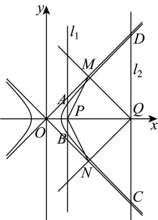
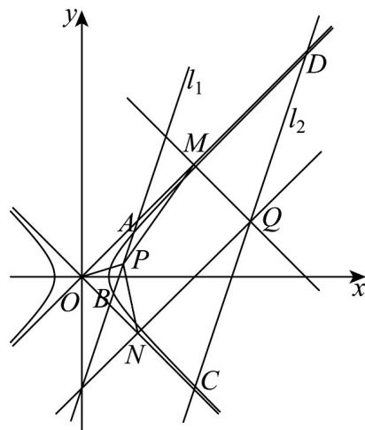
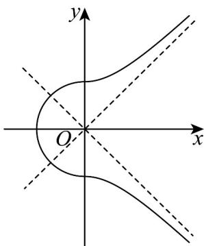

> [!faq]- 《专题02 双曲线的四大常考题型（高效培优专项训练）》官方解析
>
> > [!success]- **【答案】** (1) $\frac{x^{2}}{2}-\frac{y^{2}}{2}=1$ (2) $5+\frac{3}{2}\sqrt{2}$ (3) $\left[24,+\infty\right)$
>
> > [!note]- **【解析】**
> > （1）由题意可得 $A_{1}(-a,0)$ ， $A_{2}(a,0)$
> >
> > 则直线 $A_{1}E$ 的斜率 $k_{1} = \frac{1}{\sqrt{3} + a}$ ，直线 $A_{2}E$ 的斜率 $k_{2} = \frac{1}{\sqrt{3} - a}$
> >
> > 因为直线 $A_{1}E$ ， $A_{2}E$ 的斜率之积为1，所以 $k_{1}\cdot k_{2} = \frac{1}{\sqrt{3} + a}\cdot \frac{1}{\sqrt{3} - a} = 1$ ，解得 $a^2 = 2$
> >
> > 因为点 $E\left(\sqrt{3},1\right)$ 在双曲线上，所以 $\frac{\left(\sqrt{3}\right)^2}{2} -\frac{1^2}{b^2} = 1$ ，解得 $b^{2} = 2$
> >
> > 故双曲线 $\Gamma$ 的标准方程为 $\frac{x^2}{2} -\frac{y^2}{2} = 1$
> >
> > (2) 设点 G 所在圆的圆心为 H，则 $H(2,3)$
> >
> > 由双曲线的定义可得 $\left|KF_2\right| - \left|KF_1\right| = 2a = 2\sqrt{2}$ ， $\left|KF_2\right| = \left|KF_1\right| + 2\sqrt{2}$
> >
> > 所以 $\left|KF_2\right| + \left|KG\right| = \left|KF_1\right| + \left|KG\right| + 2\sqrt{2}$ ，因为 $\left|KF_1\right| + \left|KG\right|$ $|GF_{1}|$
> >
> > 所以当 $K, G$ ， $F_{1}$ 三点共线且 $K$ 位于点 $G$ 和 $F_{1}$ 之间时， $\left|KF_{1}\right| + \left|KG\right|$ 取得最小值 $\left|F_{1}G\right|$
> >
> > 又因为 $\left|F_{1}G\right|$ 的最小值为 $\left|HF_{1}\right|-r=5-\frac{\sqrt{2}}{2}$ ，所以 $\left|KF_{2}\right|+\left|KG\right|$ 的最小值是 $5-\frac{\sqrt{2}}{2}+2\sqrt{2}=5+\frac{3}{2}\sqrt{2}$
> >
> > (3) 由题意可知直线 $l_{1}$ 和直线 $l_{2}$ 斜率若存在，则斜率大于 $^{1}$ 或小于 $-1$ ，且双曲线 $\Gamma$ 的渐近线方程为 $x \pm y = 0$ ，故可分别设直线 $l_{1}$ 和直线 $l_{2}$ 的方程为 $x = my + 2$ 和 $x = my + 8$ ，且 $0 \leq m^{2} < 1$ ，
> >
> > 
> >
> > 
> >
> > $$
> > \left\lceil x = m y + 2 \left. \right.
> > $$
> >
> > 联立 $\left\{\frac{x^{2}}{2}-\frac{y^{2}}{2}=1\right.$ ，得 $(m^{2}-1)y^{2}+4my+2=0$ ，则 $\Delta=(4m)^{2}-4(m^{2}-1)\times2=8m^{2}+8>0$ ，
> >
> > 设 $A\left(x_{1},y_{1}\right)$ ， $B\left(x_{2},y_{2}\right)$ ，则 $y_{1} + y_{2} = -\frac{4m}{m^{2} - 1}$ ， $y_{1}y_{2} = \frac{2}{m^{2} - 1}$
> >
> > 故 $x_{1} + x_{2} = my_{1} + 2 + my_{2} + 2 = m(y_{1} + y_{2}) + 4 = m\left(-\frac{4m}{m^{2} - 1}\right) + 4 = -\frac{4}{m^{2} - 1}$
> >
> > 因为 P 是 AB 的中点，所以 $P\left(\frac{x_{1}+x_{2}}{2},\frac{y_{1}+y_{2}}{2}\right)$ ，即 $P\left(-\frac{2}{m^{2}-1},-\frac{2m}{m^{2}-1}\right)$ ，
> >
> > 同理可得 $Q\left(-\frac{8}{m^2 - 1}, - \frac{8m}{m^2 - 1}\right)$
> >
> > 所以 P 到双曲线 的两渐近线的距离分别为 $d_{1}=\frac{\left|-\frac{2}{m^{2}-1}+\frac{2m}{m^{2}-1}\right|}{\sqrt{2}}=\frac{\left|\frac{2(m-1)}{m^{2}-1}\right|}{\sqrt{2}}=\frac{\sqrt{2}}{\left|m+1\right|}$
> >
> > $$
> > d _ {2} = \frac {\left| - \frac {2}{m ^ {2} - 1} - \frac {2 m}{m ^ {2} - 1} \right|}{\sqrt {2}} = \frac {\left| \frac {2 (m + 1)}{m ^ {2} - 1} \right|}{\sqrt {2}} = \frac {\sqrt {2}}{| m - 1 |},
> > $$
> >
> > Q 到双曲线 的两渐近线的距离分别为 $\left|QM\right|=\frac{\left|-\frac{8}{m^{2}-1}+\frac{8m}{m^{2}-1}\right|}{\sqrt{2}}=\frac{\left|\frac{8(m-1)}{m^{2}-1}\right|}{\sqrt{2}}=\frac{4\sqrt{2}}{\left|m+1\right|}$
> >
> > $$
> > \left| Q N \right| = \frac {\left| - \frac {8}{m ^ {2} - 1} - \frac {8 m}{m ^ {2} - 1} \right|}{\sqrt {2}} = \frac {\left| \frac {8 (m + 1)}{m ^ {2} - 1} \right|}{\sqrt {2}} = \frac {4 \sqrt {2}}{| m - 1 |}
> > $$
> >
> > 由上知双曲线 $\Gamma$ 的两渐近线垂直，故四边形 $OMQN$ 是矩形，连接 $OP$
> >
> > 则四边形 $PMQN$ 面积为 $S_{PMQN} = S_{\text{矩形}OMQN} - S_{\triangle OMP} - S_{\triangle ONP} = |QM||QN| - \frac{1}{2}|OM|d_1 - \frac{1}{2}|ON|d_2$
> >
> > $$
> > = | Q M | | Q N | - \frac {1}{2} | Q N | d _ {1} - \frac {1}{2} | Q M | d _ {2}
> > $$
> >
> > $$
> > = \frac {4 \sqrt {2}}{| m + 1 |} \times \frac {4 \sqrt {2}}{| m - 1 |} - \frac {1}{2} \times \frac {4 \sqrt {2}}{| m - 1 |} \times \frac {\sqrt {2}}{| m + 1 |} - \frac {1}{2} \times \frac {4 \sqrt {2}}{| m + 1 |} \times \frac {\sqrt {2}}{| m - 1 |} = \frac {2 4}{| m ^ {2} - 1 |},
> > $$
> >
> > 因为 $0 \leq m^2 < 1$ ，所以 $\left|m^2 - 1\right| \in (0,1]$ ，所以 $S_{\text{四边形}PMQN} = \frac{24}{\left|m^2 - 1\right|} \in [24, +\infty)$ ，
> >
> > 所以四边形 PMQN 面积的取值范围为 $\left[24, +\infty\right)$
> >
> > 34. 我们把等轴双曲线的一部分 $E_{1}: \frac{y^{2}}{a^{2}} - \frac{x^{2}}{a^{2}} = 1 (a > 0, x > 0)$ 与半圆 $E_{2}: x^{2} + y^{2} = a^{2} (x \leq 0)$ 合成的曲线称作“羽毛球型”曲线 $E$ ，其中 $E_{1}$ 是焦距为8的等轴双曲线的一部分，如图所示：
> >
> > 
> >
> > (1)求 $E_{1}$ 与 $E_{2}$ 的方程；
> >
> > (2)已知 $M(m,0)(m > 0),N$ 为“羽毛球型”曲线 $E$ 上的动点，求线段 $MN$ 长度的最小值；
> >
> > (3)若直线 $l:y = k\left(x + 2\sqrt{2}\right)$ 与“羽毛球型”曲线 $E$ 有3个公共点，求 $k$ 的取值范围
> >
> > 【答案】(1) $\frac{y^{2}}{8}-\frac{x^{2}}{8}=1(x>0)$ ， $x^{2}+y^{2}=8(x\leq0)$
> >
> > (2) $\frac{\sqrt{2m^{2}+32}}{2}$
> >
> > (3) $\left(-1,-\frac{\sqrt{2}}{2}\right)\cup\left(\frac{\sqrt{2}}{2},1\right)$
> >
> > 【详解】（1）因为 $E_{1}$ 是焦距为8的等轴双曲线的一部分，
> >
> > 所以 $a^2 + a^2 = c^2 = 4^2$ ，解得 $a = 2\sqrt{2}$ ，
> >
> > 所以 $E_{1}$ 的方程为 $\frac{y^2}{8} -\frac{x^2}{8} = 1(x > 0),E_2$ 的方程为 $x^{2} + y^{2} = 8(x\leq 0)\cdot$
> >
> > (2) 设 $N(x, y)$ ，当 $x \leq 0$ 时， $\left|MN\right| = \sqrt{(x - m)^2 + y^2} = \sqrt{x^2 + y^2 - 2mx + m^2} = \sqrt{8 - 2mx + m^2}$
> >
> > 因为 $-2\sqrt{2} \leq x\langle 0, m \rangle 0$ ，所以当 $x = 0$ 时， $|MN|_{\min} = \sqrt{8 + m^2}$ ；
> >
> > 当 $x > 0$ 时， $\left|MN\right| = \sqrt{(x - m)^2 + y^2} = \sqrt{x^2 + y^2 - 2mx + m^2} = \sqrt{2x^2 - 2mx + m^2 + 8} = \sqrt{2\left(x - \frac{m}{2}\right)^2 + \frac{m^2}{2} + 8}$
> >
> > 当 $x = \frac{m}{2}$ 时， $|MN|_{\min} = \sqrt{\frac{m^2}{2} + 8} = \frac{\sqrt{2m^2 + 32}}{2}$ .
> >
> > 又 $\sqrt{8 + m^2} >\frac{\sqrt{2m^2 + 32}}{2}$ ，所以 $|MN|_{\mathrm{min}} = \frac{\sqrt{2m^2 + 32}}{2}$
> >
> > 即线段 MN 长度的最小值为 $\frac{\sqrt{2m^{2}+32}}{2}$ .
> >
> > （3）易知直线 $l:y = k(x + 2\sqrt{2})$ 与“羽毛球型”曲线 $E$ 有公共点 $A(-2\sqrt{2},0)$
> >
> > 联立 $\left\{ \begin{array}{l} \frac{y^2}{8} - \frac{x^2}{8} = 1 \\ x^2 + y^2 = 8 \end{array} \right.$ ，解得 $\left\{ \begin{array}{l} x = 0 \\ y = -2\sqrt{2} \end{array} \right.$ ，或 $\left\{ \begin{array}{l} x = 0 \\ y = 2\sqrt{2} \end{array} \right.$ ，
> >
> > 设 $B(0,2\sqrt{2}), C(0,-2\sqrt{2})$ .
> > - **①**：当 $k = 1$ 时，又 $k_{AB} = \frac{2\sqrt{2} - 0}{0 + 2\sqrt{2}} = 1$ ，所以直线 $l$ 与 $E_{2}$ 有2个公共点，
> >
> > 又 $E_{1}$ 的渐近线为 $y = \pm x$ ，且 $E_{1}$ 中 x > 0，所以 l 与 $E_{1}$ 没有公共点，
> >
> > 即 $k = 1$ 时，直线 $l$ 与“羽毛球型”曲线 $E$ 有 $2$ 个公共点，不符合题意
> > - **②**：当 $0 < k < 1$ 时，可知 $k < k_{AB}$ ，则直线 $l$ 与 $E_{2}$ 只有1个公共点，
> >
> > 联立 $\left\{ \begin{array}{l} \frac{y^2}{8} - \frac{x^2}{8} = 1, \\ y = k(x + 2\sqrt{2}), \quad \text{得} (k^2 - 1)x^2 + 4\sqrt{2}k^2x + 8k^2 - 8 = 0 \end{array} \right.$ ，此时 $1 - k^2 \neq 0$
> >
> > 若 $\Delta = (4\sqrt{2} k^2)^2 - 4(k^2 - 1)(8k^2 - 8) = 0$ ，解得 $k = \pm \frac{\sqrt{2}}{2}$
> >
> > 又 $0 < k < 1$ ，所以 $k = \frac{\sqrt{2}}{2}$ ，此时 $l$ 与 $E_{1}$ 相切于第一象限，只有1个公共点；
> >
> > 若 $\Delta = (4\sqrt{2} k^2)^2 - 4(k^2 - 1)(8k^2 - 8) > 0$ ，解得 $k < -\frac{\sqrt{2}}{2}$ 或 $k > \frac{\sqrt{2}}{2}$
> >
> > 又 $0 < k < 1$ ，所以 $\frac{\sqrt{2}}{2} < k < 1$ ，此时 $l$ 与 $E_{1}$ 在第一象限有 $^2$ 个公共点
> >
> > 所以 $k=\frac{\sqrt{2}}{2}$ 时，直线 l 与“羽毛球型”曲线 E 有 2 个公共点，不符合题意， $\frac{\sqrt{2}}{2}<k<1$ 时，直线 l 与“羽毛球型”曲线 E 有 3 个公共点，符合题意.
> > - **③**：当 k=0 时，易知直线 l 与 $E_{1}$ 没有公共点，与 $E_{2}$ 只有 1 个公共点，所以直线 l 与“羽毛球型”曲线 E 有 1 个公共点，不符合题意。
> >
> > 根据“羽毛球型”曲线 $E$ 的图象关于 $x$ 轴对称，可知当 $-1 < k < -\frac{\sqrt{2}}{2}$ 时，直线 $l$ 与“羽毛球型”曲线 $E$ 有3个公共点·
> >
> > 综上所述，实数 $k$ 的取值范围是 $\left(-1, -\frac{\sqrt{2}}{2}\right) \cup \left(\frac{\sqrt{2}}{2}, 1\right)$ .
