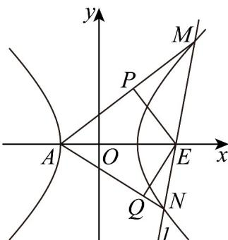

> [!faq]- 《专题02 双曲线的四大常考题型（高效培优专项训练）》官方解析
>
> > [!success]- **【答案】** (1) $x^{2}-\frac{y^{2}}{4}=1$ (2) (i) 证明见解析；(ii) $\frac{243}{49}$
>
> > [!note]- **【解析】**
> > （1）由题意知 $|F_{1}F_{2}| = 2\sqrt{5}$ ，可得 $2c = 2\sqrt{5}$ ，解得 $c = \sqrt{5}$ ，
> >
> > 因为点 $\left(\sqrt{5},0\right)$ 到直线 $bx \pm ay = 0$ 的距离为 $^2$ ，可得 $\frac{\sqrt{5}b}{\sqrt{a^2 + b^2}} = 2$
> >
> > 又因为 $a^2 + b^2 = 5$ ，可得 $a = 1, b = 2$ ，所以 $C$ 的方程为 $x^2 - \frac{y^2}{4} = 1$ 。
> >
> > (2) (i) 由 (1) 知双曲线的左顶点为 $A(-1,0)$ ,
> >
> > 设 $M\left(x_{1},y_{1}\right)$ ， $N\left(x_{2},y_{2}\right)$ ，由题意知直线 $l$ 斜率不为0，设直线 $l:x = my + 2$
> >
> > 联立方程组 $\left\{ \begin{array}{l} x = my + 2 \\ x^2 - \frac{y^2}{4} = 1 \end{array} \right.$ ，整理得 $\left(4m^2 - 1\right)y^2 + 16my + 12 = 0 \left(m \neq \pm \frac{1}{2}\right)$ ，
> >
> > 所以 $\Delta = 256m^2 - 48(4m^2 - 1) = 16(4m^2 + 3) > 0$ ，且 $y_1 + y_2 = \frac{-16m}{4m^2 - 1}$ ， $y_1y_2 = \frac{12m}{4m^2 - 1}$ ，
> >
> > $$
> > k _ {A M} k _ {A N} = \frac {y _ {1} y _ {2}}{(x _ {1} + 1) (x _ {2} + 1)} = \frac {y _ {1} y _ {2}}{(m y _ {1} + 3) (m y _ {2} + 3)} = \frac {y _ {1} y _ {2}}{m ^ {2} y _ {1} y _ {2} + 3 m (y _ {1} + y _ {2}) + 9}
> > $$
> >
> > $= \frac{\frac{12}{m^2 - 1}}{\frac{12m^2}{4m^2 - 1} + 3m\left(\frac{-16m}{4m^2 - 1}\right) + 9} = -\frac{4}{3}$ ，故直线 $AM, AN$ 的斜率之积为定值 $-\frac{4}{3}$
> >
> > （ii）由题意，直线 $AP$ 斜率存在，且不为0，设直线 $AP:y = k(x + 1)$ ，其中 $k\neq 0$
> >
> > 则直线 $PE$ 的方程为 $y = -\frac{1}{k} (x - 2)$
> >
> > 联立方程组 $\left\{\begin{aligned}y&=k(x+1)\\ y&=-\frac{1}{k}(x-2)\end{aligned}\right.$ ，解得 $y_{P}=\frac{3k}{k^{2}+1}$ ，
> >
> > 用 $-\frac{4}{3k}$ 替换上式中的 $k$ 得点 $Q$ 的纵坐标 $y_{Q} = \frac{-36k}{9k^{2} + 16}$
> >
> > 则 $S_{1}S_{2} = \frac{9}{4}\left|y_{P}y_{Q}\right| = \frac{243k^{2}}{(k^{2} + 1)(9k^{2} + 16)} = \frac{243}{9k^{2} + \frac{16}{k^{2}} + 25}$
> >
> > 因为 $9k^{2} + \frac{16}{k^{2}}\geq 2\sqrt{9k^{2}\times\frac{16}{k^{2}}} = 24$ ，当且仅当 $k = \pm \frac{2\sqrt{3}}{3}$ 时取等号，所以 $S_{1}S_{2}\leq \frac{243}{49}$ 所以 $S_{1}S_{2}$ 的最大值为 $\frac{243}{49}$ ：
> >
> > 
