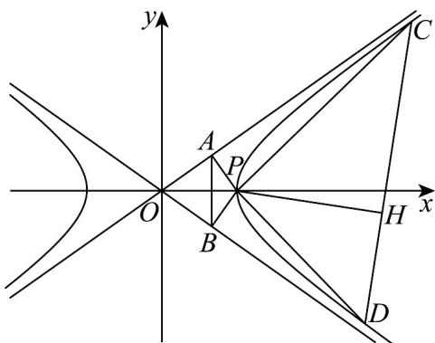

> [!faq]- 《专题02 双曲线的四大常考题型（高效培优专项训练）》官方解析
>
> > [!success]- **【答案】** (1) $\frac{4\sqrt{2}}{9}$ ; (2)证明见解析，定圆的方程为 $(x - 4)^{2} + y^{2} = 4$
>
> > [!note]- **【解析】**
> > （1）两渐近线 $OA, OB$ 的方程分别为 $y = \pm \frac{\sqrt{2}}{2} x$ ，即 $x \pm \sqrt{2} y = 0$ 。
> >
> > 则 $|PA| = \frac{2}{\sqrt{3}}, |PB| = \frac{2}{\sqrt{3}}$
> >
> > 设 的倾斜角为，则 $\tan \theta = \frac{\frac{2}{\sqrt{3}}}{\sqrt{4 - \left(\frac{2}{\sqrt{3}}\right)^2}} = \frac{\sqrt{2}}{2}$ $OA$ $\theta$
> >
> > $$
> > \sin \angle A P B = \sin (\pi - 2 \theta) = \sin 2 \theta = 2 \sin \theta \cos \theta = \frac {2 \sin \theta \cos \theta}{\sin^ {2} \theta + \cos^ {2} \theta} = \frac {2 \tan \theta}{\tan^ {2} \theta + 1} = \frac {2 \sqrt {2}}{3}
> > $$
> >
> > 从而 $S_{\triangle PAB} = \frac{1}{2}|PA|\cdot |PB|\sin \angle APB = \frac{1}{2}\times \frac{4}{3}\times \frac{2\sqrt{2}}{3} = \frac{4\sqrt{2}}{9}$
> >
> > (2) ①若直线 CD 的斜率存在时，设 $CD: y = kx + m$ ，联立 $x^{2} - 2y^{2} = 4$ ，消 y 得：
> >
> > 设，设，则 $\left(1 - 2k^2\right)x^2 -4kmx - 2(m^2 +2) = 0$ $C(x_{1},y_{1}),D(x_{2},y_{2})$
> >
> > 由 $PC \perp PD \Leftrightarrow PC \cdot PD = 0 \Leftrightarrow (x_1 - 2)(x_2 - 2) + y_1y_2 = 0$
> >
> > 即 $x_{1}x_{2} - 2(x_{1} + x_{2}) + 4 + (kx_{1} + m)(kx_{2} + m) = 0$
> >
> > 即 $\left(k^{2}+1\right)x_{1}x_{2}+\left(km-2\right)\left(x_{1}+x_{2}\right)+m^{2}+4=0$
> >
> > 即 $\left(k^{2} + 1\right)\cdot 2\left(m^{2} + 2\right) + (km - 2)(-4km) + \left(m^{2} + 4\right)\left(2k^{2} - 1\right) = 0$
> >
> > 即 $12k^{2} + 8mk + m^{2} = 0$
> >
> > 即 $(2k+m)(6k+m)=0$ ，
> >
> > 解得 $m = -2k$ 或 $m = -6k$
> >
> > ∴ 直线 CD 的方程为： $y = k(x - 2)$ （不符，舍）或 $y = k(x - 6)$
> >
> > ∴直线 CD 过定点 $Q(6,0)$
> > - **②**：若直线 $CD$ 的斜率不存在时，设 $CD: x = m$ ，联立 $x^{2} - 2y^{2} = 4$
> >
> > 得 $\left\{ \begin{array}{c}x = m\\ y = \frac{\sqrt{m^2 - 4}}{\sqrt{2}} \end{array} \right.$ 或 $\left\{ \begin{array}{c}x = m\\ y = -\frac{\sqrt{m^2 - 4}}{\sqrt{2}} \end{array} \right.,$
> >
> > 即 $C\left(m,\frac{\sqrt{m^2 - 4}}{\sqrt{2}}\right),D\left(m, - \frac{\sqrt{m^2 - 4}}{\sqrt{2}}\right)$
> >
> > 由 $\square P C\cdot\square P D=0$ 得 $(m-2)^{2}+\left(\frac{\sqrt{m^{2}-4}}{\sqrt{2}}\right)\left(-\frac{\sqrt{m^{2}-4}}{\sqrt{2}}\right)=0\Leftrightarrow m^{2}-8m+12=0\Leftrightarrow m=6$ 或 $m=2$ （不符，舍去）.
> >
> > ∴直线 CD 的方程为 x = 6 ，此时也过定点 $Q(6,0)$
> >
> > 在 $Rt\triangle PQH$ 中，取 $PQ$ 中点 $R(4,0)$ ，则 $\left|HR\right| = \frac{1}{2}\left|PQ\right| = \frac{1}{2} \times 4 = 2$
> >
> > 故动点 H 在以点 R 为圆心， $^{2}$ 为半径的定圆上，
> >
> > 且此定圆的方程为 $(x - 4)^2 + y^2 = 4$
> >
> > 
