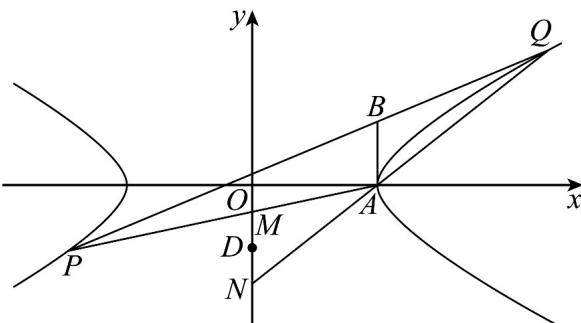

> [!faq]- 《专题02 双曲线的四大常考题型（高效培优专项训练）》官方解析
>
> > [!success]- **【答案】** (1) $E:\frac{x^{2}}{4}-y^{2}=1$ (2)不存在，理由见解析 (3)证明见解析
>
> > [!note]- **【解析】**
> > （1）由题，设双曲线 $E$ 的焦距为 $2c$ ，则 $2c = 2\sqrt{5}$ ，即 $c = \sqrt{5}$
> >
> > 根据双曲线的性质可知，点 $B(2,1)$ 在渐近线 $y = \frac{b}{a} x$ 上，
> >
> > 所以 $\frac{2b}{a} = 1$ ，即 $a = 2b$ ①，
> >
> > 又 $c^2 = a^2 + b^2$ ，所以 $a^2 + b^2 = 5$ ②
> >
> > 又①②解得 $a^{2}=4$ ， $b^{2}=1$
> >
> > 所以 E 的标准方程为 $E: \frac{x^{2}}{4} - y^{2} = 1$
> >
> > ## (2) 不存在，理由如下：
> >
> > 假设存在直线 $l$ ，使得 $\triangle APB$ 与 $\triangle ABQ$ 的面积相等，
> >
> > 则点 $B$ 为 $PQ$ 的中点，设 $P(x_{1},y_{1})$ ， $Q(x_{2},y_{2})$ ，代入 $E$ 的方程得： $\frac{x_1^2}{4} - y_1^2 = 1$ ， $\frac{x_2^2}{4} - y_2^2 = 1$
> >
> > 两式作差得 $\left(x_{1}+x_{2}\right)\left(x_{1}-x_{2}\right)=4\left(y_{1}+y_{2}\right)\left(y_{1}-y_{2}\right)$
> >
> > 因为点 $B(2,1)$ 为 PQ 的中点，所以 $(x_{1}+x_{2})=4$ ， $y_{1}+y_{2}=2$ ，
> >
> > 故 $\frac{y_1 - y_2}{x_1 - x_2} = \frac{1}{2}$ ，即直线 $l$ 的斜率为 $\frac{1}{2}$
> >
> > 故直线 $l: y - 1 = \frac{1}{2}(x - 2)$ ，即 $l: y = \frac{1}{2}x$ ，
> >
> > 此时，直线 l 与 E 的渐近线重合，与 E 没有交点，与已知矛盾，
> >
> > 所以不存在直线 $l$ ，使得 $\triangle APB$ 与 $\triangle ABQ$ 的面积相等
> >
> > (3) 证明：由题可知，直线 l 的斜率存在，设直线 $l: y = k(x - 2) + 1$ ，与 E 的方程联立 $\left\{\begin{aligned}y &= k(x - 2) + 1 \\ \frac{x^{2}}{4} &= y^{2} = 1\end{aligned}\right.$ ，得
> >
> > $$
> > \left(4 k ^ {2} - 1\right) x ^ {2} + 8 k (1 - 2 k) x + 1 6 k ^ {2} - 1 6 k + 8 = 0
> > $$
> >
> > 由题， $\left\{\begin{aligned}\Delta&=64k^{2}(1-2k)^{2}-4(4k^{2}-1)(16k^{2}-16k+8)>0\\ 4k^{2}&-1\neq0\end{aligned}\right.$ ，得 $k<\frac{1}{2}$ ，且 $k\neq-\frac{1}{2}$ ，
> >
> > 设 $P\left(x_{1},y_{1}\right)$ ， $Q\left(x_{2},y_{2}\right)$ ，则 $x_{1} + x_{2} = \frac{8k(2k - 1)}{4k^{2} - 1}$ ， $x_{1}x_{2} = \frac{16k^{2} - 16k + 8}{4k^{2} - 1}$
> >
> > 设 $M(0, y_M)$ ， $N(0, y_N)$ ，又 $A(2, 0)$ ，所以 $AP: y = \frac{y_1}{x_1 - 2}(x - 2)$ ，
> >
> > 令 $x = 0$ 得 $y_{M} = \frac{-2y_{1}}{x_{1} - 2}$ ，同理可得 $y_{N} = \frac{-2y_{2}}{x_{2} - 2}$
> >
> > 故 $y_{M} + y_{N} = \frac{-2y_{1}}{x_{1} - 2} +\frac{-2y_{2}}{x_{2} - 2} = -2\times \frac{x_{1}y_{2} + x_{2}y_{1} - 2(y_{1} + y_{2})}{x_{1}x_{2} - 2(x_{1} + x_{2}) + 4}$
> >
> > 又 $x_{1}y_{2} + x_{2}y_{1} = x_{1}[k(x_{2} - 2) + 1] + x_{2}[k(x_{1} - 2) + 1] = 2kx_{1}x_{2} + (1 - 2k)(x_{1} + x_{2})$
> >
> > $$
> > = 2 k \times \frac {1 6 k ^ {2} - 1 6 k + 8}{4 k ^ {2} - 1} + (1 - 2 k) \times \frac {8 k (2 k - 1)}{4 k ^ {2} - 1} = \frac {8 k}{4 k ^ {2} - 1},
> > $$
> >
> > $y_{1}+y_{2}=k(x_{1}-2)+1+k(x_{2}-2)+1=k(x_{1}+x_{2})-4k+2=\frac{8k^{2}(2k-1)}{4k^{2}-1}-4k+2=\frac{4k-2}{4k^{2}-1}$ ，所以
> >
> > $$
> > y _ {M} + y _ {N} = - 2 \times \frac {\frac {8 k}{4 k ^ {2} - 1} - \frac {8 k - 4}{4 k ^ {2} - 1}}{\frac {1 6 k ^ {2} - 1 6 k + 8}{4 k ^ {2} - 1} - \frac {3 2 k ^ {2} - 1 6 k}{4 k ^ {2} - 1} + 4} = - 2 \times \frac {4}{4} = - 2,
> > $$
> >
> > 所以 MN 的中点为 $D(0, -1)$ ,
> >
> > 因为 $A(2,0)$ ，所以 $\left|AM + AN\right| = 2\left|AD\right| = 2\left|(-2, - 1)\right| = 2\sqrt{5}$
> >
> > 所以 $\left|AM + AN\right|$ 为定值．得证．
> >
> > 另解：设 $M(0,y_M)$ ， $N(0,y_N)$ ，又 $A(2,0)$ ，所以 $AP:y = \frac{y_1}{x_1 - 2} (x - 2)$
> >
> > 令 $x = 0$ 得 $y_{M} = \frac{-2y_{1}}{x_{1} - 2}$ ，同理可得 $y_{N} = \frac{-2y_{2}}{x_{2} - 2}$
> >
> > 双曲线的方程化为： $(x - 2 + 2)^2 -4y^2 = 4$ ，即 $(x - 2)^2 -4y^2 +4(x - 2) = 0$
> >
> > 设直线 $y = k(x - 2) + 1$ ，即 $y - k(x - 2) = 1$
> >
> > 联立得 $(x-2)^{2}-4y^{2}+4(x-2)[y-k(x-2)]=0$ ，
> >
> > 所以 $(1-4k)(x-2)^{2}-4y^{2}+4(x-2)y=0$ ，
> >
> > 等式两边同时除以 $\left(x - 2\right)^{2}$ 得： $4\left(\frac{y}{x - 2}\right)^{2} - \frac{4y}{x - 2} +1 - 4k = 0$
> >
> > 设 $P\left(x_{1},y_{1}\right)$ ， $Q\left(x_{2},y_{2}\right)$ ，易得 $\left(x_1,y_1\right)\left(x_2,y_2\right)$ 满足方程 $4\left(\frac{y}{x - 2}\right)^2 -\frac{4y}{x - 2} +1 - 4k = 0$
> >
> > 则 $\frac{y_1}{x_1 - 2},\frac{y_2}{x_2 - 2}$ 为方程 $4\left(\frac{y}{x - 2}\right)^2 -\frac{4y}{x - 2} +1 - 4k = 0$ 两根，由韦达定理可得
> >
> > $\frac{y_{1}}{x_{1}-2}+\frac{y_{2}}{x_{2}-2}=1$ ，故 $y_{M}+y_{N}=\frac{-2y_{1}}{x_{1}-2}+\frac{-2y_{2}}{x_{2}-2}=-2$
> >
> > 所以 MN 的中点为 $D(0,-1)$ ,
> >
> > 因为 $A(2,0)$ ，所以 $\left|AM + AN\right| = 2\left|AD\right| = 2\left|(-2,-1)\right| = 2\sqrt{5}$
> >
> > 所以 $\left|AM + AN\right|$ 为定值．得证
> >
> > 
