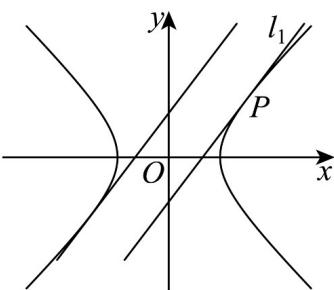
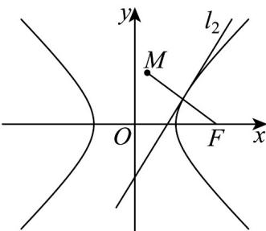

> [!faq]- 《专题02 双曲线的四大常考题型（高效培优专项训练）》官方解析
>
> > [!success]- **【答案】** (1) $x^{2} - y^{2} = 2$ (2) (i) $\frac{2\sqrt{6}}{3}$ ; (ii) 答案见解析
>
> > [!note]- **【解析】**
> > （1）∵双曲线 $C:\frac{x^{2}}{a^{2}}-\frac{y^{2}}{b^{2}}=1(a>0,b>0)$ 的右焦点为 $F(2,0)$ ，点 $P(2,\sqrt{2})$ 在 C 上.
> >
> > ∴ $c = 2$ ，且 $\left\{\begin{aligned}a^{2} + b^{2} &= 4 \\ \frac{4}{a^{2}} - \frac{2}{b^{2}} &= 1\end{aligned}\right.$
> >
> > 解得： $a^2 = b^2 = 2$ ，∴双曲线的方程为 $x^{2} - y^{2} = 2$
> >
> > (2) (i) 法一：
> >
> > 显然过点 $P(2, \sqrt{2})$ 的切线斜率存在，设 $l_{1}$ 的方程为： $y - \sqrt{2} = k(x - 2)$ ，
> >
> > 联立 $\left\{ \begin{array}{l} y = kx - 2k + \sqrt{2}\\ x^2 -y^2 = 2 \end{array} \right.$ ，消 $y$ 得： $\left(1 - k^2\right)x^2 +\left(4k^2 -2\sqrt{2} k\right)x + 4\sqrt{2} k - 4k^2 -4 = 0$
> >
> > 由 $\Delta = 0$ ，得 $k = \sqrt{2}$ ，此时： $l_{1}:y = \sqrt{2} x - \sqrt{2}$
> >
> > 设与 $l_{1}$ 平行且与双曲线左支相切的直线方程为 $y = \sqrt{2} x + m$
> >
> > 联立 $\left\{ \begin{array}{l} y = \sqrt{2} x + m \\ x^2 - y^2 = 2 \end{array} \right.$ ，消 $y$ 得 $x^2 + 2\sqrt{2} mx + m^2 + 2 = 0$ ，
> >
> > 
> >
> > 由 $\Delta = 4m^2 - 8 = 0$ ，得 $m = \sqrt{2}$ 或 $-\sqrt{2}$ （舍去），
> >
> > :与 $l_{1}$ 平行且与双曲线左支相切的直线方程为 $y=\sqrt{2}x+\sqrt{2}$
> >
> > ∴双曲线左支上的点到直线 $l_{1}$ 距离的最小值为 $d=\frac{|\sqrt{2}-(-\sqrt{2})|}{\sqrt{1^{2}+(\sqrt{2})^{2}}}=\frac{2\sqrt{6}}{3}$ .
> >
> > 法二：
> >
> > ∵切点 $P(2,\sqrt{2})$ ，∴双曲线在点 P 处的切线 $l_{1}:2x-\sqrt{2}y-2=0$
> >
> > 设平行于 $l_{1}$ 且与双曲线左支相切的直线为： $2x - \sqrt{2} y + m = 0$
> >
> > 联立 $\left\{ \begin{array}{l} 2x - \sqrt{2}y + m = 0 \\ x^2 - y^2 = 2 \end{array} \right.$ ，消 $y$ 得 $2x^{2} + 4mx + m^{2} + 4 = 0$
> >
> > 由 $\Delta = 8m^2 -32 = 0$ ，得 $m = 2$ 或-2（舍去），
> >
> > :双曲线左支上的点到直线 $l_{1}$ 距离的最小值为 $d=\frac{|2-(-2)|}{\sqrt{2^{2}+(\sqrt{2})^{2}}}=\frac{2\sqrt{6}}{3}$
> >
> > (ii) 法一：
> > - **①**：当双曲线的切线 $l_{2}$ 斜率不存在时， $l_{2}: x = \pm \sqrt{2}$ ，易得点 $M(\pm 2\sqrt{2} - 2,0)$ ；
> > - **②**：当双曲线的切线 $l_{2}$ 斜率存在时，设 $l_{2}: y = kx + n$
> >
> > 联立 $\left\{ \begin{array}{l} y = kx + n \\ x^2 - y^2 = 2 \end{array} \right.$ ，消 $y$ 得： $\left(1 - k^2\right)x^2 - 2knx - n^2 - 2 = 0$ ，
> >
> > 由 $1 - k^2 \neq 0$ ， $\Delta = 0$ ，得： $n^2 + 2 = 2k^2$
> >
> > 设点 $F(2,0)$ 关于直线 $l_{2}:y = kx + n$ 的对称点 $M\left(x_1,y_1\right)$
> >
> > 则 $\left\{ \begin{array}{l} \frac{y_1}{x_1 - 2} \cdot k = -1 \\ \frac{y_1}{2} = k \cdot \frac{x_1 + 2}{2} + n \end{array} \right.$
> >
> > 解得 $\left\{ \begin{array}{l} k = \frac{2 - x_1}{y_1} \\ n = \frac{x_1^2 + y_1^2 - 4}{2y_1} \end{array} \right.$
> >
> > 
> >
> > 代入 $n^2 + 2 = 2k^2$ ，得： $\left(\frac{x_1^2 + y_1^2 - 4}{2y_1}\right)^2 + 2 = 2\left(\frac{2 - x_1}{y_1}\right)^2$ 。
> >
> > 化简： $\left(x_{1}^{2} + y_{1}^{2} - 4\right)^{2} + 8y_{1}^{2} = 8\left(2 - x_{1}\right)^{2}$
> >
> > 展开得 $x_{1}^{4} + y_{1}^{4} + 16 - 8x_{1}^{2} - 8y_{1}^{2} + 2x_{1}^{2}y_{1}^{2} + 8y_{1}^{2} = 32 - 32x_{1} + 8x_{1}^{2}$
> >
> > 即： $x_{1}^{4} + y_{1}^{4} + 2x_{1}^{2}y_{1}^{2} = 16 - 32x_{1} + 16x_{1}^{2}$
> >
> > 化简得： $\left(x_{1}^{2} + y_{1}^{2}\right)^{2} - \left(4x_{1} - 4\right)^{2} = 0$
> >
> > $$
> > \left(x _ {1} ^ {2} + y _ {1} ^ {2} + 4 x _ {1} - 4\right) \left(x _ {1} ^ {2} + y _ {1} ^ {2} - 4 x _ {1} + 4\right) = 0
> > $$
> >
> > 当 $x_{1}^{2} + y_{1}^{2} - 4x_{1} + 4 = 0$ 时，即 $\left(x_{1} - 2\right)^{2} + y_{1}^{2} = 0$
> >
> > M 点的轨迹为点 $(2,0)$ 与 F 重合不合题意；
> >
> > 当 $x_{1}^{2} + y_{1}^{2} + 4x_{1} - 4 = 0$ 时，即 $(x_{1} + 2)^{2} + y_{1}^{2} = 8$
> >
> > $M$ 点的轨迹为以点 $(-2,0)$ 圆心，半径为 $2\sqrt{2}$ 的圆，
> >
> > 此时点 $(\pm 2\sqrt{2} - 2,0)$ 在圆上.
> >
> > 法二：
> >
> > 设切点 $Q(x_0, y_0)$ ，双曲线 $x^2 - y^2 = 2$ 在点 $Q$ 处的切线 $l_2$ 为： $xx_0 - yy_0 - 2 = 0$
> >
> > ∵点 $F(2,0)$ 关于直线 $l_{2}$ 的对称点为 M，设 $M(x_{1},y_{1})$
> > - **①**：当 $y_{0}=0$ 时， $x_{0}=\pm\sqrt{2}$ ， $l_{2}:x=\pm\sqrt{2}$ ，易得 $M(\pm2\sqrt{2}-2,0)$ 。
> > - **②**：当 $y_{0} \neq 0$ 时，直线 $l_{2}: y = \frac{x_{0}}{y_{0}} x - \frac{2}{y_{0}}$ ，斜率 $k = \frac{x_{0}}{y_{0}}$ ，
> >
> > 所以 $\left\{\begin{aligned}\frac{y_{1}}{x_{1}-2}\cdot\frac{x_{0}}{y_{0}}&=-1\\ \frac{y_{1}}{2}&=\frac{x_{0}}{y_{0}}\cdot\frac{x_{1}+2}{2}-\frac{2}{y_{0}}\end{aligned}\right.$ ，解得 $\left\{\begin{aligned}x_{0}&=\frac{4(2-x_{1})}{4-x_{1}^{2}-y_{1}^{2}}\\ y_{0}&=\frac{4y_{1}}{4-x_{1}^{2}-y_{1}^{2}}\end{aligned}\right.$
> >
> > ∵点 $Q(x_{0},y_{0})$ 在双曲线 $x^{2}-y^{2}=2$ 上，
> >
> > ∴ $x_{0}^{2}-y_{0}^{2}=2$ ，即 $\left[\frac{4(2-x_{1})}{4-x_{1}^{2}-y_{1}^{2}}\right]^{2}-\left(\frac{4y_{1}}{4-x_{1}^{2}-y_{1}^{2}}\right)^{2}=2$ ，
> >
> > $$
> > \therefore 8 \left(2 - x _ {1}\right) ^ {2} - 8 y _ {1} ^ {2} = \left(4 - x _ {1} ^ {2} - y _ {1} ^ {2}\right) ^ {2}
> > $$
> >
> > 展开得 $32 - 32x_{1} + 8x_{1}^{2} - 8y_{1}^{2} = 16 + x_{1}^{4} + y_{1}^{4} - 8x_{1}^{2} - 8y_{1}^{2} + 2x_{1}^{2}y_{1}^{2}$
> >
> > 即 $16 - 32x_{1} + 16x_{1}^{2} = x_{1}^{4} + y_{1}^{4} + 2x_{1}^{2}y_{1}^{2}$
> >
> > 化简得 $\left(x_{1}^{2}+y_{1}^{2}\right)^{2}-\left(4x_{1}-4\right)^{2}=0$ ，
> >
> > $\left(x_{1}^{2} + y_{1}^{2} + 4x_{1} - 4\right)\left(x_{1}^{2} + y_{1}^{2} - 4x_{1} + 4\right) = 0$
> >
> > 当 $x_{1}^{2} + y_{1}^{2} - 4x_{1} + 4 = 0$ 时，即 $\left(x_{1} - 2\right)^{2} + y_{1}^{2} = 0$ ， $M$ 点的轨迹为点(2,0)与 $F$ 重合不合题意；
> >
> > 当 $x_{1}^{2} + y_{1}^{2} + 4x_{1} - 4 = 0$ 时，即 $(x_{1} + 2)^{2} + y_{1}^{2} = 8$
> >
> > $M$ 点的轨迹为以点 $(-2,0)$ 为圆心，半径为 $2\sqrt{2}$ 的圆，
> >
> > 此时点 $(\pm 2\sqrt{2} - 2,0)$ 在圆上.
