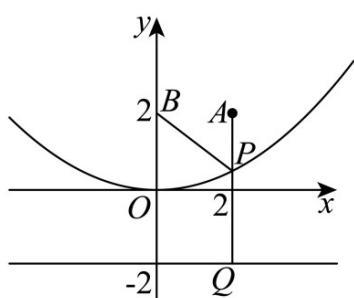

> [!faq]- 《专题03 抛物线的四大常考题型（高效培优专项训练）》官方解析
>
> > [!success]- **【答案】** B
>
> > [!note]- **【解析】**
> > 抛物线 $C: y = \frac{1}{8} x^{2}$ ，即 $x^{2} = 8y$ ，其焦点为 $F(0, 2)$ ，准线方程为 l: y = -2，
> >
> > 易知 $A(2,2)$ 在抛物线的内部，点 $B$ 即为焦点 $F$
> >
> > 如图所示，过点 $P$ 作 $PQ \perp l$ 于点 $Q$ ，则 $\left|PB\right| = \left|PQ\right|$ ，即 $\left|PA\right| + \left|PB\right| = \left|PA\right| + \left|PQ\right|$
> >
> > 显然当 P, A, Q 三点共线时 $\left|PA\right| + \left|PB\right|$ 最小，最小值为 $2 - (-2) = 4$ ，
> >
> > 即 $\left|PA\right| + \left|PB\right|$ 的最小值为 4，
> >
> > 故选：B.
> >
> > 
