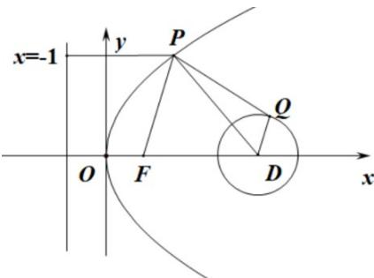

> [!faq]- 《专题03 抛物线的四大常考题型（高效培优专项训练）》官方解析
>
> > [!success]- **【答案】** 4
>
> > [!note]- **【解析】**
> > 根据题意，抛物线 $y^{2}=4x$ 的准线为 x=-1 ，设点 P 到准线的距离为 d ，则 $\left|PF\right|=d$ ，设圆心为点 $D(4,0)$ ，则点 D 到准线的距离为 5 ，
> >
> > 
> >
> > 结合图象可知，则 $\left|PF\right|+\left|PQ\right|\quad\left|PF\right|+\left|PD\right|-1=d+\left|PD\right|-1$ 5-1=4
> >
> > 当且仅当点 P 与点 O 重合，P, Q, D 三点共线且点 Q 在 P, D 之间时，等号成立。
> >
> > 故答案为：4.
