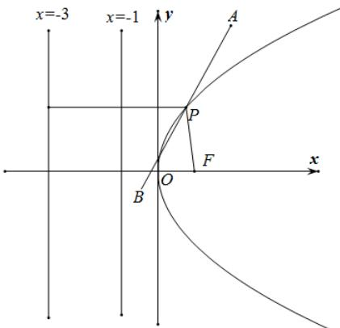

> [!faq]- 《专题03 抛物线的四大常考题型（高效培优专项训练）》官方解析
>
> > [!success]- **【答案】** $2\sqrt{17}+2$
>
> > [!note]- **【解析】**
> > 抛物线 $y^{2} = 4x$ 的焦点 $F$ 的坐标为 $(1,0)$ ，准线方程为 $x = -1$
> >
> > 因为 $P$ 为抛物线 $y^{2} = 4x$ 上的动点， $P$ 到直线 $x = -1$ ， $x = -3$ 的距离分别 $d_{1}$ ， $d_{2}$
> >
> > 所以 $d_{1} = |PF|$ ， $d_{2} = |PF| + 2$
> >
> > 因为 $A(2,4)$ 关于 P 的对称点为 B，
> >
> > 所以 $\left|AB\right|=2\left|PA\right|=2\left|PB\right|$
> >
> > 所以 $d_{1} + d_{2} + |AB| = 2\left(|PF| + |PA| + 1\right)$
> >
> > 又 $\left|PF\right|+\left|PA\right|\quad\left|FA\right|=\sqrt{(2-1)^{2}+\left(4-0\right)^{2}}=\sqrt{17}$
> >
> > 当且仅当点 P 为线段 AF 与抛物线的交点时等号成立，
> >
> > 所以 $d_{1} + d_{2} + |AB| = 2\sqrt{17} + 2$ ，当且仅当点 $P$ 为线段 $AF$ 与抛物线的交点时等号成立，
> >
> > 所以当点 $P$ 为线段 $AF$ 与抛物线的交点时， $d_{1} + d_{2} + |AB|$ 取最小值，
> >
> > $d_{1} + d_{2} + |AB|$ 的最小值为 $2\sqrt{17} + 2$
> >
> > 故答案为： $2\sqrt{17}+2$
> >
> > 
