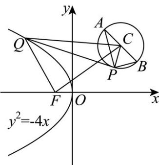

> [!faq]- 《专题03 抛物线的四大常考题型（高效培优专项训练）》官方解析
>
> > [!success]- **【答案】** B
>
> > [!note]- **【解析】**
> > 直线 $l_{1}: x - my + 4m - 1 = 0$ ，即 $(x - 1) - m(y - 4) = 0$ ，可知直线 $l_{1}$ 过定点 $P(1,4)$ ；
> >
> > 直线 $l_{2}:mx + y - 3m - 2 = 0$ ，即 $m(x - 3) + (y - 2) = 0$ ，可知直线 $l_{2}$ 过定点 $Q(3,2)$
> >
> > 且 $1 \times m + (-m) \times 1 = 0$ ，则 $l_{1} \perp l_{2}$
> >
> > 可知点 $P$ 在以 $AB$ 为直径的圆上，此时圆心为 $C(2,3)$ ，半径 $r = \frac{1}{2} |AB| = \sqrt{2}$
> >
> > 因为抛物线 $y^{2} = -4x$ 的焦点为 $F(-1,0)$ ，准线为 $x = 1$
> >
> > 且点 $Q(x_0, y_0)$ 是抛物线 $y^2 = -4x$ 上一动点，则 $|QF| = 1 - x_0$ ，即 $-x_0 = |QF| - 1$
> >
> > 可得 $|PQ| - x_0 = |PQ| + |QF| - 1$ $|QC| - r + |QF| - 1 = |QC| + |QF| - (\sqrt{2} +1)$
> >
> > 当且仅当点 $P$ 在线段 $QC$ 上时，等号成立，
> >
> > 又因为 $|QC| + |QF| \mid CF| = 3\sqrt{2}$ ，当且仅当点 $Q$ 在线段 $FC$ 上时，等号成立，
> >
> > $$
> > P Q \mid - x _ {0} \quad | Q C | + | Q F | - (\sqrt {2} + 1) \quad 3 \sqrt {2} - (\sqrt {2} + 1) = 2 \sqrt {2} - 1
> > $$
> >
> > 所以 $|PQ| - x_0$ 的最小值为 $2\sqrt{2} - 1$
> >
> > 故选：B.
> >
> > 
