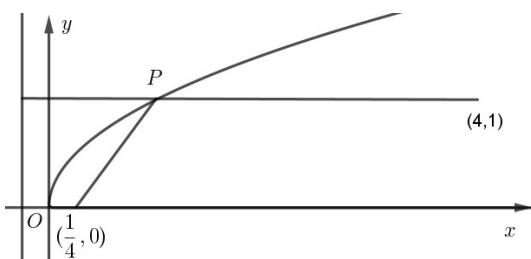

> [!faq]- 《专题03 抛物线的四大常考题型（高效培优专项训练）》官方解析
>
> > [!success]- **【答案】** ACD
>
> > [!note]- **【解析】**
> > 选项A：由 $y = \sqrt{x}$ 得 $y^{2} = x(y - 0)$ ，其图象为抛物线的上半部分，焦点为 $\left(\frac{1}{4}, 0\right) \sqrt{\left(x - \frac{1}{4}\right)^{2} + y^{2}}$ 为点 $P(x, y)$ 到焦点 $F$ 的距离，故 $\sqrt{\left(x - \frac{1}{4}\right)^{2} + y^{2}} = x + \frac{1}{4} \cdot \frac{1}{4}$ ，故A正确；选项B：到直线的距离为 $\frac{|x + y + 1|}{\sqrt{2}} = \frac{|x + \sqrt{x} + 1|}{\sqrt{2}} = \frac{\left|\left(\sqrt{x} + \frac{1}{2}\right)^{2} + \frac{3}{4}\right|}{\sqrt{2}}$ ，又 $\sqrt{x} = 0$ ，故 $\left(\sqrt{x} + \frac{1}{2}\right)^{2} = \frac{1}{4}$ ，故 $\frac{\left|\left(\sqrt{x} + \frac{1}{2}\right)^{2} + \frac{3}{4}\right|}{\sqrt{2}} = \frac{1}{\sqrt{2}} = \frac{\sqrt{2}}{2}$ ，故B错误；
> >
> > 选项 C： $\sqrt{\left(x-\frac{1}{4}\right)^{2}+y^{2}}+\sqrt{(x-4)^{2}+(y-1)^{2}}$ 即为 $P(x,y)$ 到焦点 F 与 $(4,1)$ 的距离和，
> >
> > 
> >
> > 由抛物线的定义可知，其最小值为 $(4,1)$ 到准线 $x = -\frac{1}{4}$ 的距离，即为 $\frac{17}{4}$ ，故C正确；
> >
> > 选项D：由抛物线的定义可判断 $P(x,y)$ 到 $\left(\frac{1}{4},0\right)$ 与直线 $x = -\frac{1}{4}$ 的距离相等，故D正确，
> >
> > 故选 **ACD**.
