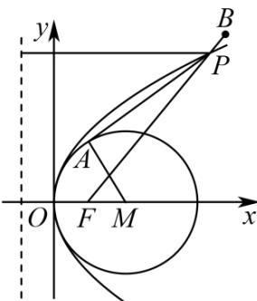

> [!faq]- 《专题03 抛物线的四大常考题型（高效培优专项训练）》官方解析
>
> > [!success]- **【答案】** $\sqrt{41} - 1 / -1 + \sqrt{41}$
>
> > [!note]- **【解析】**
> > 如图：抛物线的焦点为 $(1,0)$ ，圆心为 $M(2,0)$ ，半径为 $r = 2$ ，
> >
> > 设 $P(x_0, y_0)$ ，则 $\left|PA\right| + \left|PB\right| = \sqrt{PM^2 - 4} + \left|PB\right| = \sqrt{\left(x_0 - 2\right)^2 + y_0^2 - 4} + \left|PB\right|$
> >
> > $$
> > = \sqrt {\left(x _ {0} - 2\right) ^ {2} + 4 x _ {0} - 4} + | P B | = x _ {0} + | P B | = x _ {0} + 1 + | P B | - 1 = | P F | + | P B | - 1 \quad | B F | - 1
> > $$
> >
> > 由于 $\left|BF\right|-1=\sqrt{\left(5-1\right)^{2}+5^{2}}-1=\sqrt{41}-1$ 时，当且仅当F,P,B共线时取到等号，
> >
> > 故 $\left|PA\right|+\left|PB\right|$ 的最小值为 $\sqrt{41}-1$
> >
> > 故答案为： $\sqrt{41} - 1$
> >
> > 
>
> > [!tip]- **【名师点睛】**
> > 关键点点睛： $\left|PA\right|=\sqrt{PM^{2}-4}=\sqrt{\left(x_{0}-2\right)^{2}+y_{0}^{2}-4}=x_{0}$ ，进而根据抛物线的焦半径公式可得 $\left|PA\right|=x_{0}+1-1=\left|PF\right|-1$ ，即可利用三点共线求解.
