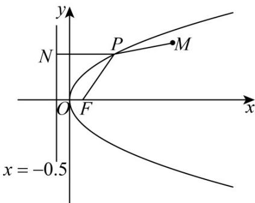
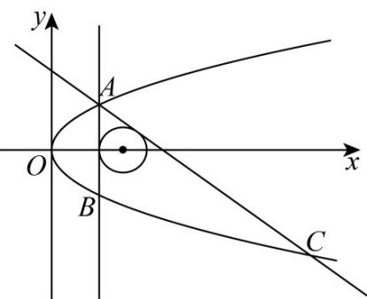

> [!faq]- 《专题03 抛物线的四大常考题型（高效培优专项训练）》官方解析
>
> > [!success]- **【答案】** (1) $\frac{7}{2}$ (2) $3x + 10y + 14 = 0$
>
> > [!note]- **【解析】**
> > （1）过点 $P$ 向抛物线的准线 $x = -\frac{1}{2}$ 作垂线，垂足为 $N$
> >
> > 
> >
> > 由抛物线的定义得： $\left|PM\right|+\left|PF\right|=P\left|M\right|+\left|PN\right|$
> >
> > 当且仅当 $M$ 、 $P$ 、 $N$ 三点共线时， $\left|PM\right| + \left|PF\right|$ 取最小值，最小值为 $3 + \frac{1}{2} = \frac{7}{2}$
> >
> > (2) 由圆 $(x-3)^{2}+y^{2}=1$ 可得圆心坐标为 $(3,0)$ ，半径为r=1。
> >
> > 因为点 $A(t,2)$ 在抛物线 E : $y^{2}=2x$ 上，
> >
> > 所以 $A(2,2)$
> >
> > 
> >
> > 因为直线 AB, AC 是圆 $(x-3)^{2} + y^{2} = 1$ 的两条切线，3 - 2 = 1 = r
> >
> > 所以直线 $AB$ 的方程为 $x = 2$ ，设直线 $AC$ 的方程为 $y - 2 = k(x - 2)$ ，即 $kx - y - 2k + 2 = 0$ ：
> >
> > 由题意得：圆心 $(3,0)$ 到直线 $AC$ 的距离为 $d = \frac{|k + 2|}{\sqrt{k^2 + 1}} = 1$ ，解得 $k = -\frac{3}{4}$
> >
> > 所以直线 AC 的方程为 $y = -\frac{3}{4}x + \frac{7}{2}$ .
> >
> > 联立 $\left\{\begin{aligned}y&=-\frac{3}{4}x+\frac{7}{2}\\ y^{2}&=2x\end{aligned}\right.$ ，解得 $C(\frac{98}{9},-\frac{14}{3})$ .
> >
> > 因为直线 AB 的方程为 x = 2 ，，点 B 在抛物线 E ： $y^{2} = 2x$ 上.
> >
> > 所以点 $B(2, - 2)$
> >
> > 所以直线 BC 的斜率为 $k_{BC} = -\frac{3}{10}$ ，
> >
> > 所以直线 $BC$ 的方程是 $y + 2 = -\frac{3}{10}(x - 2)$ ，即 $3x + 10y + 14 = 0$
