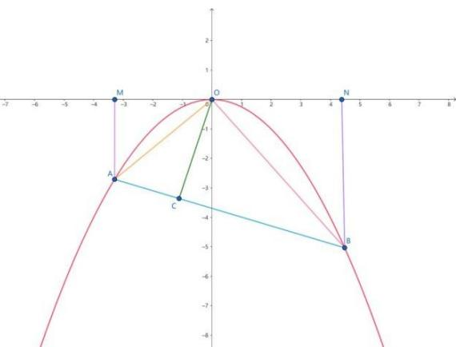

> [!faq]- 《专题03 抛物线的四大常考题型（高效培优专项训练）》官方解析
>
> > [!success]- **【答案】** B
>
> > [!note]- **【解析】**
> > 根据题意画出图像为：
> >
> > 
> >
> > 设 $A\left(x_{1}, - \frac{1}{4} x_{1}^{2}\right)$ ， $B\left(x_{2}, - \frac{1}{4} x_{2}^{2}\right)$ ，根据条件不妨设 $x_{1} <   0 <   x_{2}$
> >
> > 分别过点 $A, B$ 向 $x$ 轴作垂线，垂足分别为点 $M, N$ ，则 $\angle AOM + \angle OAM = 90^\circ$
> >
> > 因 $OA \perp OB$ ，所以 $\angle AOM + \angle BON = 90^{\circ}$ ，于是 Rt△ AOM ∼ Rt△ OBN
> >
> > 所以 $\frac{AM}{ON} = \frac{OM}{BN}$ ，即 $\frac{\frac{1}{4}x_1^2}{x_2} = \frac{-x_1}{\frac{1}{4}x_2^2}$ ，整理得 $x_{1}x_{2} = -16$
> >
> > 设直线 的方程为： $y = kx + b$ ，联立方程得方程组 $\left\{\begin{aligned}y &= kx + b \\ y &= -\frac{1}{4}x^{2}\end{aligned}\right.$
> >
> > 消去 $y$ ，得 $x^{2} + 4kx + 4b = 0$ ，根据韦达定理可知 $x_{1}x_{2} = 4b$
> >
> > 所以 $4b = -16$ ，解得 $b = -4$ ，所以直线 $AB$ 过定点 $D(0, - 4)$
> >
> > 又 $OC \perp AB$ ，所以点 $C$ 在以线段 $OD$ 为直径的圆上，该圆的圆心在 $y$ 轴上，半径为 $2$ ，
> >
> > 所以点 C 到 y 轴距离的最大值为 2.（点 C, D 重合时，点 C 到 y 轴距离最小）
> >
> > 故选 **B**.
