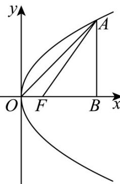

> [!faq]- 《专题03 抛物线的四大常考题型（高效培优专项训练）》官方解析
>
> > [!success]- **【答案】** A
>
> > [!note]- **【解析】**
> > 方法一：由 $F(1,0)$ 得 $\frac{p}{2} = 1$ ，即 $p = 2$ ，故抛物线的方程为 $y^{2} = 4x\cdot$ 设 $A(x_0, y_0)$ ，则 $\triangle OFA$ 的面积为 $\frac{1}{2} \times |OF| \times |y_0| = \frac{1}{2} \times |y_0| = \sqrt{3}$ ，得 $y_0 = \pm 2\sqrt{3}$ ，代入 $y^2 = 4x$ ，得 $x_0 = 3$ ，
> >
> > 过点A作 $AB \perp x$ 轴于点 $B$ ，则 $\left|AB\right| = \left|y_0\right| = 2\sqrt{3}$ ， $\left|AF\right| = x_0 + 1 = 4.$
> >
> > 
> >
> > 所以在 Rt△AFB 中， $\sin\angle AFB=\frac{|AB|}{|AF|}=\frac{2\sqrt{3}}{4}=\frac{\sqrt{3}}{2}$ ，则 $\angle AFB=\frac{\pi}{3}$
> >
> > 所以 $\angle OFA = \pi - \angle AFB = \frac{2\pi}{3}$ ;
> >
> > 方法二：由 $F(1,0)$ 得 $\frac{p}{2} = 1$ ，即 $p = 2$ ，故抛物线的方程为 $y^{2} = 4x$ ，
> >
> > 设 $A(x_0, y_0)$ ，则 $\triangle OFA$ 的面积为 $\frac{1}{2} \times |OF| \times |y_0| = \frac{1}{2} \times |y_0| = \sqrt{3}$ ，得 $y_0 = \pm 2\sqrt{3}$ ，
> >
> > 代入 $y^{2} = 4x$ ，得 $x_{0} = 3$ ，不妨设 $A(3,2\sqrt{3})$
> >
> > 由勾股定理得 $\left|OA\right| = \sqrt{9 + 12} = \sqrt{21}$ ，由焦半径公式得 $\left|AF\right| = x_0 + 1 = 4$
> >
> > 在 $\triangle AOF$ 中，由余弦定理得 $\cos \angle OFA = \frac{\left|OF\right|^2 + \left|AF\right|^2 - \left|OA\right|^2}{2\left|OF\right|\cdot\left|AF\right|} = \frac{1 + 16 - 21}{2\times 1\times 4} = -\frac{1}{2}$
> >
> > 又 $\angle OFA\in (0,\pi)$ ，故 $\angle OFA = \frac{2\pi}{3}$
> >
> > 故选 **A**
