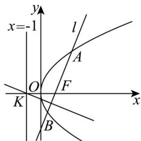

> [!faq]- 《专题03 抛物线的四大常考题型（高效培优专项训练）》官方解析
>
> > [!success]- **【答案】** A
>
> > [!note]- **【解析】**
> > 抛物线 $y^{2}=4x$ 焦点为 $F(1,0)$ ，准线 x=-1，点 $K(-1,0)$ ，
> > 由题意直线 l 的斜率存在，设直线 l 的方程为 $y=k(x-1)$ ， $k\neq0$ ，
> > 将其代入抛物线方程，得： $k^{2}(x-1)^{2}=4x\Rightarrow k^{2}x^{2}-(2k^{2}+4)x+k^{2}=0$ 则 $\Delta=(2k^{2}+4)^{2}-4k^{2}\times k^{2}=16k^{2}+16>0$ 设 $A(x_{1},y_{1}), B(x_{2},y_{2})$ ，由韦达定理得： $x_{1}+x_{2}=\frac{2k^{2}+4}{k^{2}}, x_{1}x_{2}=1$ 线段 BF 的中点坐标为 $\left(\frac{x_{2}+1}{2},\frac{y_{2}}{2}\right)$ ，垂直平分线的斜率为 $-\frac{1}{k}$ .
> > 线段 BF 的垂直平分线方程为： $y-\frac{y_{2}}{2}=-\frac{1}{k}\left(x-\frac{x_{2}+1}{2}\right)$ ，即 $y-\frac{k(x_{2}-1)}{2}=-\frac{1}{k}\left(x-\frac{x_{2}+1}{2}\right)$ ，
> > 代入 $K(-1,0)$ ，化简得： $-k^{2}(x_{2}-1)=x_{2}+3\Rightarrow x_{2}=\frac{k^{2}-3}{k^{2}+1}$ 结合 $x_{1} + x_{2} = \frac{2k^{2} + 4}{k^{2}}, x_{1}x_{2} = 1$ ，得： $\frac{k^{2}+1}{k^{2}-3}+\frac{k^{2}-3}{k^{2}+1}=\frac{2k^{2}+4}{k^{2}}$ 则 $k^{4}-6k^{2}-3=0\Rightarrow k^{2}=3+2\sqrt{3}$ 则 $x_{1} + x_{2} = \frac{2(3 + 2\sqrt{3}) + 4}{3 + 2\sqrt{3}} = \frac{8\sqrt{3}}{3} - 2$ $|AB|=x_{1}+x_{2}+p=\frac{8\sqrt{3}}{3}-2+2=\frac{8\sqrt{3}}{3}$ 故选：A
> >
> > 故选：A.
> >
> > 
