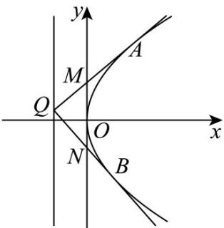

> [!faq]- 《专题03 抛物线的四大常考题型（高效培优专项训练）》官方解析
>
> > [!success]- **【答案】** D
>
> > [!note]- **【解析】**
> > 
> >
> > 由题意知点 $Q$ 在准线上，所以两条切线斜率必存在，设点 $Q(-\frac{p}{2}, y_0)$ ，直线 $QA$ 的解析式为 $y - y_0 = k_1(x + \frac{p}{2})$ ，即 $y = k_1x + \frac{p}{2}k_1 + y_0$ ，可得 $M(0, \frac{p}{2}k_1 + y_0)$ ，直线 $QB$ 的解析式为 $y - y_0 = k_2(x + \frac{p}{2})$ ，即 $y = k_2x + \frac{p}{2}k_2 + y_0$ ，可得 $N(0, \frac{p}{2}k_2 + y_0)$ 。联立直线 $QA$ 和抛物线方程组得 $\left\{\begin{array}{l} y = k_1x + \frac{p}{2}k_1 + y_0 \\ y^2 = 2px \end{array}\right.$ ，消去得 $y(k_1x + \frac{p}{2}k_1 + y_0)^2 = 2px$ ，化简得 $k_1^2x^2 + (pk_1^2 + 2k_1y_0 - 2p)x + \frac{p^2}{4}k_1^2 + y_0^2 + pk_1y_0 = 0$ ，由 $\Delta = 0$ 得 $(pk_1^2 + 2k_1y_0 - 2p)^2 - 4k_1^2(\frac{p^2}{4}k_1^2 + y_0^2 + pk_1y_0) = 0$ ，化简得 $pk_1^2 + 2k_1y_0 - p = 0$ ，根据对称性可知也有 $pk_2^2 + 2k_2y_0 - p = 0$ ，即 $k_1, k_2$ 都是方程 $px^2 + 2y_0x - p = 0$ 的根，根据韦达定理得 $k_1 + k_2 = -\frac{2y_0}{p}, k_1k_2 = -\frac{p}{p} = -1$ 。 $|OM| \cdot |ON| = -(\frac{p}{2}k_1 + y_0)(\frac{p}{2}k_2 + y_0) = -\frac{p^2}{4}k_1k_2 - \frac{py_0}{2}(k_1 + k_2) - y_0^2$ ，代入得 $|OM| \cdot |ON| = -\frac{p^2}{4} \times (-1) - \frac{py_0}{2} \cdot \frac{2y_0}{p} - y_0^2 = \frac{p^2}{4}$ 。
> >
> > 故选 **D**.
