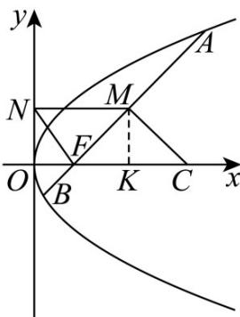

> [!faq]- 《专题03 抛物线的四大常考题型（高效培优专项训练）》官方解析
>
> > [!success]- **【答案】**  A. 12 B. 8 C. 6 D. 7
>
> > [!note]- **【解析】**
> > 抛物线 $E: y^{2} = 4x$ 的焦点 $F(1,0)$ ，则直线 AB 的方程为 y = x - 1，
> > 因为四边形 CMNF 为梯形，且 FC // NM，
> > 设 $A(x_{1},y_{1}), B(x_{2},y_{2}), M(x_{0},y_{0})$ ，则 $k_{AB}=\frac{y_{1}-y_{2}}{x_{1}-x_{2}}=\frac{4(y_{1}-y_{2})}{y_{1}^{2}-y_{2}^{2}}=\frac{4}{y_{1}+y_{2}}=1$ 所以 $y_{1} + y_{2} = 4$ ，所以 $y_{0} = 2$ 作 MK ⊥ x 轴于点 K，则 $\left|MK\right| = 2$
> >
> > 
> >
> > 因为直线 AB 的斜率为 $^{1}$ ，所以 $\triangle FMC$ 为等腰直角三角形，
> >
> > 故 $\left|FK\right|=\left|MK\right|=\left|KC\right|=2$
> >
> > 所以 $\left|MN\right|=\left|OF\right|+\left|FK\right|=3,\left|FC\right|=4$
> >
> > 所以四边形 CMNF 的面积为 $\frac{1}{2} \times (3 + 4) \times 2 = 7$ .
> >
> > 故选 **D**.
