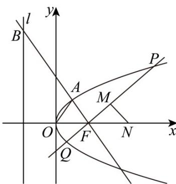

> [!faq]- 《专题03 抛物线的四大常考题型（高效培优专项训练）》官方解析
>
> > [!success]- **【答案】** (1) $y^{2}=4x$ (2)-3
>
> > [!note]- **【解析】**
> > （1）抛物线方程的准线方程为 $x = -\frac{p}{2}$ ，
> >
> > 因为 $\left|OA\right|=\left|AF\right|$ ，所以点 A 在线段 OF 的中垂线上，
> >
> > 所以 $x_{A} = \frac{p}{4}$ ， $\left|y_A\right| = \frac{\sqrt{2}}{2} p$ ，此时 $\tan \angle OFA = \frac{\left|y_A\right|}{\frac{p}{4}} = \frac{\left|y_B\right|}{p}$ 即 $\frac{\frac{\sqrt{2}}{2}p}{\frac{p}{4}} = \frac{|y_B|}{p}$ ，解得 $|y_{B}| = 2\sqrt{2} p$
> >
> > 因为三角形 OFB 的面积为 $2\sqrt{2}$ ，
> >
> > 所以 $\frac{1}{2} |OF||y_B| = \frac{1}{2}\cdot \frac{p}{2}\cdot 2\sqrt{2} p = 2\sqrt{2}$ ，解得 $p = 2$ ，
> >
> > 则抛物线 C 的方程为 $y^{2}=4x$ .
> >
> > (2) 证明：设 $P(x_{1}, y_{1}), Q(x_{2}, y_{2}), N(t, 0)$ ，
> >
> > 联立 $\left\{ \begin{array}{l} y = k(x - 1) \\ y^2 = kx \end{array} \right.$ ，消去 $y$ 并整理得 $k^2 x^2 - (2k^2 + 4)x + k^2 = 0(k^2 \neq 0)$ ，
> >
> > 由韦达定理得 $x_{1} + x_{2} = 2 + \frac{4}{k^{2}}$ ， $x_{1}x_{2} = 1$ ，因为 $M$ 为线段 $PQ$ 的中点，
> >
> > 所以 $\left|MN\right|^{2}-\frac{1}{4}\left|PQ\right|^{2}=\frac{NM}{NM}^{2}-\frac{1}{4}PQ^{2}=\left(\frac{NM}{NM}-\frac{1}{2}PQ\right)\cdot\left(\frac{NM}{NM}+\frac{1}{2}PQ\right)$ $=\left(NM+MP\right)\cdot\left(NM+MQ\right)=NP\cdot NQ=\left(x_{1}-t,kx_{1}-k\right)\left(x_{2}-t,kx_{2}-k\right)$ $=\left(x_{1}-t\right)\left(x_{2}-t\right)+\left(kx_{1}-k\right)\left(kx_{2}-k\right)=\left(k^{2}+1\right)x_{1}x_{2}-\left(k^{2}+t\right)\left(x_{1}+x_{2}\right)+k^{2}+t^{2}$ $=k^{2}+1-\left(k^{2}+t\right)\left(2+\frac{4}{k^{2}}\right)+k^{2}+t^{2}=t^{2}-2t-3-\frac{4t}{k^{2}}$
> >
> > 则当 $t = 0$ 时， $\left|MN\right|^2 -\frac{1}{4}\left|PQ\right|^2 = -3$ 为定值，与 $k$ 的取值无关，
> >
> > 故在 $x$ 轴上存在点 $N(0,0)$ ，使得 $\left|MN\right|^2 - \frac{1}{4}\left|PQ\right|^2$ 为定值，定值为 $-3$
> >
> > 
