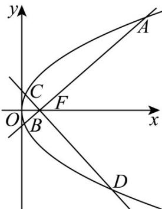

> [!faq]- 《专题03 抛物线的四大常考题型（高效培优专项训练）》官方解析
>
> > [!success]- **【答案】** (1) $y^{2}=4x$ ； (2)16
>
> > [!note]- **【解析】**
> > （1）将 $x + 1 = \sqrt{(x - 1)^2 + y^2}$ 两边平方，得 $x^{2} + 2x + 1 = x^{2} - 2x + 1 + y^{2}$ ，整理得 $y^{2} = 4x$ ，经验证符合题意，
> >
> > 所以曲线 $C$ 的方程为 $y^{2} = 4x$
> >
> > (2) 设点 $A(x_{1}, y_{1}), B(x_{2}, y_{2}), C(x_{3}, y_{3}), D(x_{4}, y_{4})$ ，显然 $AB \perp CD$ ，抛物线 $C$ 的焦点 $F(1, 0)$ ，准线为 $x = -1$ ，则 $|AF| = x_{1} + 1, |BF| = x_{2} + 1, |CF| = x_{3} + 1, |DF| = x_{4} + 1$ ，
> >
> > 由 $\left\{ \begin{array}{l} y = k(x - 1) \\ y^2 = 4x \end{array} \right.$ 消去 $y$ 得 $k^2 x^2 - (2k^2 + 4)x + k^2 = 0$ ， $\Delta = (2k^2 + 4)^2 - 4k^4 = 16k^2 + 16 > 0$ ，
> >
> > 则 $x_{1} + x_{2} = 2 + \frac{4}{k^{2}}, x_{1}x_{2} = 1$ ，而直线 $CD:y = -\frac{1}{k}(x - 1)$ ，同理 $x_{3} + x_{4} = 4k^{2} + 2, x_{3}x_{4} = 1$ ，
> >
> > $$
> > A C \cdot D B = (A F + F C) \cdot (D F + F B) = A F \cdot D F + A F \cdot F B + F C \cdot D F + F C \cdot F B
> > $$
> >
> > $$
> > = \stackrel {{\text { U   U   U }}} {{A F}} \cdot \stackrel {{\text { U   U   U }}} {{F B}} + \stackrel {{\text { U   U   U }}} {{F C}} \cdot \stackrel {{\text { U   U   U }}} {{D F}} = | \stackrel {{\text { U   U   U }}} {{A F}} | | \stackrel {{\text { U   U   U }}} {{F B}} | + | \stackrel {{\text { U   U   U }}} {{F C}} | | \stackrel {{\text { U   U   U }}} {{D F}} | = (x _ {1} + 1) (x _ {2} + 1) + (x _ {3} + 1) (x _ {4} + 1)
> > $$
> >
> > $= x_{1}x_{2} + x_{1} + x_{2} + 1 + x_{3}x_{4} + x_{3} + x_{4} + 1 = 8 + \frac{4}{k^{2}} +4k^{2}$ 16，当且仅当 $k^2 = 1$ ，即 $k = \pm 1$ 时取等号，
> >
> > 所以 $AC \cdot DB$ 最小值为 16 .
> >
> > 
