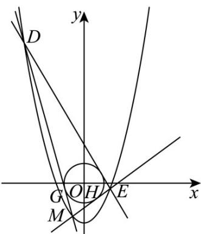

> [!faq]- 《专题03 抛物线的四大常考题型（高效培优专项训练）》官方解析
>
> > [!success]- **【答案】** (1) $6 \sqrt{5}$ (2) $\left(-\frac{\sqrt{3}}{3},-\frac{5}{3}\right)$ ，或 $(\sqrt{3},1)$
>
> > [!note]- **【解析】**
> > （1）因为动点 $A(x,y)$ 到点 $B\left(0, - \frac{7}{4}\right)$ 的距离与到直线 $l:y = -\frac{9}{4}$ 的距离相等，
> >
> > 所以有 $\sqrt{x^2 + \left(y + \frac{7}{4}\right)^2} = \left|y + \frac{9}{4}\right|$ ，两边同时平方，化简得 $x^{2} = y + 2$
> >
> > 因为直线 $l'$ 过点 $(3,0)$ 且斜率为 -2，
> >
> > 所以直线 $l'$ 的方程为 $y = -2(x - 3)$ ，代入 $x^{2} = y + 2$ 中，化简，得
> >
> > $x^{2}+2x-8=0$ ，解得x=-4，或x=2，
> >
> > 不妨令 $P(-4,14), Q(2,2)$
> >
> > 于是 $\left|PQ\right|=\sqrt{\left(-4-2\right)^{2}+\left(14-2\right)^{2}}=6\sqrt{5}$ ;
> >
> > (2) 设 $M(x_{0}, x_{0}^{2} - 2), D(x_{1}, x_{1}^{2} - 2), E(x_{2}, x_{2}^{2} - 2)$ ,
> >
> > 因为直线 DE 的倾斜角为 $120^{\circ}$ ，
> >
> > 所以直线 DE 的方程可设为： $y = -\sqrt{3}x + b$ ，代入 $x^{2} = y + 2$ 中，
> >
> > 得 $x^{2} + \sqrt{3} x - 2 - b = 0 \Rightarrow \Delta = 3 + 4(2 + b) > 0 \Rightarrow b > -\frac{11}{4}$ ，则有 $x_{1} + x_{2} = -\sqrt{3}$ ，
> >
> > 直线 $_{MD}$ 的斜率为 $\frac{x_{1}^{2}-2-x_{0}^{2}+2}{x_{1}-x_{0}}=x_{1}+x_{0}$ ，
> >
> > 因此直线 $MD$ 的方程为： $y - (x_0^2 - 2) = (x_1 + x_0)(x - x_0) \Rightarrow (x_1 + x_0)x - y - 2 - x_1x_0 = 0$
> >
> > 同理直线 $ME$ 的方程为： $y - \left(x_0^2 - 2\right) = \left(x_2 + x_0\right)(x - x_0) \Rightarrow \left(x_2 + x_0\right)x - y - 2 - x_2x_0 = 0$
> >
> > 因为直线 $MD, ME$ 与以坐标原点为圆心的单位圆相切，
> >
> > 所以 $\frac{\left|2 + x_1x_0\right|}{\sqrt{\left(x_1 + x_0\right)^2 + \left(-1\right)^2}} = 1,\frac{\left|2 + x_2x_0\right|}{\sqrt{\left(x_2 + x_0\right)^2 + \left(-1\right)^2}} = 1$
> >
> > $$
> > \frac {\left| 2 + x _ {1} x _ {0} \right|}{\sqrt {\left(x _ {1} + x _ {0}\right) ^ {2} + (- 1) ^ {2}}} = 1 \Rightarrow x _ {1} ^ {2} \left(x _ {0} ^ {2} - 1\right) + 2 x _ {1} x _ {0} + 3 - x _ {0} ^ {2} = 0
> > $$
> >
> > $$
> > \frac {\left| 2 + x _ {2} x _ {0} \right|}{\sqrt {\left(x _ {2} + x _ {0}\right) ^ {2} + (- 1) ^ {2}}} = 1 \Rightarrow x _ {2} ^ {2} \left(x _ {0} ^ {2} - 1\right) + 2 x _ {2} x _ {0} + 3 - x _ {0} ^ {2} = 0
> > $$
> >
> > 所以 $x_{1}, x_{2}$ 是方程 $x^{2}\left(x_{0}^{2}-1\right)+2xx_{0}+3-x_{0}^{2}=0$ 的两个根，
> >
> > 因此 $\left\{ \begin{array}{l} x_0^2 - 1 \neq 0 \\ 4x_0^2 - 4(x_0^2 - 1)(3 - x_0^2) > 0 \end{array} \right. \Rightarrow x_0 \neq \pm 1$
> >
> > 所以有 $x_{1} + x_{2} = -\frac{2x_{0}}{x_{0}^{2} - 1}$ ，而 $x_{1} + x_{2} = -\sqrt{3}$
> >
> > 即 $-\frac{2x_0}{x_0^2 - 1} = -\sqrt{3}\Rightarrow x_0 = -\frac{\sqrt{3}}{3}$ ，或 $x_0 = \sqrt{3}$
> >
> > 因此点 $M$ 的坐标为 $\left(-\frac{\sqrt{3}}{3}, -\frac{5}{3}\right)$ ，或 $(\sqrt{3}, 1)$
> >
> > 
