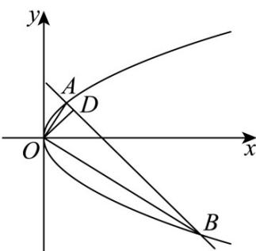

<!-- question-source:start -->
34. 如图，已知直线 $l$ 与抛物线 $y^{2} = 2px(p > 0)$ 交于A、 $B$ 两点，且 $OA\bot OB$ ， $OD\bot AB$ 于点 $D(1,1)$

(1)求直线 l 的方程；

(2)求 $\triangle OAB$ 的面积.
<!-- question-source:end -->

![[高中/课堂同步/题库/人教A版高中数学同步讲义(2026)/03_选择性必修第一册/第三章 圆锥曲线的方程/专题03 抛物线的四大常考题型（高效培优专项训练）/题型四_抛物线综合问题/questions/answers/Q00080112A1.md]]
