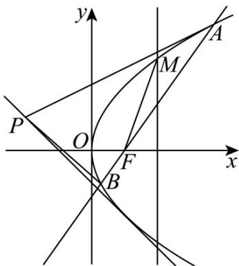

> [!faq]- 《专题03 抛物线的四大常考题型（高效培优专项训练）》官方解析
>
> > [!success]- **【答案】** (1) $y^{2}=4x$ ； (2) $y = 1$ 或 $x - 2y + 4 = 0$ 或 $x + y + 1 = 0$ ; (3) $\frac{11}{2}$ .
>
> > [!note]- **【解析】**
> > （1）抛物线 $C:y^{2} = 2px(p > 0)$ 的准线方程为 $x = -\frac{p}{2}$ 由 $M(2,t)$ 是抛物线 $C$ 上一点，且 $\left|MF\right| = 3\Rightarrow \left\{ \begin{array}{l} \frac{p}{2} +2 = 3\\ t^2 = 4p \end{array} \right.\Rightarrow \left\{ \begin{array}{l} p = 2\\ t = \pm 2\sqrt{2} \end{array} \right.,$
> >
> > 则抛物线 $C$ 的方程为 $y^{2} = 4x$
> >
> > (2) 由题知，直线 l 绕其上一点 $P(-2,1)$ 旋转，
> >
> > 当直线 $l$ 与抛物线只有一个公共点时，直线 $l$ 的斜率一定存在，
> >
> > 设直线 $l$ 的斜率为 $k$ ，直线 $l$ 的方程为 $y - 1 = k(x + 2)$ ，即 $y = kx + 2k + 1$
> >
> > 联立 $\left\{ \begin{array}{l} y = kx + 2k + 1 \\ y^2 = 4x \end{array} \right. \Rightarrow k^2 x^2 + (4k^2 + 2k - 4)x + (2k + 1)^2 = 0$ ，直线与抛物线 $C$ 只有一个公共点，
> >
> > 当 $k = 0$ 时，解得 $x = \frac{1}{4}, y = 1$ ，此时，直线与抛物线只有一个交点， $y = 1$ ，
> >
> > 当 $k \neq 0$ 时， $\Delta = (4k^2 + 2k - 4)^2 - 4k^2(2k + 1)^2 = -16(2k^2 + k - 1) = -16(2k - 1)(k + 1) = 0$
> >
> > 即 $k = \frac{1}{2}$ 或 $k = -1$ 时，直线和抛物线只有一个公共点，
> >
> > $k = \frac{1}{2}$ 时，直线 l 的方程为 $y = \frac{1}{2}x + 2$ ，即 $x - 2y + 4 = 0$ ，
> >
> > $k = -1$ 时，直线 $l$ 的方程为 $y = -x - 1$ ，即 $x + y + 1 = 0$
> >
> > 综上，直线与抛物线只有一个公共点时，直线方程为 $y = 1$ 或 $x - 2y + 4 = 0$ 或 $x + y + 1 = 0$
> >
> > 
> >
> > (3) 由 (1) 知，抛物线的焦点 $F(1,0)$
> >
> > 设 $A(x_{1},y_{1}),B(x_{2},y_{2})$ ，直线 $AB$ 方程为 $x = my + 1$
> >
> > 联立 $\left\{ \begin{array}{l}x = my + 1\\ y^2 = 4x \end{array} \right.\Rightarrow y^2 -4my - 4 = 0$
> >
> > 所以 $y_{1} + y_{2} = 4m, y_{1}y_{2} = -4, x_{1} = my_{1} + 1, x_{2} = my_{2} + 1$
> >
> > $$
> > \therefore \stackrel {{\sqcup \sqcup \sqcup}} {P A} = (x _ {1} + 2, y _ {1} - 1) = (m y _ {1} + 3, y _ {1} - 1), \stackrel {{\sqcup \sqcup \sqcup}} {P B} = (x _ {2} + 2, y _ {2} - 1) = (m y _ {2} + 3, y _ {2} - 1),
> > $$
> >
> > 因此 $\overline{PA}\cdot\overline{PB}=m^{2}y_{1}y_{2}+3m(y_{1}+y_{2})+9+y_{1}y_{2}-(y_{1}+y_{2})+1=8m^{2}-4m+6$
> >
> > 令 $f(m) = \overline{PA} \cdot \overline{PB} = 8m^2 - 4m + 6$ ，这个二次函数开口向上，对称轴方程为 $m = \frac{1}{4}$
> >
> > 因此，当 $m = \frac{1}{4}$ 时， $f(m)$ 的最小值为 $f\left(\frac{1}{4}\right) = \frac{11}{2}$ ，即 $\square PA \cdot PB$ 的最小值为 $\frac{11}{2}$
