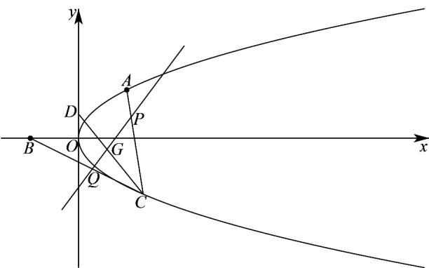

> [!faq]- 《专题03 抛物线的四大常考题型（高效培优专项训练）》官方解析
>
> > [!success]- **【答案】** (1) $y^{2}=x$ $$ (2) \left(x + \frac {3}{8}\right) ^ {2} + \left(y - \frac {5}{4}\right) ^ {2} = \frac {1 2 5}{6 4} $$ $$ (3) (3 y - 1) ^ {2} = 3 x \left(y \neq \frac {2}{3}\right) $$
>
> > [!note]- **【解析】**
> > （1）因为 $A(1,1)$ 在 E 上，所以 1=2p ，所以 E 的方程为 $y^{2}=x$
> >
> > (2) 若 $l$ 与 $x$ 轴平行，则直线 $l$ 与 $x$ 轴无交点，不合题意；
> >
> > 若 l 不与 x 轴平行，则 l 与 E 相切于 A，
> >
> > 设直线 $l$ 的方程为 $x = my + n$ ，由 $\left\{ \begin{array}{l} y^2 = x \\ x = my + n \end{array} \right.$ ，得 $y^2 - my - n = 0$
> >
> > 所以 $\left\{\begin{aligned}\Delta &=m^{2}+4n=0\\ 1 &=m+n\end{aligned}\right.$ ，解得 $\left\{\begin{aligned}m&=2\\ n&=-1\end{aligned}\right.$
> >
> > 所以直线 l 的方程为 $y = \frac{x + 1}{2}$ ，
> >
> > 因为 $B(-1,0)$ 、 $F\left(\frac{1}{4},0\right)$ 、 $A(1,1)$ ， $D\left(0,\frac{1}{2}\right)$ ，故 $D$ 为 $AB$ 中点，所以，线段 $AB$ 中垂线的方程为 $y = -2x + \frac{1}{2}$ ，线段 $BF$ 中垂线的方程为 $x = -\frac{3}{8}$ ，联立 $\left\{ \begin{array}{l} x = -\frac{3}{8} \\ y = -2x + \frac{1}{2} \end{array} \right.$ ，解得 $\left\{ \begin{array}{l} x = -\frac{3}{8} \\ y = \frac{5}{4} \end{array} \right.$ ，因此的外接圆圆心坐标为 $\left(-\frac{3}{8}, \frac{5}{4}\right)$ ， $\triangle ABF$ 的外接圆半径等于 $\sqrt{\left(-\frac{3}{8} + 1\right)^2 + \left(\frac{5}{4} - 0\right)^2} = \frac{5\sqrt{5}}{8}$ ，所以， $\triangle ABF$ 外接圆方程为 $\left(x + \frac{3}{8}\right)^2 + \left(y - \frac{5}{4}\right)^2 = \frac{125}{64}$ ．(3)
> > 解法一：设 $CP = \lambda CA (0 < \lambda < 1)$ ， $CQ = \mu CB (0 < \mu < 1)$ ， $\overline{CP} = \lambda CA = \lambda (CP + PA) (0 < \lambda < 1)$ ，故 $(1 - \lambda) CP = \lambda PA$ ，所以 $\left|\frac{|PA|}{|CP|} = \frac{1 - \lambda}{\lambda}\right.$ ，同理 $\left|\frac{|QB|}{|CQ|} = \frac{1 - \mu}{\mu}\right.$ ，
> >
> > 
> >
> > 因为 $\frac{|PA|}{|CP|} +\frac{|QB|}{|CQ|} = 1$ ，所以 $\frac{1 - \lambda}{\lambda} +\frac{1 - \mu}{\mu} = 1$ ，所以 $\frac{1}{\lambda} +\frac{1}{\mu} = 3$
> >
> > 设 $CG = mCD(0 < m < 1)$ ，因为 $CD = \frac{1}{2}CA + \frac{1}{2}CB$
> >
> > 所以 $CG=\frac{m}{2}CA+\frac{m}{2}CB=\frac{m}{2\lambda}CP+\frac{m}{2\mu}CQ$
> >
> > 因为 $P$ 、 $G$ 、 $Q$ 三点共线，所以 $\frac{m}{2\lambda} + \frac{m}{2\mu} = 1$ ，所以 $m = \frac{2}{3}$ ，则 $CG = \frac{2}{3} CD$ 设 $C(x_0, y_0)$ ，则 $y_0^2 = x_0$ ， $y_0 \neq 1$ ，设点 $G(x, y)$ ，
> >
> > 因为 $CG = (x - x_{0}, y - y_{0})$ ， $CD = \left(-x_{0}, \frac{1}{2} - y_{0}\right)$ ，
> >
> > 所以 $\left\{\begin{aligned}x&=\frac{x_{0}}{3}\\ y&=\frac{y_{0}+1}{3}\end{aligned}\right.$ ，所以 $\left(3y-1\right)^{2}=3x$
> >
> > 因为 A、C 不重合，所以 $y_{0} \neq 1$ ， $y \neq \frac{2}{3}$ ，
> >
> > 综上，点 $G$ 的轨迹方程为 $\left(3y - 1\right)^2 = 3x\left(y \neq \frac{2}{3}\right)$
> >
> > 解法二：因为 $D$ 为 $AB$ 中点，记 $\lambda = \frac{|CD|}{|CG|}$ ， $t_1 = \frac{|CA|}{|CP|} = 1 + \frac{|AP|}{|CP|}$ ， $t_2 = \frac{|CP|}{|CQ|} = 1 + \frac{|QB|}{|CQ|}$ ，
> >
> > $$
> > t _ {1} + t _ {2} = 3
> > $$
> >
> > 因为 $CD$ 为 $VABC$ 中线，则 $\frac{S_{\triangle CQP}}{S_{\triangle CAB}} = \frac{|CQ| \cdot |CP|}{|CB| \cdot |CA|} = \frac{1}{t_1 t_2}$ 且 $\frac{S_{\triangle CQP}}{S_{\triangle CAB}} = \frac{S_{\triangle CGP}}{2S_{\triangle CAD}} + \frac{S_{\triangle CGQ}}{2S_{\triangle CBD}} = \frac{1}{2}\left(\frac{1}{\lambda t_1} + \frac{1}{\lambda t_2}\right) = \frac{t_1 + t_2}{2t_1 t_2 \lambda}$ ，故 $\frac{t_1 + t_2}{2t_1 t_2 \lambda} = \frac{1}{t_1 t_2}$ ，
> >
> > 所以 $\lambda=\frac{3}{2}$ ，所以 G 是 VABC 的重心，
> >
> > 设 $C(x_{0},y_{0})$ ，则 $y_{0}^{2}=x_{0}$ ， $y_{0}\neq1$ ，设点 $G(x,y)$
> >
> > 所以 $\left\{\begin{aligned}x&=\frac{x_{0}}{3}\\ y&=\frac{y_{0}+1}{3}\end{aligned}\right.$ ，解得 $y_{0}^{2}=x_{0}$ $(3y-1)^{2}=3x$
> >
> > 因为 A、C 不重合，所以 $y_{0} \neq 1$ ， $y \neq \frac{2}{3}$ ，
> >
> > 综上，点 $G$ 的轨迹方程为 $\left(3y - 1\right)^2 = 3x\left(y \neq \frac{2}{3}\right)$ ；
> >
> > 解法三：设 $G(x,y)$ 、 $P(x_{1},y_{1})$ 、 $Q(x_{2},y_{2})$ 、 $C(y_{0}^{2},y_{0})(y_{0}\neq1)$ ，
> >
> > 设 $\frac{|PA|}{|CP|} = \alpha$ ，则 $\overline{AP} = \alpha \overline{PC}$ ，所以 $(x_{1} - 1, y_{1} - 1) = \alpha (y_{0}^{2} - x_{1}, y_{0} - y_{1})$ ，
> >
> > 所以 $x_{1}=\frac{1+\alpha y_{0}^{2}}{1+\alpha}$ ， $y_{1}=\frac{1+\alpha y_{0}}{1+\alpha}$ ，
> >
> > 设 $\frac{|QB|}{|CQ|} = \beta$ ，同理可得： $x_{2} = \frac{-1 + \beta y_{0}^{2}}{1 + \beta}$ ， $y_{2} = \frac{\beta y_{0}}{1 + \beta}$
> >
> > 直线 的方程为 $\frac{y-\frac{1+\alpha y_{0}}{1+\alpha}}{\frac{\beta y_{0}}{1+\beta}-\frac{1+\alpha y_{0}}{1+\alpha}}=\frac{x-\frac{1+\alpha y_{0}^{2}}{1+\alpha}}{\frac{-1+\beta y_{0}^{2}}{1+\beta}-\frac{1+\alpha y_{0}^{2}}{1+\alpha}}$
> >
> > 又因为 $\alpha +\beta = 1$ ，化简得： $\left[\left(\beta -\alpha\right)y_0 - \left(1 + \beta\right)\right]x = \left[\left(\beta -\alpha\right)y_0^2 -3\right]y + 1 + y_0 - \beta y_0^2$ ①，
> >
> > 直线 CD 的方程为 $y=\frac{y_{0}-\frac{1}{2}}{y_{0}^{2}}x+\frac{1}{2}=\frac{(2y_{0}-1)x+y_{0}^{2}}{2y_{0}^{2}}$ ②，
> >
> > 由①②解得 $\left\{ \begin{array}{l} x = \frac{y_0^2}{3} \\ y = \frac{1 + y_0}{3} \end{array} \right.$ ，消去得： $y_0$ （ $3y - 1)^2 = 3x$
> >
> > 因为 A、C 不重合，所以 $y_{0} \neq 1$ ， $y \neq \frac{2}{3}$ ，
> >
> > 综上，点 $G$ 的轨迹方程为 $(3y - 1)^2 = 3x\left(y \neq \frac{2}{3}\right)$ .
