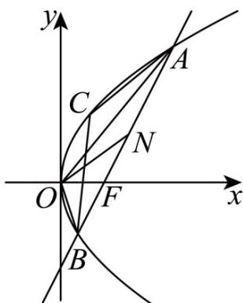

> [!faq]- 《专题03 抛物线的四大常考题型（高效培优专项训练）》官方解析
>
> > [!success]- **【答案】** (1) $y^{2}=12x$ (2)(i)证明见解析；(ii)不存在，理由见解析
>
> > [!note]- **【解析】**
> > （1）设圆心 $M(x,y)$ ，圆 $M$ 的半径为 $r$ ，
> >
> > 由圆 $F:(x-3)^{2}+y^{2}=1$ ，圆心 $F(3,0)$ ，半径为 1，
> >
> > 则 $\left\{ \begin{array}{l} \sqrt{(x - 3)^2 + y^2} = r + 1 \\ |x + 2| = r \end{array} \right.$
> >
> > 消去 $r$ ，得 $\sqrt{(x - 3)^2 + y^2} = |x + 2| + 1$
> >
> > 当 $x \leq -2$ 时， $y^{2} = 8x - 8 < 0$ ，舍去；
> >
> > 当 $x > -2$ 时， $y^{2} = 12x$
> >
> > 综上所述， $E$ 的方程为 $y^{2} = 12x$
> >
> > (2) (i) 由题意可知，直线 AB 的斜率存在且不为 0，
> >
> > 设 $AB: x = ty + 3(t \neq 0)$
> >
> > 联立 $\left\{ \begin{array}{l} x = ty + 3, \\ y^2 = 12x, \text{消}_x \end{array} \right.$ ，得 $y^2 - 12ty - 36 = 0$ ，
> >
> > 设 $A(x_{1},y_{1})$ ， $B(x_{2},y_{2})$ ，则 $\left\{\begin{aligned}\Delta&=144t^{2}+144>0,\\ y_{1}&+y_{2}=12t,\\ y_{1}&y_{2}=-36.\end{aligned}\right.$ (※)
> >
> > 设 $C(x_{3},y_{3})$ ， $x_{3}y_{3}\neq0$
> >
> > 因为 $k_{1}k_{2} = k_{3}k_{4}$ ，则 $\frac{y_1}{x_1}\cdot \frac{y_2}{x_2} = \frac{y_3 - y_1}{x_3 - x_1}\cdot \frac{y_3 - y_2}{x_3 - x_2}$
> >
> > 因为 A，B，C 是 E 上三点，则 $y_{i}^{2}=12x_{i}$ ，i=1，2，3
> >
> > 所以 $\frac{12}{y_1} \cdot \frac{12}{y_2} = \frac{12}{y_3 + y_1} \cdot \frac{12}{y_3 + y_2}$
> >
> > 则 $y_{1}y_{2}=(y_{3}+y_{1})(y_{3}+y_{2})$
> >
> > 化简得， $y_{1} + y_{2} + y_{3} = 0$ .
> >
> > $$
> > k _ {1} + k _ {4} = \frac {y _ {1}}{x _ {1}} + \frac {y _ {3} - y _ {2}}{x _ {3} - x _ {2}} = \frac {1 2}{y _ {1}} + \frac {1 2}{y _ {3} + y _ {2}} = \frac {1 2 (y _ {1} + y _ {2} + y _ {3})}{y _ {1} (y _ {3} + y _ {2})} = 0
> > $$
> >
> > 同理 $k_{2} + k_{3} = \frac{y_{2}}{x_{2}} +\frac{y_{3} - y_{1}}{x_{3} - x_{1}} = \frac{12}{y_{2}} +\frac{12}{y_{3} + y_{1}} = \frac{12(y_{1} + y_{2} + y_{3})}{y_{2}(y_{3} + y_{1})} = 0$
> >
> > 所以 $k_{1} + k_{4} = k_{2} + k_{3}$ .
> >
> > (ii) 不存在直线 $AB$ ，使得 $m$ ， $n$ ， $r$ 均为正整数，理由如下：
> >
> > 由（※），得 $\left\{\begin{aligned}m&=6t^{2}+3,\\ n&=6t,\\ r^{2}&=m^{2}+n^{2}.\end{aligned}\right.$
> >
> > 由 $m = 6t^2 +3$ ， $n = 6t$ ，消去 $t$ ，得 $n^2 = 6(m - 3)$
> >
> > 假设存在直线 AB，使得 m，n，r 均为正整数，
> >
> > 则 $n$ 是 ${}^{3}$ 的正整数倍，进而 $m$ ， $r$ 都是 ${}^{3}$ 的正整数倍，
> >
> > 不妨设 $m = 3m'$ ， $n = 3n'$ ， $r = 3r'\left(m', n', r' \in N^{*}\right)$
> >
> > 则 $\left\{ \begin{array}{l} n'^2 = 2m' - 2, \\ r'^2 = m'^2 + n'^2, \end{array} \right.$ 消去 $n'$ ，得 $\left(m' + 1\right)^2 - r'^2 = 3$ ，
> >
> > 即 $\left(m^{\prime} + 1 + r^{\prime}\right)\left(m^{\prime} + 1 - r^{\prime}\right) = 3$
> >
> > 因为 $m^{\prime} + 1 + r^{\prime}$ ， $m^{\prime} + 1 - r^{\prime}$ 有相同的奇偶性，且 $m^{\prime} + 1 + r^{\prime} > m^{\prime} + 1 - r^{\prime}$
> >
> > 所以 $\left\{\begin{aligned}m^{\prime}+1+r^{\prime}=3,\\ m^{\prime}+1-r^{\prime}=1,\end{aligned}\right.$ 解得 $\left\{\begin{aligned}m^{\prime}=1,\\ r^{\prime}=1,\end{aligned}\right.$
> >
> > 所以 m = 3 ， r = 3 ，
> >
> > 所以 n = 0 ，与 m ， n ， r 均为正整数矛盾，
> >
> > 所以不存在直线 AB ，使得 m ， n ， r 均为正整数·
> >
> > 
