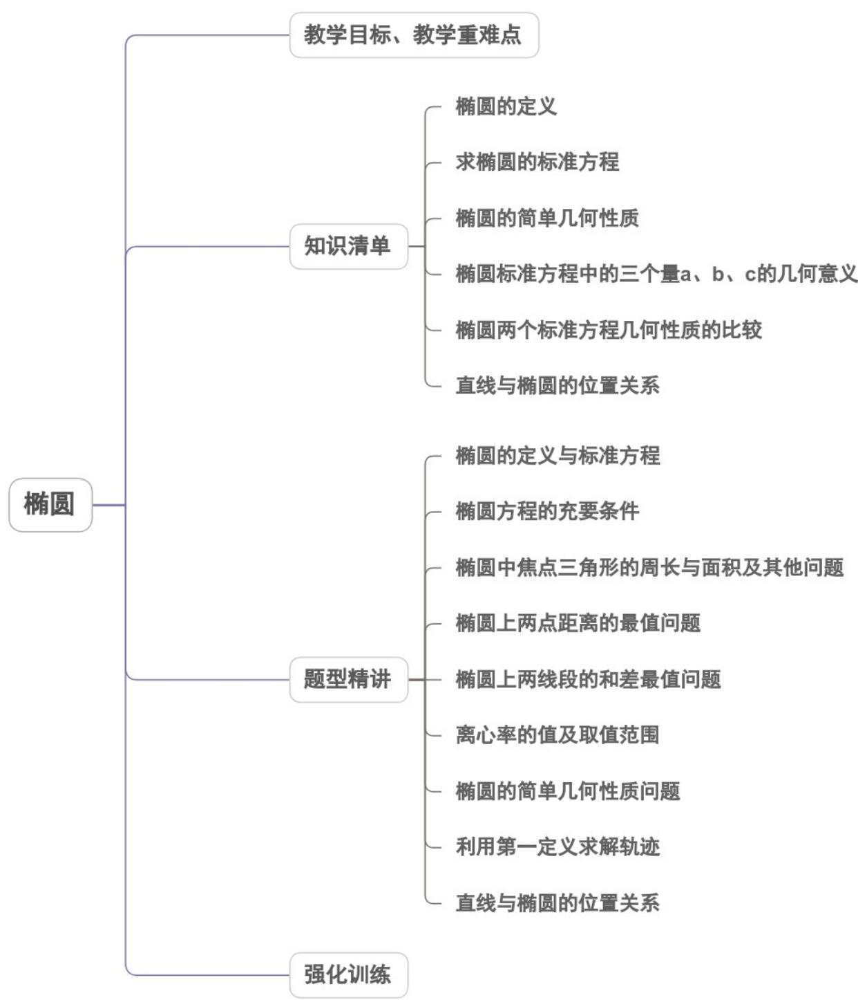
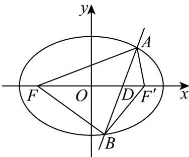
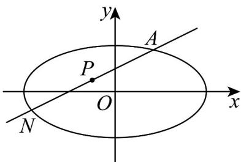
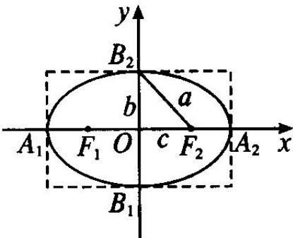
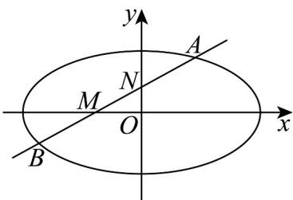
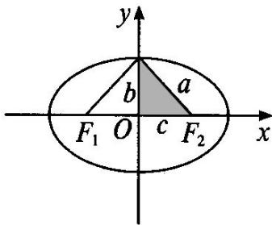
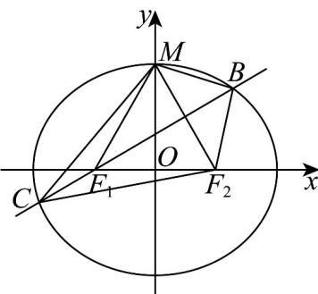
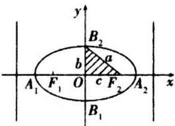
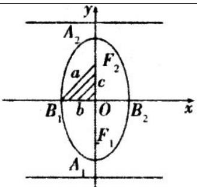

<!-- source-part:1 pages:1-50 -->

专题3.1 椭圆

## 教学目标、教学重难点

<table><tr><td>教学目标</td><td>1.了解椭圆的实际背景.2.经历从具体情境中抽象出椭圆模型的过程,掌握椭圆的定义及标准方程.3.掌握椭圆的简单几何性质.2.通过椭圆与方程的学习,了解椭圆的简单应用,进一步体会数形结合的思想.</td></tr><tr><td>教学重难点</td><td>1.重点掌握直线与椭圆的位置关系.2.难点掌握椭圆中的定点、定值、定直线及向量问题.</td></tr></table>

## 知识清单

## 知识点 01 椭圆的定义

平面内一个动点 $P$ 到两个定点 $F_{1}$ 、 $F_{2}$ 的距离之和等于常数（ $\left|PF_1\right| + \left|PF_2\right| = 2a > \left|F_1F_2\right|$ ），这个动点 $P$ 的轨迹

叫椭圆．这两个定点叫椭圆的焦点，两焦点的距离叫作椭圆的焦距．

【即学即练】

1. 已知 $F_{1}, F_{2}$ 分别为椭圆 $C: \frac{x^{2}}{4} + y^{2} = 1$ 的两个焦点， $P$ 为椭圆上一点，则 $\left|PF_{1}\right| - \left|PF_{2}\right|$ 的最大值为 \_\_\_\_.

【答案】 $2 \sqrt{3}$

【详解】 $F_{1}, F_{2}$ 分别为椭圆 $C: \frac{x^{2}}{4} + y^{2} = 1$ 的两个焦点，则 $F_{1}(-\sqrt{3}, 0), F_{2}(\sqrt{3}, 0)$

所以 $\left|PF_{1}\right|-\left|PF_{2}\right|\leq\left|F_{1}F_{2}\right|=2\sqrt{3}$ ，当且仅当 P 位于椭圆的右顶点时取等号，

故 $\left|PF_{1}\right|-\left|PF_{2}\right|$ 的最大值为 $2\sqrt{3}$ .

故答案为： $2\sqrt{3}$

2. 直线 $l$ 与椭圆 $\frac{x^2}{4} + \frac{y^2}{2} = 1$ 交于A，B两点， $F$ 为椭圆左焦点·则 $\triangle ABF$ 周长最大值是

【答案】8

【详解】

如图所示，设椭圆右焦点为 $F'$ ，直线 l 交 x 轴于点 D，连接 $AF'$ ， $BF'$ 。

则根据三角形三边关系可得 $AF^{\prime} + BF^{\prime}$ AB，当且仅当A， $F^{\prime}$ ，B三点共线时等号成立，即点D与点 $F^{\prime}$ 重合·

$\therefore \triangle ABF$ 周长 $AF + BF + AB \leq AF + BF + AF' + BF'$ .

根据椭圆的定义及椭圆的标准方程 $\frac{x^2}{4} +\frac{y^2}{2} = 1$ 可知： $AF + BF + AF' + BF' = (AF + AF') + (BF + BF') = 4\times 2 = 8$

∴ $AF + BF + AB \leq AF + BF + AF' + BF' = 8$ ，即 $\triangle ABF$ 周长最大值为 8.

故答案为：8·

## 知识点 02 求椭圆的标准方程

求椭圆的标准方程主要用到以下几种方法：（1）待定系数法：①若能够根据题目中条件确定焦点位置，可先设出标准方程，再由题设确定方程中的参数 $a, b$ ，即：“先定型，再定量”。②由题目中条件不能确定焦点位置，一般需分类讨论；有时也可设其方程的一般式： $mx^2 + ny^2 = 1$ （ $m, n > 0$ 且 $m \neq n$ ）。

（2）定义法：先分析题设条件，判断出动点的轨迹，然后根据椭圆的定义确定方程，即“先定型，再定量”.
利用该方法求标准方程时，要注意是否需先建立平面直角坐标系再解题．

【即学即练】

1. 已知椭圆的两个焦点坐标分别是 $(-2,0), (2,0)$ ，并且经过点 $\left(\frac{5}{2}, -\frac{3}{2}\right)$ ，则它的标准方程为（）A. $\frac{x^2}{5} + y^2 = 1$ B. $\frac{x^2}{10} + \frac{y^2}{6} = 1$ C. $x^2 + \frac{y^2}{5} = 1$ D. $\frac{x^2}{6} + \frac{y^2}{10} = 1$

【答案】B

【详解】因为椭圆的焦点在 $x$ 轴上，所以设它的标准方程为 $\frac{x^2}{a^2} +\frac{y^2}{b^2} = 1(a > b > 0)$

所以 $\left\{ \begin{array}{l}a^{2} = b^{2} + 4\\ \frac{25}{4} +\frac{9}{b^{2}} = 1 \end{array} \right.$ ，解得 $a^2 = 10,b^2 = 6$

所以椭圆的标准方程为 $\frac{x^{2}}{10} + \frac{y^{2}}{6} = 1$ .

故选：B.

2. 设椭圆 $C: \frac{x^2}{a^2} + \frac{y^2}{b^2} = 1 (a > b > 0)$ 过点 $A\left(1, -\frac{\sqrt{3}}{2}\right), B\left(\frac{\sqrt{2}}{2} a, \frac{\sqrt{2}}{2}\right)$

(1)求椭圆 $C$ 的标准方程；

(2)若过点 $(-1,0)$ 且斜率为 $\frac{1}{2}$ 的直线 $l$ 与椭圆 $C$ 交于 $M,N$ 两点，求线段 $MN$ 中点 $P$ 的坐标。

【答案】(1) $\frac{x^{2}}{4}+y^{2}=1$

(2) $\left(-\frac{1}{2},\frac{1}{4}\right)$

【详解】（1）因椭圆 $C: \frac{x^2}{a^2} + \frac{y^2}{b^2} = 1 (a > b > 0)$ 过点 $A\left(1, -\frac{\sqrt{3}}{2}\right), B\left(\frac{\sqrt{2}}{2} a, \frac{\sqrt{2}}{2}\right)$

则有 $\left\{ \begin{array}{l} \frac{1}{a^2} + \frac{3}{4b^2} = 1 \\ \frac{2}{4} + \frac{2}{4b^2} = 1 \end{array} \right.$ ，解得 $a^2 = 4, b^2 = 1$

所以椭圆 C 的标准方程为： $\frac{x^{2}}{4}+y^{2}=1$ ；

(2) 依题意，直线的方程为： $y = \frac{1}{2}(x + 1)$ ，由 $\left\{\begin{aligned}y &= \frac{1}{2}(x + 1) \\ \frac{x^2}{4} + y^2 &= 1\end{aligned}\right.$ 消去 $y$ 并整理得： $2x^{2} + 2x - 3 = 0$ ，

显然 $\Delta = 4 - 4\times 2\times (-3) > 0$ ，设 $M(x_{1},y_{1}),N(x_{2},y_{2})$ ，则 $x_{1} + x_{2} = -1$

因此线段 $MN$ 中点 $P$ 的横坐标 $x_0 = \frac{x_1 + x_2}{2} = -\frac{1}{2}$ ，其纵坐标 $y_0 = \frac{1}{2}(x_0 + 1) = \frac{1}{4}$

所以线段MN中点P的坐标为 $\left(-\frac{1}{2},\frac{1}{4}\right)$ .

知识点 03 椭圆的简单几何性质

我们根据椭圆 $\frac{x^2}{a^2} +\frac{y^2}{b^2} = 1(a > b > 0)$ 来研究椭圆的简单几何性质

椭圆的范围：椭圆上所有的点都位于直线 $x = \pm a$ 和 $y = \pm b$ 所围成的矩形内，所以椭圆上点的坐标满足 $\left|x\right| \leq a$ ， $|y| \leq b$

椭圆的对称性：对于椭圆标准方程 $\frac{x^2}{a^2} +\frac{y^2}{b^2} = 1$ ，把 $x$ 换成 $-x$ ，或把 $y$ 换成 $-y$ ，或把 $x$ 、 $y$ 同时换成 $-x$ 、 $-y$ ，

方程都不变，所以椭圆 $\frac{x^2}{a^2} +\frac{y^2}{b^2} = 1$ 是以 $x$ 轴、 $y$ 轴为对称轴的轴对称图形，且是以原点为对称中心的中心对

称图形，这个对称中心称为椭圆的中心。

椭圆的顶点：①椭圆的对称轴与椭圆的交点称为椭圆的顶点．②椭圆 $\frac{x^{2}}{a^{2}}+\frac{y^{2}}{b^{2}}=1\quad(a>b>0)$ 与坐标轴的四个交

点即为椭圆的四个顶点，坐标分别为 $A_{1}(-a,0)$ ， $A_{2}(a,0)$ ， $B_{1}(0,-b)$ ， $B_{2}(0,b)$ ③线段 $A_{1}A_{2}$ ， $B_{1}B_{2}$ 分别叫做

椭圆的长轴和短轴， $\left|A_{1}A_{2}\right|=2a,\left|B_{1}B_{2}\right|=2b$ ．a和b分别叫做椭圆的长半轴长和短半轴长．

椭圆的离心率：①椭圆的焦距与长轴长度的比叫做椭圆的离心率，用 $e$ 表示，记作 $\frac{e = c}{a}$ ②因为 $a > c > 0$

所以 $e$ 的取值范围是 $0 < e < 1$ 。 $e$ 越接近1，则 $c$ 就越接近 $a$ ，从而 $b = \sqrt{a^2 - c^2}$ 越小，因此椭圆越扁；反之， $e$

越接近于0， $c$ 就越接近0，从而 $b$ 越接近于 $a$ ，这时椭圆就越接近于圆．当且仅当 $a = b$ 时， $c = 0$ ，这时两

个焦点重合，图形变为圆，方程为 $x^{2} + y^{2} = a^{2}$

【即学即练】

1. 椭圆 $\frac{x^2}{4} + \frac{y^2}{3} = 1$ 的两个焦点之间的距离为 \_\_\_\_.

【答案】2

【详解】由椭圆方程可知： $a^2 = 4, b^2 = 3$

所以 $c^{2}=a^{2}-b^{2}=1$

则焦点坐标为 $(1,0),(-1,0)$

所以两个焦点之间的距离为 $^{2}$ ，

故答案为：2

2. 如图，斜率为 $\frac{1}{2}$ 的直线与椭圆 $C: \frac{x^2}{4} + \frac{y^2}{b^2} = 1 (0 < b < 2)$ 交于A，B两点，与 $x$ 轴、 $y$ 轴分别交于点 $M$ ， $N$ ，

若 $|AN|=|NM|=|MB|$ ，则椭圆C的焦距为\_\_\_\_.

【答案】 $2 \sqrt{3}$

【详解】设 $A(x_{1},y_{1}),B(x_{2},y_{2})$ ，又因为 $|AN| = |NM| = |MB|$

所以 $M(-x_1,0),N\left(0,\frac{y_1}{2}\right)$ ，则 $B\left(-2x_{1}, - \frac{y_{1}}{2}\right)$ ，则 $\left\{ \begin{array}{l}x_{2} = -2x_{1}\\ y_{2} = -\frac{y_{1}}{2} \end{array} \right.$

由 $\left\{ \begin{array}{l} \frac{x_1^2}{4} + \frac{y_1^2}{b^2} = 1 \\ \frac{x_2^2}{4} + \frac{y_2^2}{b^2} = 1 \end{array} \right.$ ，两式相减得 $\frac{(x_1 - x_2)(x_1 + x_2)}{4} + \frac{(y_1 - y_2)(y_1 + y_2)}{b^2} = 0$ ，

即 $\frac{y_1 - y_2}{x_1 - x_2} \cdot \frac{y_1 + y_2}{x_1 + x_2} = -\frac{b^2}{4}$ ，因为 $\frac{y_1 - y_2}{x_1 - x_2} = \frac{1}{2}$ ，所以 $\frac{y_1 + \frac{y_1}{2}}{x_1 + 2x_1} = \frac{1}{2}$ ，所以 $\frac{y_1}{x_1} = 1$ ，

$\frac{y_{1}+y_{2}}{x_{1}+x_{2}}=\frac{y_{1}-\frac{y_{1}}{2}}{x_{1}-2x_{1}}=-\frac{y_{1}}{2x_{1}}=-\frac{1}{2}$ ，所以 $\frac{1}{2}\cdot\left(-\frac{1}{2}\right)=-\frac{b^{2}}{4}$ ，解得b=1，

所以 $c = \sqrt{a^2 - b^2} = \sqrt{3}$ ，所以椭圆 $C$ 的焦距为 $2\sqrt{3}$

故答案为： $2\sqrt{3}$

## 知识点 04 椭圆标准方程中的三个量 a、b、c 的几何意义

椭圆标准方程中， $a$ 、 $b$ 、 $c$ 三个量的大小与坐标系无关，是由椭圆本身的形状大小所确定的，分别表示椭圆

的长半轴长、短半轴长和半焦距长，均为正数，且三个量的大小关系为： $a > b > 0$ ， $a > c > 0$ ，且 $a^2 = b^2 +c^2$

可借助下图帮助记忆：

$a$ 、 $b$ 、 $c$ 恰构成一个直角三角形的三条边，其中 $a$ 是斜边， $b$ 、 $c$ 为两条直角边．和 $a$ 、 $b$ 、 $c$ 有关的椭圆问题常与与焦点三角形 $\Delta PF_{1}F_{2}$ 有关，这样的问题考虑到用椭圆的定义及余弦定理（或勾股定理）、三角形面积公式 $S_{\Delta PF_1F_2} = \frac{1}{2} |PF_1| \cdot |PF_2| \sin \angle F_1PF$ 相结合的方法进行计算与解题，将有关线段 $|PF_1|$ 、 $|PF_2|$ 、 $|F_1F_2|$ ，有关角 $\angle F_1PF_2$ ( $\angle F_1PF_2 \leq \angle F_1BF_2$ ) 结合起来，建立 $|PF_1| + |PF_2|$ 、 $|PF_1| \cdot |PF_2|$ 之间的关系．

## 【即学即练】

1. 已知焦点在 $x$ 轴上的椭圆，上顶点为 $M$ ，左、右焦点分别为 $F_{1}$ ， $F_{2}$ ，经过点 $F_{1}$ 的直线垂直平分线段 $MF_{2}$ ，且交椭圆于 $B$ ， $C$ 两点， $\triangle MBC$ 的周长为8，则椭圆的标准方程为（）A. $x^{2} + 4y^{2} = 1$ B. $\frac{x^2}{16} + \frac{y^2}{12} = 1$ C. $\frac{x^2}{4} + y^2 = 1$ D. $\frac{x^2}{4} + \frac{y^2}{3} = 1$

【答案】D

【详解】

如图，因经过点 $F_{1}$ 的直线垂直平分线段 $MF_{2}$ ，则 $\left|MF_1\right| = \left|F_1F_2\right|$ ，即 $a = 2c$ ，

因 $|MB|=|F_2B|, |CM|=|CF_2|$ ，则 $\triangle MBC$ 的周长等于 $^{\triangle}BF_2C$ 的周长4a

即 4a = 8，解得 a = 2, c = 1， $b = \sqrt{3}$ ，故椭圆的标准方程为 $\frac{x^{2}}{4} + \frac{y^{2}}{3} = 1$

故选：D.

2. 已知椭圆 $C: \frac{x^2}{16} + \frac{y^2}{12} = 1$ 的左、右焦点分别为 $F_1, F_2, P$ 是 $C$ 上在第二象限内的一点，且 $\left|PF_2\right| - \left|PF_1\right| = 2$ ，则直

线 $PF_{2}$ 的斜率为（）
A. $-\frac{4}{3}$ B. $-\frac{3}{4}$ C. $\frac{3}{4}$ D. $\frac{4}{3}$

【答案】B

【详解】由条件可知， $\left\{\begin{aligned}\left|PF_{2}\right|+\left|PF_{1}\right|=8\\ \left|PF_{2}\right|-\left|PF_{1}\right|=2\end{aligned}\right.$ ，得 $\left|PF_{2}\right|=5$ ， $\left|PF_{1}\right|=3$ ，且 $\left|F_{1}F_{2}\right|=4$

所以 $PF_{1} \perp F_{1}F_{2}$ ，且 $\tan \angle PF_{2}F_{1} = \frac{3}{4}$

设直线 $PF_{2}$ 的倾斜角为 $\theta$ ，则 $\tan \theta = -\frac{3}{4}$

所以直线 $PF_{2}$ 的斜率为 $-\frac{3}{4}$ .

## 知识点 05 椭圆两个标准方程几何性质的比较

<table><tr><td colspan="2">标准方程</td><td> $\frac{x^2}{a^2} + \frac{y^2}{b^2} = 1 (a > b > 0)$ </td><td> $\frac{x^2}{b^2} + \frac{y^2}{a^2} = 1 (a > b > 0)$ </td></tr><tr><td colspan="2">图形</td><td></td><td></td></tr><tr><td rowspan="7">性质</td><td>焦点</td><td> $F_1(-c,0), F_2(c,0)$ </td><td> $F_1(0,-c), F_2(0,c)$ </td></tr><tr><td>焦距</td><td> $|F_1F_2|=2c (c=\sqrt{a^2-b^2})$ </td><td> $|F_1F_2|=2c (c=\sqrt{a^2-b^2})$ </td></tr><tr><td>范围</td><td> $|x|\leq a, |y|\leq b$ </td><td> $|x|\leq b, |y|\leq a$ </td></tr><tr><td>对称性</td><td colspan="2">关于x轴、y轴和原点对称</td></tr><tr><td>顶点</td><td> $(\pm a,0), (0,\pm b)$ </td><td> $(0,\pm a), (\pm b,0)$ </td></tr><tr><td>轴</td><td colspan="2">长轴长=2a,短轴长=2b</td></tr><tr><td>离心率</td><td colspan="2">\( e=\frac{c}{a} (0</td></tr></table>

【即学即练】

1. 若椭圆的两焦点为 $(-2,0)$ 和 $(2,0)$ ，且椭圆过点 $\left(\frac{5}{2}, -\frac{3}{2}\right)$ ，则椭圆方程是（）A. $\frac{y^2}{8} + \frac{x^2}{4} = 1$ B. $\frac{x^2}{10} + \frac{y^2}{6} = 1$ C. $\frac{y^2}{4} + \frac{x^2}{8} = 1$ D. $\frac{y^2}{10} + \frac{x^2}{6} = 1$

【答案】B

【详解】根据题意可设椭圆的标准方程为： $\frac{x^{2}}{a^{2}}+\frac{y^{2}}{b^{2}}=1,\quad(a>b>0)$

则 $\left\{ \begin{array}{l} c = 2 \\ \frac{25}{4a^2} + \frac{9}{4b^2} = 1 \\ a^2 = b^2 + c^2 \end{array} \right.$ ，解得： $b^2 = 6, a^2 = 10$

所以椭圆的方程为 $\frac{x^{2}}{10} + \frac{y^{2}}{6} = 1$ .

故选：B.

2. 已知椭圆 $C$ 的一个焦点 $F(0, -\sqrt{5})$ ， $P$ 为 $C$ 上一点，满足 $|OP| = |OF|$ ， $|PF| = 4$ ，则椭圆 $C$ 的标准方程为（）A. $\frac{y^2}{15} + \frac{x^2}{10} = 1$ B. $\frac{y^2}{9} + \frac{x^2}{4} = 1$ C. $\frac{y^2}{12} + \frac{x^2}{7} = 1$ D. $\frac{y^2}{8} + \frac{x^2}{3} = 1$

【答案】B

【详解】依题意，椭圆的焦点在 $y$ 轴上，设椭圆为 $\frac{y^2}{a^2} +\frac{x^2}{b^2} = 1$ ， $P(m,n)$

则 $\left\{ \begin{array}{l} |OP|^2 = |OF|^2 \\ |PF|^2 = 16 \end{array} \right.$ ，即 $\left\{ \begin{array}{l} m^2 + n^2 = 5 \\ m^2 + (n + \sqrt{5})^2 = 16 \end{array} \right.$ ，解得 $\left\{ \begin{array}{l} m^2 = \frac{16}{5} \\ n^2 = \frac{9}{5} \\ \frac{n^2}{a^2} + \frac{m^2}{b^2} = 1 \end{array} \right.$ ，又

因此 $\left\{ \begin{array}{l} \frac{9}{5} + \frac{16}{5} = 1 \\ a^2 = b^2 + 5 \end{array} \right.$ ，解得 $\left\{ \begin{array}{ll} a^2 = 9 & \text{所以椭圆的标准方程为} \\ b^2 = 4 & C \end{array} \right.$ $\frac{y^2}{9} + \frac{x^2}{4} = 1$

故选：B

## 知识点 06 直线与椭圆的位置关系

平面内点与椭圆的位置关系:椭圆将平面分成三部分：椭圆上、椭圆内、椭圆外，因此，平面上的点与椭圆的

位置关系有三种，任给一点 $M(x,y)$ ，

若点 $M(x,y)$ 在椭圆上，则有 $\frac{x^2}{a^2} +\frac{y^2}{b^2} = 1(a > b > 0)$

若点 $M(x,y)$ 在椭圆内，则有 $\frac{x^2}{a^2} +\frac{y^2}{b^2} < 1 (a > b > 0)$

若点 $M(x,y)$ 在椭圆外，则有 $\frac{x^2}{a^2} +\frac{y^2}{b^2} >1$ （ $a > b > 0$ ）.

直线与椭圆的位置关系；将直线的方程 $y = kx + b$ 与椭圆的方程 $\frac{x^2}{a^2} + \frac{y^2}{b^2} = 1 (a > b > 0)$ 联立成方程组，消元转

化为关于 $x$ 或 $y$ 的一元二次方程，其判别式为 $\Delta$ 。

① $\Delta >0 \Leftrightarrow$ 直线和椭圆相交 $\Leftrightarrow$ 直线和椭圆有两个交点（或两个公共点）；

② $\Delta = 0 \Leftrightarrow$ 直线和椭圆相切 $\Leftrightarrow$ 直线和椭圆有一个切点（或一个公共点）；

③ $\Delta < 0 \Leftrightarrow$ 直线和椭圆相离 $\Leftrightarrow$ 直线和椭圆无公共点.

直线与椭圆的相交弦：设直线 $y = kx + b$ 交椭圆 $\frac{x^2}{a^2} + \frac{y^2}{b^2} = 1 (a > b > 0)$ 于点 $P_1(x_1, y_1)$ ， $P_2(x_2, y_2)$ 两点，则

$$
\mid P _ {1} P _ {2} \mid = \sqrt {(x _ {1} - x _ {2}) ^ {2} + (y _ {1} - y _ {2}) ^ {2}} = \sqrt {(x _ {1} - x _ {2}) ^ {2} [ 1 + (\frac {y _ {1} - y _ {2}}{x _ {1} - x _ {2}}) ^ {2} ]} \sqrt {1 + k ^ {2}} \mid x _ {1} - x _ {2} \mid
$$

$$
\left| P _ {1} P _ {2} \right| = \sqrt {1 + \frac {1}{k ^ {2}}} \left| y _ {1} - y _ {2} \right| (k \neq 0)
$$

同理可得

这里 $|x_{1} - x_{2}|$ ， $|y_{1} - y_{2}|$ 的求法通常使用韦达定理，需作以下变形： $|x_1 - x_2| = \sqrt{(x_1 - x_2)^2 - 4x_1x_2}$ $|y_{1} - y_{2}| = \sqrt{(y_{1} - y_{2})^{2} - 4y_{1}y_{2}}$

【即学即练】

1. 直线 $kx + y - 2 = 0$ 与椭圆 $\frac{x^2}{6} + \frac{y^2}{m} = 1$ 恒有公共点，则实数 $m$ 的取值范围是

【答案】 $\left[4,6\right)\cup(6,+\infty)$

【详解】直线方程可化为 $y = -kx + 2$ ，故该直线恒过定点 $(0,2)$ ，

因为直线 $kx + y - 2 = 0$ 与椭圆 $\frac{x^{2}}{6} + \frac{y^{2}}{m} = 1$ 恒有公共点，

则点 在椭圆内或椭圆上，所以， $\left\{\begin{aligned}&\frac{4}{m}\leq1\\ &m>0\\ &m\neq6\\ &\end{aligned}\right.$ ，解得且，
(0,2) $m \quad 4 \quad m \neq 6$

所以，实数 m 的取值范围是 $\left[4,6\right)\cup\left(6,+\infty\right)$ .

故答案为： $\left[4,6\right)\cup\left(6,+\infty\right)$ .

2. 已知椭圆 $C: \frac{x^2}{4} + \frac{y^2}{3} = 1$ 上存在关于直线 $l: y = x + m$ 对称的点，则 $m$ 的取值范围是

【答案】 $\left(-\frac{\sqrt{7}}{7},\frac{\sqrt{7}}{7}\right)$

【详解】由题意可知：直线 $l:y = x + m$ 的斜率 $k = 1$ ，

设椭圆 $C$ 上关于直线 $l$ 对称的两点分别为 $A(x_{1},y_{1}),B(x_{2},y_{2})$ ， $AB$ 的中点为 $E(x_0,y_0)$

可得 $\left\{ \begin{array}{l} x_{0} = \frac{x_{1} + x_{2}}{2} \\ y_{0} = \frac{y_{1} + y_{2}}{2} \end{array} \right.$ ，且 $k_{AB} = \frac{y_1 - y_2}{x_1 - x_2} = -1$ ， $k_{OE} = \frac{\frac{y_1 + y_2}{2}}{\frac{x_1 + x_2}{2}} = \frac{y_1 + y_2}{x_1 + x_2}$

因为点 在 上，则 $\left\{\begin{aligned}\frac{x_{1}^{2}}{4}+\frac{y_{1}^{2}}{3}&=1\\\frac{x_{2}^{2}}{4}+\frac{y_{2}^{2}}{3}&=1\end{aligned}\right.$ ，两式相减得 $\frac{x_{1}^{2}-x_{2}^{2}}{4}+\frac{y_{1}^{2}-y_{2}^{2}}{3}=0$ ，

整理可得 $\frac{y_1 - y_2}{x_1 - x_2} \cdot \frac{y_1 + y_2}{x_1 + x_2} = -\frac{3}{4}$ ，可得 $k_{AB} \cdot k_{OE} = -\frac{3}{4}$ ，即 $k_{OE} = \frac{3}{4}$

则 $OE:y = \frac{3}{4} x$

联立方程 $\left\{ \begin{array}{l} y = \frac{3}{4} x \\ y = x + m \end{array} \right.$ ，解得 $\left\{ \begin{array}{l} x = -4m \\ y = -3m \end{array} \right.$ ，即 $E(-4m, -3m)$ ，

因为点 $E$ 在椭圆 $C$ 内，所以 $4m^{2} + 3m^{2} < 1$ ，解得 $-\frac{\sqrt{7}}{7} < m < \frac{\sqrt{7}}{7}$

所以实数 $m$ 的取值范围是 $\left(-\frac{\sqrt{7}}{7}, \frac{\sqrt{7}}{7}\right)$ .

$\left(-\frac{\sqrt{7}}{7}, \frac{\sqrt{7}}{7}\right)$ . 故答案为：

## 题型精讲

![[高中/课堂同步/题库/人教A版高中数学同步讲义(2026)/03_选择性必修第一册/第三章 圆锥曲线的方程/专题3.1 椭圆（高效培优讲义）/题型01_椭圆的定义与标准方程/题型01_椭圆的定义与标准方程.md]]
![[高中/课堂同步/题库/人教A版高中数学同步讲义(2026)/03_选择性必修第一册/第三章 圆锥曲线的方程/专题3.1 椭圆（高效培优讲义）/题型02_椭圆方程的充要条件/题型02_椭圆方程的充要条件.md]]
![[高中/课堂同步/题库/人教A版高中数学同步讲义(2026)/03_选择性必修第一册/第三章 圆锥曲线的方程/专题3.1 椭圆（高效培优讲义）/题型03_椭圆中焦点三角形的周长与面积及其他问题/题型03_椭圆中焦点三角形的周长与面积及其他问题.md]]
![[高中/课堂同步/题库/人教A版高中数学同步讲义(2026)/03_选择性必修第一册/第三章 圆锥曲线的方程/专题3.1 椭圆（高效培优讲义）/题型04_椭圆上两点距离的最值问题/题型04_椭圆上两点距离的最值问题.md]]
![[高中/课堂同步/题库/人教A版高中数学同步讲义(2026)/03_选择性必修第一册/第三章 圆锥曲线的方程/专题3.1 椭圆（高效培优讲义）/题型05_椭圆上两线段的和差最值问题/题型05_椭圆上两线段的和差最值问题.md]]
![[高中/课堂同步/题库/人教A版高中数学同步讲义(2026)/03_选择性必修第一册/第三章 圆锥曲线的方程/专题3.1 椭圆（高效培优讲义）/题型06_离心率的值及取值范围/题型06_离心率的值及取值范围.md]]
![[高中/课堂同步/题库/人教A版高中数学同步讲义(2026)/03_选择性必修第一册/第三章 圆锥曲线的方程/专题3.1 椭圆（高效培优讲义）/题型07_椭圆的简单几何性质问题/题型07_椭圆的简单几何性质问题.md]]
![[高中/课堂同步/题库/人教A版高中数学同步讲义(2026)/03_选择性必修第一册/第三章 圆锥曲线的方程/专题3.1 椭圆（高效培优讲义）/题型08_利用第一定义求解轨迹/题型08_利用第一定义求解轨迹.md]]
![[高中/课堂同步/题库/人教A版高中数学同步讲义(2026)/03_选择性必修第一册/第三章 圆锥曲线的方程/专题3.1 椭圆（高效培优讲义）/题型09_直线与椭圆的位置关系/题型09_直线与椭圆的位置关系.md]]
![[高中/课堂同步/题库/人教A版高中数学同步讲义(2026)/03_选择性必修第一册/第三章 圆锥曲线的方程/专题3.1 椭圆（高效培优讲义）/强化训练/强化训练.md]]
