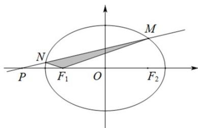

<!-- question-source:start -->
12. 设椭圆 $C \frac{x^2}{a^2} + \frac{y^2}{b^2} = 1 (a > b > 0)$ 的左、右焦点分别为 $F_1, F_2$ . 已知 $M\left(1, \frac{\sqrt{2}}{2}\right)$ 在椭圆 $C$ 上，且 $\triangle MF_1F_2$ 的面积为 $\frac{\sqrt{2}}{2}$ .

(1)求椭圆 $C$ 的标准方程；

(2)如图，过点 $M$ 的直线 $l$ 与椭圆 $C$ 交于另一点 $N$ 与 $x$ 轴交于点 $P$ ，若 $\angle PF_{1}M + \angle PF_{1}N = \pi$ ，求 ${}^{\triangle}MNF_{1}$ 的面

积.
<!-- question-source:end -->

![[高中/课堂同步/题库/人教A版高中数学同步讲义(2026)/03_选择性必修第一册/第三章 圆锥曲线的方程/专题3.1 椭圆（高效培优讲义）/强化训练/questions/answers/Q00080164A1.md]]
