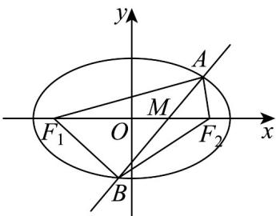

> [!faq]- 《专题3.1 椭圆（高效培优讲义）》官方解析
>
> > [!success]- **【答案】** C
>
> > [!note]- **【解析】**
> > 设直线 $y = x + m$ 与 x 轴的交点为 M，则 $M(-m,0)$
> >
> > 所以 $S_{F_1AB} = \frac{1}{2}\left|MF_1\right|\left|y_A - y_B\right|$ ， $S_{F_2AB} = \frac{1}{2}\left|MF_2\right|\left|y_A - y_B\right|$
> >
> > 因为 $S_{F_1AB} = 2S_{F_2AB}$ ，所以 $\left|MF_1\right| = 2\left|MF_2\right|$
> >
> > 由 $\frac{x^2}{3} + y^2 = 1$ 得 $c = \sqrt{2}$ ，即 $F_{1}(-\sqrt{2},0)$ ， $F_{2}(\sqrt{2},0)$ ， $|F_{1}F_{2}| = 2\sqrt{2}$
> >
> > 所以 $\left|-\sqrt{2}+m\right|=2\left|\sqrt{2}+m\right|$ ，解得 $m=-\frac{\sqrt{2}}{3}$ 或 $-3\sqrt{2}$
> >
> > 因为 $y = x + m$ 与 $C$ 有两个交点，联立 $\left\{ \begin{array}{l} y = x + m \\ \frac{x^2}{3} + y^2 = 1 \\ \text{消} y \text{得} 4x^2 + 6mx + 3m^2 - 3 = 0 \end{array} \right.$
> >
> > 则 $\Delta = 36m^2 - 16(3m^2 - 3) > 0$ ，解得 $m^2 < 4$ 。所以 $m = -\frac{\sqrt{2}}{3}$
> >
> > 
> >
> > 故选：C.
> >
> > 2. 椭圆 $C: \frac{x^2}{12} + \frac{y^2}{16} = 1$ 的两个焦点为 $F_1, F_2, P$ 为椭圆 $C$ 上与两焦点不共线的一点，则 $\Delta PF_1F_2$ 的周长为
> >
> > 【答案】12
> >
> > 【详解】因为 a = 4 ， $b = 2\sqrt{3}$ ，所以 $c = \sqrt{a^{2} - b^{2}} = 2$ ，
> >
> > 故 $\triangle PF_{1}F_{2}$ 的周长为 $2a + 2c = 12$ .
> >
> > 故答案为：12
