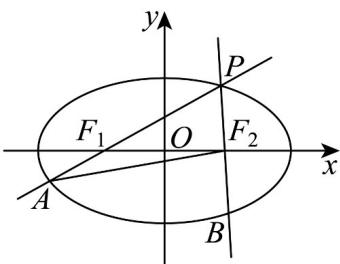

> [!faq]- 《专题3.1 椭圆（高效培优讲义）》官方解析
>
> > [!success]- **【答案】** $x^{2} + y^{2} = 5$
>
> > [!note]- **【解析】**
> > 由椭圆 $C:\frac{y^{2}}{a}+x^{2}=1(a>1)$ 的离心率为 $\frac{\sqrt{3}}{2}$ ，得 $\frac{\sqrt{a-1}}{\sqrt{a}}=\frac{\sqrt{3}}{2}$ ，解得 a=4，
> >
> > 椭圆 $C: \frac{y^2}{4} + x^2 = 1$ 在顶点 $(0,2), (1,0)$ 处的切线分别为 $y = 2, x = 1$ ，它们交于点 $(1,2)$
> >
> > 显然点 $(1,2)$ 在椭圆 $C$ 的蒙日圆 $x^{2} + y^{2} = r^{2}$ 上，因此 $r^2 = 1^2 + 2^2 = 5$
> >
> > 所以椭圆 $C$ 的蒙日圆方程为 $x^{2} + y^{2} = 5$
> >
> > 故答案为： $x^{2} + y^{2} = 5$
> >
> > 4. 动点 $P$ 在椭圆 $C$ 上， $F_{1}$ ， $F_{2}$ 为 $C$ 的左、右焦点，直线 $PF_{1}$ 和直线 $PF_{2}$ 分别交 $C$ 于点 $A$ ， $B$ ，若 $\triangle PAF_{2}$ 的周长为 $^{20}$ ，且 $C$ 的左顶点和上顶点距离为 $\sqrt{41}$ ，则（）
> >
> > 【答案】
> >
> > A. 椭圆焦距为 $^{3}$ B. 离心率 $e = \frac{3}{5}$ C. $\triangle PF_{1}F_{2}$ 面积最大值为 $^{12}$ D. $PF_{1}$ 和 $PF_{2}$ 斜率乘积为定值
> >
> > 【答案】BC
> >
> > 【详解】因为点 $P$ ， $A$ 在椭圆上，所以 $\left|PF_1\right| + \left|PF_2\right| = 2a$ ， $\left|AF_1\right| + \left|AF_2\right| = 2a$
> >
> > 故 $\triangle PAF_{2}$ 的周长为 $\left|PA\right| + \left|AF_{2}\right| + \left|PF_{2}\right| = \left|PF_{1}\right| + \left|PF_{2}\right| + \left|AF_{1}\right| + \left|AF_{2}\right| = 4a = 20$
> >
> > 解得 $a = 5$ ，因为左顶点和上顶点的距离为 $\sqrt{a^2 + b^2} = \sqrt{5^2 + b^2} = \sqrt{41}$
> >
> > 解得 $b = 4$ ，则 $c = \sqrt{a^2 - b^2} = 3$ ，焦距为 $2c = 6$ ，故A错误；
> >
> > $e=\frac{c}{a}=\frac{3}{5}$ ，故 $^{B}$ 正确；
> >
> > $$
> > S _ {\triangle P F _ {1} F _ {2}} = \frac {1}{2} \times \left| F _ {1} F _ {2} \right| \times \left| y _ {P} \right| = c \left| y _ {P} \right| \leq b c = 1 2,
> > $$
> >
> > 当点 P 位于 y 轴上时， $\Delta PF_{1}F_{2}$ 面积取得最大值 12，故 C 正确；
> >
> > 设 $P(x,y)$ ，则 $\frac{x^2}{25} +\frac{y^2}{16} = 1$ ，即 $y^{2} = 16 - \frac{16}{25} x^{2}$
> >
> > 因为 $F_{1}(-3,0)$ ， $F_{2}(3,0)$ ，所以 $k_{PF_1} = \frac{y}{x + 3}$ ， $k_{PF_2} = \frac{y}{x - 3}$
> >
> > 故 $k_{PF_1} \cdot k_{PF_2} = \frac{y}{x + 3} \times \frac{y}{x - 3} = \frac{y^2}{x^2 - 9} = \frac{16}{25} \cdot \frac{25 - x^2}{x^2 - 9}$ 不是定值，故D错误：
> >
> > 
> >
> > 故选 **BC**.
