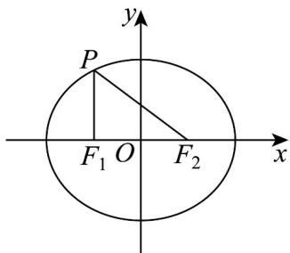

> [!faq]- 《专题3.1 椭圆（高效培优讲义）》官方解析
>
> > [!success]- **【答案】** $-\frac{3}{4} / \frac{-3}{4}$
>
> > [!note]- **【解析】**
> > 如图所示，根据椭圆的定义可知， $\left|PF_{2}\right|+\left|PF_{1}\right|=2a=8$ ①，
> >
> > 由题意知 $\left|PF_{2}\right|-\left|PF_{1}\right|=2$ ②，
> >
> > 联立①②方程组可解得 $\left|PF_{2}\right|=5,\left|PF_{1}\right|=3$ .
> >
> > 而 $\left|F_{1}F_{2}\right|=4$ ，所以 $\left|PF_{2}\right|^{2}=\left|PF_{1}\right|^{2}+\left|F_{1}F_{2}\right|^{2}$ ，即 $\triangle PF_{1}F_{2}$ 为直角三角形， $PF_{1}\perp F_{1}F_{2}$
> >
> > 由于 P 在第二象限，所以 P 点的坐标为 $(-2,3)$ .
> >
> > 因为 $F_{2}(2,0)$ ，所以直线 $PF_{2}$ 的斜率为 $\frac{3-0}{-2-2}=-\frac{3}{4}$ .
> >
> > 故答案为： $-\frac{3}{4}$
> >
> > 
