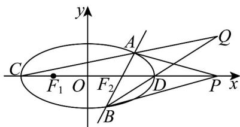

> [!faq]- 《专题3.1 椭圆（高效培优讲义）》官方解析
>
> > [!success]- **【答案】** (1) $\frac{x^{2}}{4}+\frac{y^{2}}{3}=1$ (2)证明见解析 (3) $x = 4(y \neq 0)$
>
> > [!note]- **【解析】**
> > （1）解：由椭圆 $E:\frac{x^{2}}{a^{2}}+\frac{y^{2}}{b^{2}}=1(a>b>0)$ 的长轴长为4，离心率 $e=\frac{1}{2}$
> >
> > 可得 $\left\{\begin{aligned}2a&=4\\ e&=\frac{c}{a}=\frac{1}{2}\end{aligned}\right.$ ，解得 a=2, c=1，又由 $a^{2}=b^{2}+c^{2}$ ，可得 $b=\sqrt{3}$ ，
> >
> > 所以椭圆 E 的标准方程为 $\frac{x^{2}}{4} + \frac{y^{2}}{3} = 1$
> >
> > (2) 解：由题意知，直线 AB 的斜率不为 0，不妨设直线 AB 的方程为 $x = ty + 1$
> >
> > 且 $A\left(x_{1},y_{1}\right),B\left(x_{2},y_{2}\right)$ ，联立方程组 $\left\{ \begin{array}{l} \frac{x^2}{4} +\frac{y^2}{3} = 1\\ x = ty + 1 \end{array} \right.$ ，整理得 $\left(3t^2 +4\right)y^2 +6ty - 9 = 0$
> >
> > 则有 $\Delta = 144t^2 + 144 > 0$ 且 $y_1 + y_2 = -\frac{6t}{3t^2 + 4}, y_1y_2 = \frac{-9}{3t^2 + 4}$
> >
> > $$
> > k _ {1} + k _ {2} = \frac {y _ {1}}{x _ {1} - 4} + \frac {y _ {2}}{x _ {2} - 4} = \frac {y _ {1}}{t y _ {1} - 3} + \frac {y _ {2}}{t y _ {2} - 3} = \frac {y _ {1} (t y _ {2} - 3) + y _ {2} (t y _ {1} - 3)}{(t y _ {1} - 3) (t y _ {2} - 3)} = \frac {2 t y _ {1} y _ {2} - 3 (y _ {1} + y _ {2})}{(t y _ {1} - 3) (t y _ {2} - 3)} = 0
> > $$
> >
> > (3) 解：设点 $Q(x, y)$ ，由题意知点 $A$ 和点 $B$ 均不在 $x$ 轴上，所以 $y \neq 0$
> >
> > 则直线 AC 的方程为 $y = \frac{y_{1}}{x_{1} + 2}(x + 2)$ ，① 直线 BD 的方程为 $y = \frac{y_{2}}{x_{2} - 2}(x - 2)$ ，②
> >
> > 由①②消去y得 $\frac{y_{1}}{x_{1}+2}(x+2)=\frac{y_{2}}{x_{2}-2}(x-2)$
> >
> > $$
> > \frac {x + 2}{x - 2} = \frac {y _ {2} (x _ {1} + 2)}{y _ {1} (x _ {2} - 2)} = \frac {x _ {1} y _ {2} + 2 y _ {2}}{x _ {2} y _ {1} - 2 y _ {1}} = \frac {(t y _ {1} + 1) y _ {2} + 2 y _ {2}}{(t y _ {2} + 1) y _ {1} - 2 y _ {1}} = \frac {t y _ {1} y _ {2} + 3 y _ {2}}{t y _ {1} y _ {2} - y _ {1}}
> > $$
> >
> > 又由 $2ty_{1}y_{2} = 3(y_{1} + y_{2})$ ，代入可得 $\frac{x + 2}{x - 2} = \frac{\frac{3}{2}y_1 + \frac{3}{2}y_2 + 3y_2}{\frac{3}{2}y_1 + \frac{3}{2}y_2 - y_1} = \frac{\frac{3}{2}y_1 + \frac{9}{2}y_2}{\frac{1}{2}y_1 + \frac{3}{2}y_2} = 3$
> >
> > 解得 x = 4 ，所以点 Q 点的轨迹方程是 $x = 4 (y \neq 0)$ .
> >
> > 
