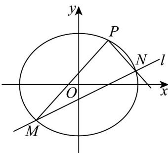

> [!faq]- 《专题3.1 椭圆（高效培优讲义）》官方解析
>
> > [!success]- **【答案】** (1) $\frac{x^{2}}{4}+\frac{y^{2}}{3}=1$ ; (2) $x - 2y - 1 = 0$
>
> > [!note]- **【解析】**
> > （1）由椭圆 $C:\frac{x^{2}}{a^{2}}+\frac{y^{2}}{b^{2}}=1$ 过点 $(0,\sqrt{3})$ ，则 $b=\sqrt{3}$
> >
> > 由椭圆 C 的离心率为 $\frac{1}{2}$ ，得 $\frac{\sqrt{a^{2}-b^{2}}}{a}=\frac{1}{2}$ ，则 a=2，
> >
> > 所以椭圆 C 的方程为 $\frac{x^{2}}{4} + \frac{y^{2}}{3} = 1$
> >
> > (2) 依题意，直线 l 的斜率存在，设方程为 $y = k(x - 1)$
> >
> > 由 $\left\{\begin{aligned}y&=k(x-1)\\ 3x^{2}&+4y^{2}=12\end{aligned}\right.$ 消去 y 得 $(4k^{2}+3)x^{2}-8k^{2}x+4k^{2}-12=0$ ，显然 $\Delta>0$ ，
> >
> > 设 $M(x_{1},y_{1}),N(x_{2},y_{2})$ ，则 $x_{1} + x_{2} = \frac{8k^{2}}{4k^{2} + 3},x_{1}x_{2} = \frac{4k^{2} - 12}{4k^{2} + 3}$
> >
> > 直线 $PM, PN$ 的斜率分别为 $k_{PM} = \frac{y_1 - \frac{3}{2}}{x_1 - 1}, k_{PN} = \frac{y_2 - \frac{3}{2}}{x_2 - 1}$ ，由 $k_{PM} + k_{PN} = 0$ ，
> >
> > 得 $\frac{y_1 - \frac{3}{2}}{x_1 - 1} +\frac{y_2 - \frac{3}{2}}{x_2 - 1} = 0$ ，即 $(x_{2} - 1)(kx_{1} - k - \frac{3}{2}) + (x_{1} - 1)(kx_{2} - k - \frac{3}{2}) = 0$
> >
> > 整理得 $2kx_{1}x_{2}-(2k+\frac{3}{2})(x_{1}+x_{2})+2k+3=0$
> >
> > 则 $2k \cdot \frac{4k^2 - 12}{4k^2 + 3} - (2k + \frac{3}{2}) \cdot \frac{8k^2}{4k^2 + 3} + 2k + 3 = 0$ ，解得 $k = \frac{1}{2}$
> >
> > 所以直线 l 的方程为 $y=\frac{1}{2}(x-1)$ ，即 x-2y-1=0。
> >
> > 
