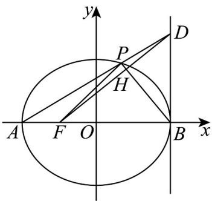

> [!faq]- 《专题3.1 椭圆（高效培优讲义）》官方解析
>
> > [!success]- **【答案】** (1)9 (2)证明见解析
>
> > [!note]- **【解析】**
> > （1）
> >
> > 
> >
> > 法一：设 $D(2,t)(t\neq 0)$ ，则直线 $AD:y = \frac{t}{4} (x + 2)$
> >
> > 与椭圆方程联立，得 $\left(t^2 + 12\right)x^2 + 4t^2x + 4t^2 - 48 = 0$
> >
> > 则由 $\Delta = 16t^4 - 4(t^2 + 12)(4t^2 - 48) = 144 > 0$
> >
> > 且 $-2x_{P}=\frac{4t^{2}-48}{t^{2}+12}$ ，故 $x_{P}=\frac{24-2t^{2}}{t^{2}+12}$ ，则 $y_{P}=\frac{12t}{t^{2}+12}$
> >
> > 所以 $\overrightarrow{FD} \cdot \overrightarrow{FP} = (3, t) \cdot \left( \frac{36 - t^{2}}{t^{2} + 12}, \frac{12t}{t^{2} + 12} \right) = \frac{108 - 3t^{2}}{t^{2} + 12} + \frac{12t^{2}}{t^{2} + 12} = 9$ .
> >
> > 法二：设 $P(m,n)$ ，则 $3m^{2} + 4n^{2} = 12$
> >
> > 则直线 $AP$ 的方程为： $y = \frac{n}{m + 2}(x + 2)$ ，令 $x = 2$ ，代入即得 $D(2, \frac{4n}{m + 2})$ 。
> >
> > 所以 $FD \cdot FP = \left(3, \frac{4n}{m+2}\right) \cdot (m+1, n) = 3m + 3 + \frac{4n^{2}}{m+2} = 3m + 3 + \frac{12 - 3m^{2}}{m+2} = 9$
> >
> > (2) 因为 $\angle DBH + \angle FBH = 90^{\circ}$
> >
> > 所以，要证 $\angle BFH = \angle DBH$ ，只需证 $\angle BFH + \angle FBH = 90^{\circ}$ ，即证 $DF\perp PB\cdot$
> >
> > 对应（1）中的法一：因为 $D(2,t)$ ， $F(-1,0)$ ， $P\left(\frac{24 - 2t^2}{t^2 + 12}, \frac{12t}{t^2 + 12}\right)$ ， $B(2,0)$ ，
> >
> > 所以 $\overrightarrow{DF} \cdot \overrightarrow{PB} = (-1 - 2, 0 - t) \cdot (2 - \frac{24 - 2t^{2}}{t^{2} + 12}, 0 - \frac{12t}{t^{2} + 12})$
> >
> > $$
> > = (- 3, - t) \cdot \left(\frac {4 t ^ {2}}{t ^ {2} + 1 2}, \frac {- 1 2 t}{t ^ {2} + 1 2}\right) = \frac {- 1 2 t ^ {2}}{t ^ {2} + 1 2} + \frac {1 2 t ^ {2}}{t ^ {2} + 1 2} = 0,
> > $$
> >
> > 于是 $DF \perp PB$ .
> >
> > 或者：因直线 $DF:y = \frac{t}{3} (x + 1)$ ，直线 $PB:y = \frac{\frac{12t}{t^2 + 12}}{\frac{24 - 2t^2}{t^2 + 12} - 2}(x - 2)$ 即 $y = -\frac{3}{t} (x - 2)$
> >
> > 联立，解得 $H(\frac{18-t^{2}}{t^{2}+9},\frac{9t}{t^{2}+9})$
> >
> > 因为 $\overline{FH} \cdot \overline{BH} = \left( \frac{18 - t^{2}}{t^{2} + 9} + 1, \frac{9t}{t^{2} + 9} \right) \cdot \left( \frac{18 - t^{2}}{t^{2} + 9} - 2, \frac{9t}{t^{2} + 9} \right)$
> >
> > $= \frac{27}{t^2 + 9}\times \frac{-3t^2}{t^2 + 9} +\frac{9t}{t^2 + 9}\times \frac{9t}{t^2 + 9} = 0$ ，所以 $FH\perp BH\cdot$
> >
> > 对应（1）的法二：因为 $\angle DBH + \angle FBH = 90^{\circ}$
> >
> > 所以，要证 $\angle BFH = \angle DBH$ ，只需证 $\angle BFH + \angle FBH = 90^{\circ}$ ，即证 $DF\perp PB$
> >
> > 因为 $D(2, \frac{4n}{m+2})$ ， $F(-1,0)$ ， $P(m,n)$ ， $B(2,0)$ ，
> >
> > 所以 $\frac{D\overline{F}\cdot\overline{PB}}{DF} = (-3,\frac{-4n}{m + 2})\cdot (2 - m, - n) = 3m - 6 + \frac{4n^2}{m + 2} = 3m - 6 + \frac{12 - 3m^2}{m + 2} = 0$
> >
> > 于是 $DF \perp PB$ .
