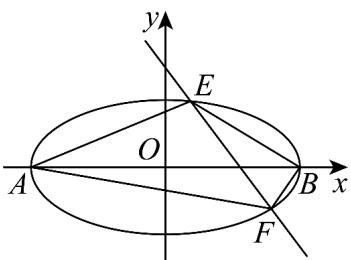

> [!faq]- 《专题3.1 椭圆（高效培优讲义）》官方解析
>
> > [!success]- **【答案】** (1) $\frac{x^{2}}{4}+y^{2}=1$ (2)① $\frac{4\sqrt{3}}{3}$ ; ②是, $-2 - \sqrt{3}$
>
> > [!note]- **【解析】**
> > （1）由题意得 $\left\{ \begin{array}{l} 2a = 4, \\ 2c = 2\sqrt{3}, \text{得} \end{array} \right.$ $\left\{ \begin{array}{l} a = 2, \\ c = \sqrt{3}, \text{则} b^2 = a^2 - c^2 = 1 \end{array} \right.$ ，
> >
> > 所以 C 的方程为 $\frac{x^{2}}{4} + y^{2} = 1$ .
> >
> > (2) 由 (1) 可知 $A(-2,0)$ , $B(2,0)$ ,
> >
> > 易得直线 l 的斜率不为零，设 $l: x = ty + \sqrt{3}$ ， $E(x_{1}, y_{1})$ ， $F(x_{2}, y_{2})$ 。
> >
> > 
> >
> > 由
> >
> > $$
> > \left\{ \begin{array}{l l} x = t y + \sqrt {3}, \text {得} \\ \frac {x ^ {2}}{4} + y ^ {2} = 1, \quad \left(t ^ {2} + 4\right) y ^ {2} + 2 \sqrt {3} t y - 1 = 0 \end{array} , \text {得} \left\{ \begin{array}{l l} \Delta = 1 6 \left(t ^ {2} + 1\right) > 0, \\ y _ {1} + y _ {2} = \frac {- 2 \sqrt {3} t}{t ^ {2} + 4}, \\ y _ {1} y _ {2} = \frac {- 1}{t ^ {2} + 4}. \end{array} \right. \right.
> > $$
> > - **①**：四边形 $_{AEBF}$ 的面积为 $S_{\triangle ABE} + S_{\triangle ABF} = \frac{1}{2} |AB||y_1 - y_2| = 2\sqrt{(y_1 + y_2)^2 - 4y_1y_2}$
> >
> > $$
> > = 8 \sqrt {\frac {t ^ {2} + 1}{\left(t ^ {2} + 4\right) ^ {2}}} = 8 \sqrt {\frac {t ^ {2} + 1}{\left(t ^ {2} + 1\right) ^ {2} + 6 (t ^ {2} + 1) + 9}} = 8 \sqrt {\frac {1}{t ^ {2} + 1 + \frac {9}{t ^ {2} + 1} + 6}}
> > $$
> >
> > $$
> > \leq 8 \sqrt {\frac {1}{2 \sqrt {\left(t ^ {2} + 1\right) \cdot \frac {9}{t ^ {2} + 1}} + 6}} = \frac {4 \sqrt {3}}{3}
> > $$
> >
> > 当且仅当 $t^{2}+1=\frac{9}{t^{2}+1}$ ，即 $t^{2}=2$ 时，等号成立·
> >
> > 故四边形 AEBF 面积的最大值为 $\frac{4\sqrt{3}}{3}$
> > - **②**：$k_{2}(k_{1}+k_{3})$ 是定值，该定值为 $-2-\sqrt{3}$ .
> >
> > $$
> > k _ {1} = \frac {y _ {1}}{x _ {1} + 2}, k _ {2} = \frac {y _ {1}}{x _ {1} - 2}, k _ {3} = \frac {y _ {2}}{x _ {2} - 2}.
> > $$
> >
> > $$
> > k _ {1} k _ {2} = \frac {y _ {1}}{x _ {1} + 2} \cdot \frac {y _ {1}}{x _ {1} - 2} = \frac {y _ {1} ^ {2}}{x _ {1} ^ {2} - 4} = \frac {1 - \frac {x _ {1} ^ {2}}{4}}{x _ {1} ^ {2} - 4} = - \frac {1}{4},
> > $$
> >
> > $$
> > k _ {2} k _ {3} = \frac {y _ {1}}{x _ {1} - 2} \cdot \frac {y _ {2}}{x _ {2} - 2} = \frac {y _ {1} y _ {2}}{\left(t y _ {1} + \sqrt {3} - 2\right) \left(t y _ {2} + \sqrt {3} - 2\right)}
> > $$
> >
> > $$
> > = \frac {y _ {1} y _ {2}}{t ^ {2} y _ {1} y _ {2} + (\sqrt {3} - 2) t (y _ {1} + y _ {2}) + 7 - 4 \sqrt {3}}
> > $$
> >
> > $$
> > = \frac {\frac {- 1}{t ^ {2} + 4}}{\frac {- t ^ {2}}{t ^ {2} + 4} + (\sqrt {3} - 2) t \times \frac {- 2 \sqrt {3} t}{t ^ {2} + 4} + 7 - 4 \sqrt {3}} = - \frac {7}{4} - \sqrt {3},
> > $$
> >
> > 所以 $k_{2}(k_{1}+k_{3})=k_{1}k_{2}+k_{2}k_{3}=-\frac{1}{4}-\frac{7}{4}-\sqrt{3}=-2-\sqrt{3}$
