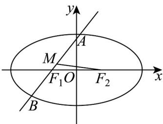

> [!faq]- 《专题3.1 椭圆（高效培优讲义）》官方解析
>
> > [!success]- **【答案】** (1) $\frac{x^{2}}{4}+\frac{y^{2}}{3}=1$ (2) $\frac{\sqrt{3}}{4}$ .
>
> > [!note]- **【解析】**
> > （1）当 $l$ 的方程为 $y = \sqrt{3}(x + 1)$ 时， $\angle AF_1F_2 = \frac{\pi}{3}$ ，则 $F_{1}(-1,0)$ ， $\left|F_{1}F_{2}\right| = 2 = \left|AF_{2}\right|$
> >
> > 故 $\triangle AF_1F_2$ 为等边三角形，则 $2a = |AF_1| + |AF_2| = 4$ ，解得 $a = 2$ ，
> >
> > 则 $b^{2}=4-1=3$ ，故C的方程为 $\frac{x^{2}}{4}+\frac{y^{2}}{3}=1$
> >
> > (2) 设点 $M$ 的坐标为 $\left(x_{M}, y_{M}\right)$ , $A\left(x_{1}, y_{1}\right)$ , $B\left(x_{2}, y_{2}\right)$ ,
> >
> > 由题意知：直线 AB 斜率存在且不为 0，设直线 AB 的方程为： $x = my - 1$ （ $m \neq 0$ ），联立 $\left\{ \begin{array}{l} \frac{x^2}{4} + \frac{y^2}{3} = 1 \\ x = my - 1 \end{array} \right.$ ，消 $x$ 得 $\left(3m^2 + 4\right)y^2 - 6my - 9 = 0$ ，且 $\Delta = 144(m^2 + 1) > 0$ ，
> >
> > 故 $y_{1} + y_{2} = \frac{6m}{3m^{2} + 4}$
> >
> > 故 $y_{M} = \frac{3m}{3m^{2} + 4}$ ，所以 $S_{\triangle MF_1F_2} = \frac{1}{2}\cdot 2\cdot \frac{|3m|}{3m^2 + 4} = \frac{3|m|}{3m^2 + 4} = \frac{3}{3|m| + \frac{4}{|m|}}\leq \frac{3}{4\sqrt{3}} = \frac{\sqrt{3}}{4}$
> >
> > 当且仅当 $|m| = \frac{2\sqrt{3}}{3}$ 时等号成立，所以 $\triangle MF_1F_2$ 面积的最大值为 $\frac{\sqrt{3}}{4}$
> >
> > 
